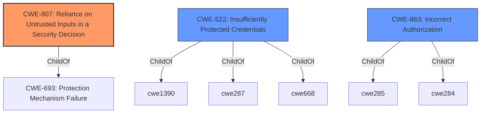

# Raw Analyzer Response for CVE-2021-36777

# Summary
| CWE ID  | CWE Name                                                      | Confidence | CWE Abstraction Level | CWE Vulnerability Mapping Label | CWE-Vulnerability Mapping Notes |
| :-------- | :------------------------------------------------------------ | :--------- | :---------------------- | :------------------------------ | :---------------------------- |
| CWE-807 | Reliance on Untrusted Inputs in a Security Decision          | 1          | Base                    | Allowed                         | Primary CWE                   |
| CWE-522 | Insufficiently Protected Credentials                          | 0.7        | Class                   | Allowed-with-Review           | Secondary candidate         |
| CWE-863 | Incorrect Authorization                                       | 0.6        | Class                   | Allowed-with-Review           | Secondary candidate         |

## Evidence and Confidence

*   **Confidence Score:** 0.9
*   **Evidence Strength:** HIGH

## Relationship Analysis
The primary relationship influencing the CWE selection is the hierarchical structure. CWE-807 is chosen as the base level weakness which is the preferred level. CWE-522 and CWE-863 are considered as higher level classes.

## Vulnerability Chain
The vulnerability chain starts with the **reliance on untrusted inputs** (CWE-807) which leads to sending clear text credentials to an attacker specified server.

## Summary of Analysis
The initial analysis identified **reliance on untrusted inputs** as the root cause, which aligns with CWE-807. The vulnerability description and CVE reference links confirm that the `login-proxy` accepted an unsanitized `url` parameter, allowing attackers to redirect credentials to an attacker-controlled server.

*   The assessment is primarily based on the provided evidence, specifically:
    *   **Vulnerability Description Key Phrases:** "**rootcause:** **reliance on untrusted inputs**"
    *   **CVE Reference Links Content Summary:** "The `login-proxy` used by SUSE and openSUSE services was vulnerable to a flaw where it could be tricked into sending user credentials (username and password) to an attacker-controlled server. This was due to the `login-proxy` accepting a `url` parameter which was not properly sanitized."

*   The graph relationships influenced the selection by prioritizing the base-level CWE (CWE-807) over the class-level CWEs (CWE-522, CWE-863) for the primary mapping.

*   The selected CWE, CWE-807, is at the optimal level of specificity because it directly addresses the root cause of the vulnerability which is the **reliance on untrusted inputs** when making security decisions.

Relevant CWE Information:

*   **CWE-807: Reliance on Untrusted Inputs in a Security Decision**
    *   The `login-proxy` uses the `url` parameter without proper sanitization.
    *   Attackers can modify this input to redirect credentials to their own server.
    *   This aligns with the CWE description: "The product uses a protection mechanism that relies on the existence or values of an input, but the input can be modified by an untrusted actor in a way that bypasses the protection mechanism."
    *   Confidence: 1

*   **CWE-522: Insufficiently Protected Credentials**
    *   The credentials are sent in clear text to the attacker specified server.
    *   This is a valid, but secondary issue as the root cause is the **reliance on untrusted inputs**
    *   Confidence: 0.7

*   **CWE-863: Incorrect Authorization**
    *   The `login-proxy` does not correctly authorize the redirect URL.
    *   The check is missing or insufficient, allowing unauthorized redirection.
    *   This is a valid, but secondary issue as the root cause is the **reliance on untrusted inputs**.
    *   Confidence: 0.6

*   **CWEs Considered but Not Used:**
    *   CWE-61, CWE-184, CWE-183, CWE-1289, CWE-303, CWE-41, CWE-204, CWE-1391, CWE-1390, CWE-668, CWE-59, CWE-386, CWE-434, CWE-78, CWE-79, CWE-22, CWE-98, CWE-252, CWE-367, CWE-178, CWE-113, CWE-697, CWE-565
    *   These CWEs were considered, but ultimately deemed less relevant as they did not directly address the root cause which is the **reliance on untrusted inputs** in security decisions. For example, CWE-61 (UNIX Symbolic Link Following) is not applicable as the vulnerability does not involve symbolic links.