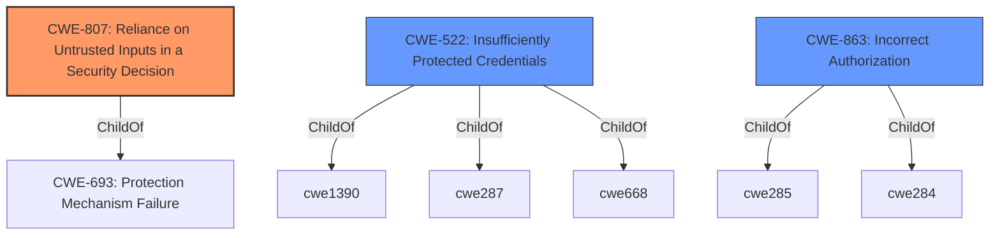

# Analysis for CVE-2021-36777

# Summary
| CWE ID  | CWE Name                                                      | Confidence | CWE Abstraction Level | CWE Vulnerability Mapping Label | CWE-Vulnerability Mapping Notes |
| :-------- | :------------------------------------------------------------ | :--------- | :---------------------- | :------------------------------ | :---------------------------- |
| CWE-807 | Reliance on Untrusted Inputs in a Security Decision          | 1          | Base                    | Allowed                         | Primary CWE                   |
| CWE-522 | Insufficiently Protected Credentials                          | 0.7        | Class                   | Allowed-with-Review           | Secondary candidate         |
| CWE-863 | Incorrect Authorization                                       | 0.6        | Class                   | Allowed-with-Review           | Secondary candidate         |

## Evidence and Confidence

*   **Confidence Score:** 0.9
*   **Evidence Strength:** HIGH

## Relationship Analysis
The primary relationship influencing the CWE selection is the hierarchical structure. CWE-807 is chosen as the base level weakness which is the preferred level. CWE-522 and CWE-863 are considered as higher level classes.

## Vulnerability Chain
The vulnerability chain starts with the **reliance on untrusted inputs** (CWE-807) which leads to sending clear text credentials to an attacker specified server.

## Summary of Analysis
The initial analysis identified **reliance on untrusted inputs** as the root cause, which aligns with CWE-807. The vulnerability description and CVE reference links confirm that the `login-proxy` accepted an unsanitized `url` parameter, allowing attackers to redirect credentials to an attacker-controlled server.

*   The assessment is primarily based on the provided evidence, specifically:
    *   **Vulnerability Description Key Phrases:** "**rootcause:** **reliance on untrusted inputs**"
    *   **CVE Reference Links Content Summary:** "The `login-proxy` used by SUSE and openSUSE services was vulnerable to a flaw where it could be tricked into sending user credentials (username and password) to an attacker-controlled server. This was due to the `login-proxy` accepting a `url` parameter which was not properly sanitized."

*   The graph relationships influenced the selection by prioritizing the base-level CWE (CWE-807) over the class-level CWEs (CWE-522, CWE-863) for the primary mapping.

*   The selected CWE, CWE-807, is at the optimal level of specificity because it directly addresses the root cause of the vulnerability which is the **reliance on untrusted inputs** when making security decisions.

Relevant CWE Information:

*   **CWE-807: Reliance on Untrusted Inputs in a Security Decision**
    *   The `login-proxy` uses the `url` parameter without proper sanitization.
    *   Attackers can modify this input to redirect credentials to their own server.
    *   This aligns with the CWE description: "The product uses a protection mechanism that relies on the existence or values of an input, but the input can be modified by an untrusted actor in a way that bypasses the protection mechanism."
    *   Confidence: 1

*   **CWE-522: Insufficiently Protected Credentials**
    *   The credentials are sent in clear text to the attacker specified server.
    *   This is a valid, but secondary issue as the root cause is the **reliance on untrusted inputs**
    *   Confidence: 0.7

*   **CWE-863: Incorrect Authorization**
    *   The `login-proxy` does not correctly authorize the redirect URL.
    *   The check is missing or insufficient, allowing unauthorized redirection.
    *   This is a valid, but secondary issue as the root cause is the **reliance on untrusted inputs**.
    *   Confidence: 0.6

*   **CWEs Considered but Not Used:**
    *   CWE-61, CWE-184, CWE-183, CWE-1289, CWE-303, CWE-41, CWE-204, CWE-1391, CWE-1390, CWE-668, CWE-59, CWE-386, CWE-434, CWE-78, CWE-79, CWE-22, CWE-98, CWE-252, CWE-367, CWE-178, CWE-113, CWE-697, CWE-565
    *   These CWEs were considered, but ultimately deemed less relevant as they did not directly address the root cause which is the **reliance on untrusted inputs** in security decisions. For example, CWE-61 (UNIX Symbolic Link Following) is not applicable as the vulnerability does not involve symbolic links.

# Enhanced Query for CVE-2021-36777

## Vulnerability Description
A Reliance on Untrusted Inputs in a Security Decision vulnerability in the login proxy of the openSUSE Build service allowed attackers to present users with a expected login form that then sends the clear text credentials to an attacker specified server. This issue affects openSUSE Build service login-proxy-scripts versions prior to dc000cdfe9b9b715fb92195b1a57559362f689ef.

### Vulnerability Description Key Phrases
- **rootcause:** **reliance on untrusted inputs**
- **impact:** send clear text credentials to attacker specified server
- **attacker:** attackers
- **product:** openSUSE Build service
- **version:** prior to dc000cdfe9b9b715fb92195b1a57559362f689ef
- **component:** login proxy

## CVE Reference Links Content Summary
Based on the provided content, here's an analysis of CVE-2021-36777:

**Root Cause of Vulnerability:**

The `login-proxy` used by SUSE and openSUSE services was vulnerable to a flaw where it could be tricked into sending user credentials (username and password) to an attacker-controlled server. This was due to the `login-proxy` accepting a `url` parameter which was not properly sanitized.

**Weaknesses/Vulnerabilities Present:**

*   **Unsanitized URL Parameter:** The primary weakness was the login-proxy's acceptance of a `url` parameter. This parameter allowed an attacker to specify an arbitrary URL where the login form's POST data (including credentials) would be sent.
*   **Lack of Input Validation:** The `login-proxy` failed to validate or sanitize the provided URL, thus allowing arbitrary external URLs to be used as the target for sending sensitive user information.

**Impact of Exploitation:**

*   **Credentials Theft:** A successful exploit would allow an attacker to capture the user's username and password when they attempt to log in through the compromised proxy.
*   **Account Compromise:** With stolen credentials, the attacker could then gain unauthorized access to the user's accounts on SUSE and openSUSE services.

**Attack Vectors:**

*   **Malicious URL:** The attack vector is a crafted URL containing the vulnerable `ICSLogin/auth-up` endpoint along with the malicious `url` parameter pointing to an attacker-controlled server.

**Required Attacker Capabilities/Position:**

*   **Knowledge of Vulnerable Endpoint:** The attacker needs to know the specific vulnerable endpoint (e.g., `https://build.opensuse.org/ICSLogin/auth-up/`).
*   **Ability to Craft Malicious URL:** The attacker needs to be able to create the malicious URL that includes the `url` parameter pointing to their server.
*  **Server for Receiving Credentials:** The attacker needs to have a server running to receive and capture the transmitted credentials sent by the vulnerable `login-proxy`.

**Additional Notes:**

* The vulnerability affected specific login-proxy instances used within the SUSE and openSUSE infrastructure, not the services themselves.
* The vulnerability was fixed by patching out the vulnerable URL parameter. The general removal of the URL parameter needed testing which was later implemented in a commit `d0b45f98fc74b254ee0585f26647cb6c8d2c871f`
* The provided bug report includes example attack URLs showing how the exploit could be executed.
* The vulnerability has been resolved and is publicly disclosed.

## Retriever Results

### Top Combined Results

| Rank | CWE ID | Name | Abstraction | Usage  | Retrievers | Individual Scores |
|------|--------|------|-------------|-------|------------|-------------------|
| 1 | 807 | Reliance on Untrusted Inputs in a Security Decision | Base | Allowed | sparse | 0.566 |
| 2 | 61 | UNIX Symbolic Link (Symlink) Following | Compound | Allowed | sparse | 0.357 |
| 3 | 522 | Insufficiently Protected Credentials | Class | Allowed-with-Review | sparse | 0.340 |
| 4 | 697 | Incorrect Comparison | Pillar | Discouraged | sparse | 0.323 |
| 5 | 863 | Incorrect Authorization | Class | Allowed-with-Review | sparse | 0.321 |
| 6 | 565 | Reliance on Cookies without Validation and Integrity Checking | Base | Allowed | dense | 0.528 |
| 7 | 386 | Symbolic Name not Mapping to Correct Object | Base | Allowed | graph | 0.002 |
| 8 | 303 | Incorrect Implementation of Authentication Algorithm | Base | Allowed | sparse | 0.320 |
| 9 | 256 | Plaintext Storage of a Password | Base | Allowed | sparse | 0.317 |
| 10 | 184 | Incomplete List of Disallowed Inputs | Base | Allowed | sparse | 0.312 |

# Complete CWE Specifications

## CWE-807: Reliance on Untrusted Inputs in a Security Decision
**Abstraction:** Base
**Status:** Incomplete

### Description
The product uses a protection mechanism that relies on the existence or values of an input, but the input can be modified by an untrusted actor in a way that bypasses the protection mechanism.

### Extended Description

Developers may assume that inputs such as cookies, environment variables, and hidden form fields cannot be modified. However, an attacker could change these inputs using customized clients or other attacks. This change might not be detected. When security decisions such as authentication and authorization are made based on the values of these inputs, attackers can bypass the security of the software.

Without sufficient encryption, integrity checking, or other mechanism, any input that originates from an outsider cannot be trusted.

### Alternative Terms
None

### Relationships
ChildOf -> CWE-693

### Mapping Guidance
**Usage:** Allowed
**Rationale:** This CWE entry is at the Base level of abstraction, which is a preferred level of abstraction for mapping to the root causes of vulnerabilities.
**Comments:** Carefully read both the name and description to ensure that this mapping is an appropriate fit. Do not try to 'force' a mapping to a lower-level Base/Variant simply to comply with this preferred level of abstraction.
**Reasons:**
- Acceptable-Use

### Observed Examples
- **CVE-2009-1549:** Attacker can bypass authentication by setting a cookie to a specific value.
- **CVE-2009-1619:** Attacker can bypass authentication and gain admin privileges by setting an "admin" cookie to 1.
- **CVE-2009-0864:** Content management system allows admin privileges by setting a "login" cookie to "OK."

## CWE-61: UNIX Symbolic Link (Symlink) Following
**Abstraction:** Compound
**Status:** Incomplete

### Description
The product, when opening a file or directory, does not sufficiently account for when the file is a symbolic link that resolves to a target outside of the intended control sphere. This could allow an attacker to cause the product to operate on unauthorized files.

### Extended Description
A product that allows UNIX symbolic links (symlink) as part of paths whether in internal code or through user input can allow an attacker to spoof the symbolic link and traverse the file system to unintended locations or access arbitrary files. The symbolic link can permit an attacker to read/write/corrupt a file that they originally did not have permissions to access.

### Alternative Terms
Symlink following
symlink vulnerability

### Relationships
ChildOf -> CWE-59
Requires -> CWE-362
Requires -> CWE-340
Requires -> CWE-386
Requires -> CWE-732

### Mapping Guidance
**Usage:** Allowed
**Rationale:** This is a well-known Composite of multiple weaknesses that must all occur simultaneously, although it is attack-oriented in nature.
**Comments:** While attack-oriented composites are supported in CWE, they have not been a focus of research. There is a chance that future research or CWE scope clarifications will change or deprecate them. Perform root-cause analysis to determine which weaknesses allow symlink following to occur, and map to those weaknesses. For example, predictable file names might be intended functionality, but creation in a directory with insecure permissions might not.
**Reasons:**
- Other

### Additional Notes
**[Research Gap]** 

Symlink vulnerabilities are regularly found in C and shell programs, but all programming languages can have this problem. Even shell programs are probably under-reported.

"Second-order symlink vulnerabilities" may exist in programs that invoke other programs that follow symlinks. They are rarely reported but are likely to be fairly common when process invocation is used [REF-493].

### Observed Examples
- **CVE-1999-1386:** Some versions of Perl follow symbolic links when running with the -e option, which allows local users to overwrite arbitrary files via a symlink attack.
- **CVE-2000-1178:** Text editor follows symbolic links when creating a rescue copy during an abnormal exit, which allows local users to overwrite the files of other users.
- **CVE-2004-0217:** Antivirus update allows local users to create or append to arbitrary files via a symlink attack on a logfile.

## CWE-522: Insufficiently Protected Credentials
**Abstraction:** Class
**Status:** Incomplete

### Description
The product transmits or stores authentication credentials, but it uses an insecure method that is susceptible to unauthorized interception and/or retrieval.

### Extended Description
Not provided

### Alternative Terms
None

### Relationships
ChildOf -> CWE-1390
ChildOf -> CWE-287
ChildOf -> CWE-668

### Mapping Guidance
**Usage:** Allowed-with-Review
**Rationale:** This CWE entry is a Class and might have Base-level children that would be more appropriate
**Comments:** Examine children of this entry to see if there is a better fit
**Reasons:**
- Abstraction

### Observed Examples
- **CVE-2022-30018:** A messaging platform serializes all elements of User/Group objects, making private information available to adversaries
- **CVE-2022-29959:** Initialization file contains credentials that can be decoded using a "simple string transformation"
- **CVE-2022-35411:** Python-based RPC framework enables pickle functionality by default, allowing clients to unpickle untrusted data.

## CWE-697: Incorrect Comparison
**Abstraction:** Pillar
**Status:** Incomplete

### Description
The product compares two entities in a security-relevant context, but the comparison is incorrect, which may lead to resultant weaknesses.

### Extended Description

This Pillar covers several possibilities:

  - the comparison checks one factor incorrectly;

  - the comparison should consider multiple factors, but it does not check at least one of those factors at all;

  - the comparison checks the wrong factor.

### Alternative Terms
None

### Relationships
None

### Mapping Guidance
**Usage:** Discouraged
**Rationale:** This CWE entry is extremely high-level, a Pillar. However, sometimes this weakness is forced to be used due to the lack of in-depth weakness research. See Research Gaps.
**Comments:** Where feasible, consider children or descendants of this entry instead.
**Reasons:**
- Abstraction

### Additional Notes
**[Research Gap]** 

Weaknesses related to this Pillar appear to be under-studied, especially with respect to classification schemes. Input from academic and other communities could help identify and resolve gaps or organizational difficulties within CWE.

**[Maintenance]** This entry likely has some relationships with case sensitivity (CWE-178), but case sensitivity is a factor in other types of weaknesses besides comparison. Also, in cryptography, certain attacks are possible when certain comparison operations do not take place in constant time, causing a timing-related information leak (CWE-208).

### Observed Examples
- **CVE-2021-3116:** Chain: Python-based HTTP Proxy server uses the wrong boolean operators (CWE-480) causing an incorrect comparison (CWE-697) that identifies an authN failure if all three conditions are met instead of only one, allowing bypass of the proxy authentication (CWE-1390)
- **CVE-2020-15811:** Chain: Proxy uses a substring search instead of parsing the Transfer-Encoding header (CWE-697), allowing request splitting (CWE-113) and cache poisoning
- **CVE-2016-10003:** Proxy performs incorrect comparison of request headers, leading to infoleak

## CWE-863: Incorrect Authorization
**Abstraction:** Class
**Status:** Incomplete

### Description
The product performs an authorization check when an actor attempts to access a resource or perform an action, but it does not correctly perform the check.

### Extended Description
Not provided

### Alternative Terms
AuthZ: "AuthZ" is typically used as an abbreviation of "authorization" within the web application security community. It is distinct from "AuthN" (or, sometimes, "AuthC") which is an abbreviation of "authentication." The use of "Auth" as an abbreviation is discouraged, since it could be used for either authentication or authorization.

### Relationships
ChildOf -> CWE-285
ChildOf -> CWE-284

### Mapping Guidance
**Usage:** Allowed-with-Review
**Rationale:** This CWE entry is a Class and might have Base-level children that would be more appropriate
**Comments:** Examine children of this entry to see if there is a better fit
**Reasons:**
- Abstraction

### Additional Notes
**[Terminology]** 

Assuming a user with a given identity, authorization is the process of determining whether that user can access a given resource, based on the user's privileges and any permissions or other access-control specifications that apply to the resource.

### Observed Examples
- **CVE-2021-39155:** Chain: A microservice integration and management platform compares the hostname in the HTTP Host header in a case-sensitive way (CWE-178, CWE-1289), allowing bypass of the authorization policy (CWE-863) using a hostname with mixed case or other variations.
- **CVE-2019-15900:** Chain: sscanf() call is used to check if a username and group exists, but the return value of sscanf() call is not checked (CWE-252), causing an uninitialized variable to be checked (CWE-457), returning success to allow authorization bypass for executing a privileged (CWE-863).
- **CVE-2009-2213:** Gateway uses default "Allow" configuration for its authorization settings.

## CWE-565: Reliance on Cookies without Validation and Integrity Checking
**Abstraction:** Base
**Status:** Incomplete

### Description
The product relies on the existence or values of cookies when performing security-critical operations, but it does not properly ensure that the setting is valid for the associated user.

### Extended Description
Attackers can easily modify cookies, within the browser or by implementing the client-side code outside of the browser. Reliance on cookies without detailed validation and integrity checking can allow attackers to bypass authentication, conduct injection attacks such as SQL injection and cross-site scripting, or otherwise modify inputs in unexpected ways.

### Alternative Terms
None

### Relationships
ChildOf -> CWE-642
ChildOf -> CWE-669
ChildOf -> CWE-602

### Mapping Guidance
**Usage:** Allowed
**Rationale:** This CWE entry is at the Base level of abstraction, which is a preferred level of abstraction for mapping to the root causes of vulnerabilities.
**Comments:** Carefully read both the name and description to ensure that this mapping is an appropriate fit. Do not try to 'force' a mapping to a lower-level Base/Variant simply to comply with this preferred level of abstraction.
**Reasons:**
- Acceptable-Use

### Additional Notes
**[Relationship]** This problem can be primary to many types of weaknesses in web applications. A developer may perform proper validation against URL parameters while assuming that attackers cannot modify cookies. As a result, the program might skip basic input validation to enable cross-site scripting, SQL injection, price tampering, and other attacks..

### Observed Examples
- **CVE-2008-5784:** e-dating application allows admin privileges by setting the admin cookie to 1.

## CWE-386: Symbolic Name not Mapping to Correct Object
**Abstraction:** Base
**Status:** Draft

### Description
A constant symbolic reference to an object is used, even though the reference can resolve to a different object over time.

### Extended Description
Not provided

### Alternative Terms
None

### Relationships
ChildOf -> CWE-706
PeerOf -> CWE-367
PeerOf -> CWE-610
PeerOf -> CWE-486

### Mapping Guidance
**Usage:** Allowed
**Rationale:** This CWE entry is at the Base level of abstraction, which is a preferred level of abstraction for mapping to the root causes of vulnerabilities.
**Comments:** Carefully read both the name and description to ensure that this mapping is an appropriate fit. Do not try to 'force' a mapping to a lower-level Base/Variant simply to comply with this preferred level of abstraction.
**Reasons:**
- Acceptable-Use

## CWE-303: Incorrect Implementation of Authentication Algorithm
**Abstraction:** Base
**Status:** Draft

### Description
The requirements for the product dictate the use of an established authentication algorithm, but the implementation of the algorithm is incorrect.

### Extended Description
This incorrect implementation may allow authentication to be bypassed.

### Alternative Terms
None

### Relationships
ChildOf -> CWE-1390

### Mapping Guidance
**Usage:** Allowed
**Rationale:** This CWE entry is at the Base level of abstraction, which is a preferred level of abstraction for mapping to the root causes of vulnerabilities.
**Comments:** Carefully read both the name and description to ensure that this mapping is an appropriate fit. Do not try to 'force' a mapping to a lower-level Base/Variant simply to comply with this preferred level of abstraction.
**Reasons:**
- Acceptable-Use

### Observed Examples
- **CVE-2003-0750:** Conditional should have been an 'or' not an 'and'.

## CWE-256: Plaintext Storage of a Password
**Abstraction:** Base
**Status:** Incomplete

### Description
Storing a password in plaintext may result in a system compromise.

### Extended Description
Password management issues occur when a password is stored in plaintext in an application's properties, configuration file, or memory. Storing a plaintext password in a configuration file allows anyone who can read the file access to the password-protected resource. In some contexts, even storage of a plaintext password in memory is considered a security risk if the password is not cleared immediately after it is used.

### Alternative Terms
None

### Relationships
ChildOf -> CWE-522

### Mapping Guidance
**Usage:** Allowed
**Rationale:** This CWE entry is at the Base level of abstraction, which is a preferred level of abstraction for mapping to the root causes of vulnerabilities.
**Comments:** Carefully read both the name and description to ensure that this mapping is an appropriate fit. Do not try to 'force' a mapping to a lower-level Base/Variant simply to comply with this preferred level of abstraction.
**Reasons:**
- Acceptable-Use

### Observed Examples
- **CVE-2022-30275:** Remote Terminal Unit (RTU) uses a driver that relies on a password stored in plaintext.

## CWE-184: Incomplete List of Disallowed Inputs
**Abstraction:** Base
**Status:** Draft

### Description
The product implements a protection mechanism that relies on a list of inputs (or properties of inputs) that are not allowed by policy or otherwise require other action to neutralize before additional processing takes place, but the list is incomplete.

### Extended Description
Not provided

### Alternative Terms
Denylist / Deny List: This is used by CWE and CAPEC instead of other commonly-used terms. Its counterpart is allowlist.
Blocklist / Block List: This is often used by security tools such as firewalls, email or web gateways, proxies, etc.
Blacklist / Black List: This term is frequently used, but usage has been declining as organizations have started to adopt other terms.

### Relationships
ChildOf -> CWE-693
ChildOf -> CWE-1023
CanPrecede -> CWE-79
CanPrecede -> CWE-78
CanPrecede -> CWE-434
CanPrecede -> CWE-98

### Mapping Guidance
**Usage:** Allowed
**Rationale:** This CWE entry is at the Base level of abstraction, which is a preferred level of abstraction for mapping to the root causes of vulnerabilities.
**Comments:** Carefully read both the name and description to ensure that this mapping is an appropriate fit. Do not try to 'force' a mapping to a lower-level Base/Variant simply to comply with this preferred level of abstraction.
**Reasons:**
- Acceptable-Use

### Additional Notes
**[Relationship]** 

Multiple interpretation errors can indirectly introduce inputs that should be disallowed. For example, a list of dangerous shell metacharacters might not include a metacharacter that only has meaning in one particular shell, not all of them; or a check for XSS manipulations might ignore an unusual construct that is supported by one web browser, but not others.

### Observed Examples
- **CVE-2024-4315:** Chain: API for text generation using Large Language Models (LLMs) does not include the "\" Windows folder separator in its denylist (CWE-184) when attempting to prevent Local File Inclusion via path traversal (CWE-22), allowing deletion of arbitrary files on Windows systems.
- **CVE-2008-2309:** product uses a denylist to identify potentially dangerous content, allowing attacker to bypass a warning
- **CVE-2005-2782:** PHP remote file inclusion in web application that filters "http" and "https" URLs, but not "ftp".

