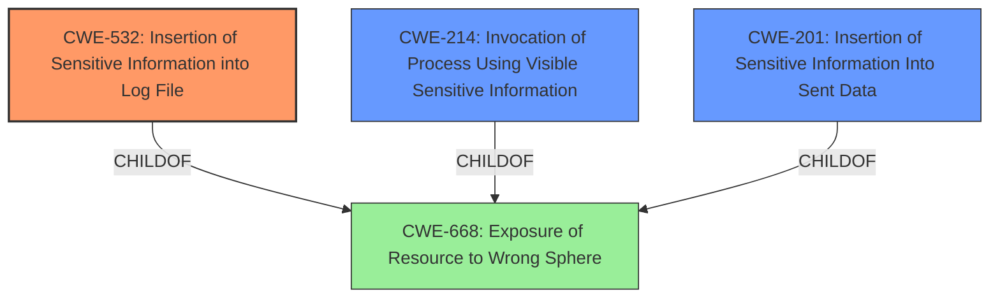

# Analysis for CVE-2021-3684

# Summary
| CWE ID | CWE Name | Confidence | CWE Abstraction Level | CWE Vulnerability Mapping Label | CWE-Vulnerability Mapping Notes |
|---|---|---|---|---|---|
| CWE-532 | Insertion of Sensitive Information into Log File | 1 | Base | Primary | Allowed |
| CWE-214 | Invocation of Process Using Visible Sensitive Information | 0.7 | Base | Secondary | Allowed |
| CWE-201 | Insertion of Sensitive Information Into Sent Data | 0.6 | Base | Secondary | Allowed |
| CWE-668 | Exposure of Resource to Wrong Sphere | 0.4 | Class | Secondary | Discouraged |

## Evidence and Confidence

*   **Confidence Score:** 0.8
*   **Evidence Strength:** HIGH

## Relationship Analysis
The primary weakness is the logging of sensitive information, represented by CWE-532. CWE-214 and CWE-201 are secondary considerations as they both relate to the broader issue of exposing sensitive data. CWE-668 is a high-level classification that encompasses the problem, but is discouraged.

## Vulnerability Chain
The vulnerability chain starts with the **improper generation of image pull secrets** and leads to the **insertion of these secrets into log files**, which ultimately results in the **exposure of sensitive information** to an authenticated user.

## Summary of Analysis
The primary CWE selected is CWE-532 because the vulnerability description and CVE summary explicitly state that the image pull secrets were leaked as plaintext in the installation logs. This aligns directly with CWE-532's description: "The product writes sensitive information to a log file." The evidence is strong, as the CVE summary emphasizes that the root cause was the **sensitive data exposure** due to the insertion of plaintext secrets into log files.

CWE-214 (Invocation of Process Using Visible Sensitive Information) was considered as a secondary CWE because the image pull secrets might have been visible as command-line arguments or environment variables during the generation of the Discovery ISO, but the primary issue was their presence in the logs.

CWE-201 (Insertion of Sensitive Information Into Sent Data) was also considered, as the log files could be viewed as data "sent" to an authenticated user. However, the primary issue is the **storage** of sensitive information in logs rather than the act of sending the data.

CWE-668 (Exposure of Resource to Wrong Sphere) was considered but is a high-level classification and discouraged.

I am confident in this assessment because it is directly supported by the provided evidence. The selection of CWE-532 is at the optimal level of specificity, as it clearly identifies the core weakness of the vulnerability.