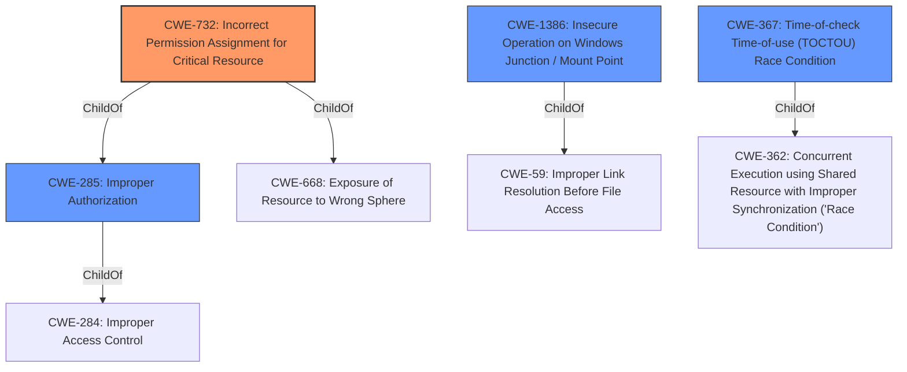

# Analysis Report for CVE-2021-36934

# Vulnerability Analysis Report: CVE-2021-36934

## Description


## Analysis (with Relationship Data)

# Summary
| CWE ID  | CWE Name                                                     | Confidence | CWE Abstraction Level | CWE Vulnerability Mapping Label | CWE-Vulnerability Mapping Notes |
| :-------- | :----------------------------------------------------------- | :--------- | :---------------------- | :------------------------------ | :------------------------------ |
| CWE-732   | Incorrect Permission Assignment for Critical Resource        | 0.9        | Class                   | Allowed-with-Review             | Primary CWE                     |
| CWE-285   | Improper Authorization                                       | 0.7        | Class                   | Discouraged                     | Secondary Candidate             |
| CWE-1386  | Insecure Operation on Windows Junction / Mount Point        | 0.6        | Base                    | Allowed                         | Secondary Candidate             |
| CWE-367   | Time-of-check Time-of-use (TOCTOU) Race Condition        | 0.5        | Base                    | Allowed                         | Secondary Candidate             |

## Evidence and Confidence

*   **Confidence Score:** 0.8
*   **Evidence Strength:** HIGH

## Relationship Analysis
The primary CWE is CWE-732, which is a Class-level CWE. It has parent relationships to CWE-285 and CWE-668.
CWE-285 is also a Class, with a parent relationship to CWE-284, and it can be refined to CWE-862 or CWE-863.
CWE-1386 and CWE-367 are Base-level CWEs. CWE-1386 is a child of CWE-59. CWE-367 is a child of CWE-362.



## Vulnerability Chain
The vulnerability chain starts with **overly permissive Access Control Lists (ACLs)**, leading to an elevation of privilege. The **incorrect permissions assigned to files** within the %windir%\\system32\\config directory allow unauthorized access. VSS shadow copies further exacerbate the issue. This leads to the impact of a local privilege escalation.
  - **Root Cause:** **Incorrect permissions assigned to files**
  - **Weakness:** **Overly permissive Access Control Lists (ACLs)**
  - **Impact:** Elevation of privilege

## Summary of Analysis
Based on the evidence provided, the primary weakness is **CWE-732: Incorrect Permission Assignment for Critical Resource**. This is supported by the vulnerability description stating "overly permissive Access Control Lists (ACLs)" and the CVE Reference Links Content Summary mentioning "Incorrect permissions assigned to files within the %windir%\\system32\\config directory." The vulnerability allows attackers to "run arbitrary code with SYSTEM privileges," indicating a critical resource is affected.

CWE-732 is a Class-level CWE, and the mapping guidance suggests reviewing its children for a better fit. However, none of the children seem to fit better than CWE-732 itself.
CWE-285: Improper Authorization was considered since incorrect permissions often relate to authorization issues. However, the core issue is with the assignment of permissions, making CWE-732 more appropriate.
CWE-1386: Insecure Operation on Windows Junction / Mount Point was considered because the VSS shadow copies could potentially be manipulated using junctions or mount points. However, the primary issue is not the manipulation of junctions, but the initial incorrect permission assignment.
CWE-367: Time-of-check Time-of-use (TOCTOU) Race Condition was considered, but the vulnerability doesn't explicitly involve a race condition between a check and use of a resource. The issue is with the static permission assignment.

The final decision to use CWE-732 is based on the clear evidence of incorrect permission assignments for critical system files, leading to privilege escalation. This aligns with the description and observed examples of CWE-732.

Relevant CWE Information:

# Enhanced Context (25 CWEs)
The following CWEs were identified as potentially relevant to this vulnerability:

## CWE-59: Improper Link Resolution Before File Access ('Link Following')
**Abstraction Level**: Base
**Similarity Score**: 0.77
**Source**: dense

**Description**:
The product attempts to access a file based on the filename, but it does not properly prevent that filename from identifying a link or shortcut that resolves to an unintended resource.

**Mapping Guidance**:
- Usage: Allowed
- Rationale: This CWE entry is at the Base level of abstraction, which is a preferred level of abstraction for mapping to the root causes of vulnerabilities.

## CWE-668: Exposure of Resource to Wrong Sphere
**Abstraction Level**: Class
**Similarity Score**: 0.77
**Source**: dense

**Description**:
The product exposes a resource to the wrong control sphere, providing unintended actors with inappropriate access to the resource.

**Mapping Guidance**:
- Usage: Discouraged
- Rationale: CWE-668 is high-level and is often misused as a catch-all when lower-level CWE IDs might be applicable. It is sometimes used for low-information vulnerability reports [REF-1287]. It is a level-1 Class (i.e., a child of a Pillar). It is not useful for trend analysis.

## CWE-274: Improper Handling of Insufficient Privileges
**Abstraction Level**: Base
**Similarity Score**: 0.77
**Source**: dense

**Description**:
The product does not handle or incorrectly handles when it has insufficient privileges to perform an operation, leading to resultant weaknesses.

**Mapping Guidance**:
- Usage: Discouraged
- Rationale: This CWE entry could be deprecated in a future version of CWE.

## CWE-266: Incorrect Privilege Assignment
**Abstraction Level**: Base
**Similarity Score**: 0.77
**Source**: dense

**Description**:
A product incorrectly assigns a privilege to a particular actor, creating an unintended sphere of control for that actor.

**Mapping Guidance**:
- Usage: Allowed
- Rationale: This CWE entry is at the Base level of abstraction, which is a preferred level of abstraction for mapping to the root causes of vulnerabilities.

## CWE-280: Improper Handling of Insufficient Permissions or Privileges
**Abstraction Level**: Base
**Similarity Score**: 0.76
**Source**: dense

**Description**:
The product does not handle or incorrectly handles when it has insufficient privileges to access resources or functionality as specified by their permissions. This may cause it to follow unexpected code paths that may leave the product in an invalid state.

**Mapping Guidance**:
- Usage: Allowed
- Rationale: This CWE entry is at the Base level of abstraction, which is a preferred level of abstraction for mapping to the root causes of vulnerabilities.

## CWE-807: Reliance on Untrusted Inputs in a Security Decision
**Abstraction Level**: Base
**Similarity Score**: 0.76
**Source**: dense

**Description**:
The product uses a protection mechanism that relies on the existence or values of an input, but the input can be modified by an untrusted actor in a way that bypasses the protection mechanism.

**Mapping Guidance**:
- Usage: Allowed
- Rationale: This CWE entry is at the Base level of abstraction, which is a preferred level of abstraction for mapping to the root causes of vulnerabilities.

## CWE-303: Incorrect Implementation of Authentication Algorithm
**Abstraction Level**: Base
**Similarity Score**: 0.76
**Source**: dense

**Description**:
The requirements for the product dictate the use of an established authentication algorithm, but the implementation of the algorithm is incorrect.

**Mapping Guidance**:
- Usage: Allowed
- Rationale: This CWE entry is at the Base level of abstraction, which is a preferred level of abstraction for mapping to the root causes of vulnerabilities.

## CWE-267: Privilege Defined


## CWE Relationship Analysis

Current CWEs represent these abstraction levels: .


### Vulnerability Chain Analysis

**Chain starting from CWE-862:**
- 862 (Missing Authorization) - ROOT


**Chain starting from CWE-362:**
- 362 (Concurrent Execution using Shared Resource with Improper Synchronization ('Race Condition')) - ROOT


### CWE Relationship Diagram

```mermaid
graph TD
    classDef primary fill:#f96,stroke:#333,stroke-width:2px
    classDef secondary fill:#69f,stroke:#333
    classDef tertiary fill:#9e9,stroke:#333
```


*Report generated on 2025-03-30 17:00:28*
