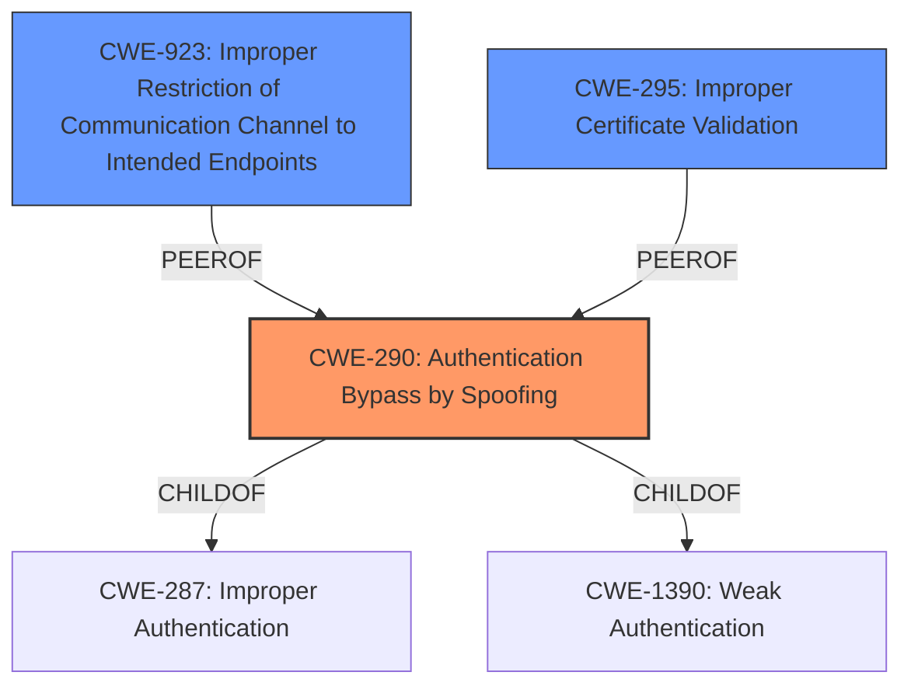

# Raw Analyzer Response for CVE-2021-36942

# Summary
| CWE ID  | CWE Name                                                     | Confidence | CWE Abstraction Level | CWE Vulnerability Mapping Label | CWE-Vulnerability Mapping Notes |
| :-------- | :----------------------------------------------------------- | :--------- | :---------------------- | :------------------------------ | :------------------------------ |
| CWE-290 | Authentication Bypass by Spoofing                          | 0.8        | Base                    | Primary                         | Allowed                         |
| CWE-923 | Improper Restriction of Communication Channel to Intended Endpoints | 0.6        | Class                   | Secondary                       | Allowed-with-Review             |
| CWE-295 | Improper Certificate Validation                            | 0.5        | Base                    | Secondary                       | Allowed                         |

## Evidence and Confidence

*   **Confidence Score:** 0.7
*   **Evidence Strength:** HIGH

## Relationship Analysis
The primary mapping is CWE-290 Authentication Bypass by Spoofing, which aligns with the **spoofing** weakness described. CWE-290 is a child of CWE-287 (Improper Authentication) and CWE-1390 (Weak Authentication). CWE-923 Improper Restriction of Communication Channel to Intended Endpoints is a related class-level CWE that highlights the communication channel aspect. CWE-295 Improper Certificate Validation is also related due to the certificate usage in the described attack.

## Vulnerability Chain
The vulnerability chain starts with the anonymous invocation of `EfsRpcOpenFileRaw`, leading to an NTLM authentication request. The NTLM request is then relayed to the AD CS, resulting in the issuance of a certificate that can be used to compromise the Active Directory.
  - **Root Cause:** Anonymous invocation of `EfsRpcOpenFileRaw` due to **lack of proper authentication/authorization.**
  - **Weakness:** NTLM relay vulnerability and **spoofing**.
  - **Impact:** Active Directory compromise.

## Summary of Analysis
The initial assessment identified a **spoofing** vulnerability in Windows LSA. The analysis of the CVE Reference Links Content Summary revealed that the root cause lies in the default behavior of Microsoft Windows Active Directory Certificate Services (AD CS), allowing NTLM relay attacks through the `EfsRpcOpenFileRaw` function. This function can be invoked anonymously, triggering an NTLM authentication request.

The primary CWE is CWE-290 Authentication Bypass by Spoofing, which directly addresses the **spoofing** aspect of the vulnerability. The evidence is that the **"Vulnerability Description Key Phrases"** lists **"weakness: Spoofing"**. The **"CVE Reference Links Content Summary"** indicates that the `EfsRpcOpenFileRaw` function can be invoked anonymously. This is a base-level CWE, which is the preferred level of abstraction.

CWE-923 Improper Restriction of Communication Channel to Intended Endpoints is included as a secondary CWE because the vulnerability involves a communication channel (EFSRPC) that is not properly restricted to intended endpoints. This aligns with the description of CWE-923. However, CWE-923 is a class-level CWE, so it is less specific than CWE-290. The **"CVE Reference Links Content Summary"** section indicates that the `EfsRpcOpenFileRaw` function can be invoked anonymously, bypassing authorization and authentication checks.

CWE-295 Improper Certificate Validation is included as another secondary CWE, because the attack involves obtaining a certificate from AD CS. The **"CVE Reference Links Content Summary"** mentions that by relaying an NTLM authentication request from a domain controller to AD CS, an attacker can obtain a certificate that can be used to get a Ticket Granting Ticket (TGT). This "Golden Ticket" attack can lead to full compromise of the Active Directory infrastructure. However, the core issue is not the certificate validation itself, but the **spoofing** that allows the attacker to obtain the certificate.

CWE-297 Improper Validation of Certificate with Host Mismatch was considered but not selected. While certificate validation is a part of the attack, the main issue is the **spoofing** that enables obtaining the certificate in the first place. The **"CVE Reference Links Content Summary"** section describes how the `EfsRpcOpenFileRaw` function can be invoked anonymously, triggering an NTLM authentication request. This is the root cause that enables the **spoofing** attack.

CWE-350 Reliance on Reverse DNS Resolution for a Security-Critical Action was also considered but not selected, as the vulnerability does not specifically involve reverse DNS resolution.

The selected CWEs are at the optimal level of specificity, with CWE-290 being the primary base-level CWE that accurately represents the **spoofing** aspect of the vulnerability.

Relevant CWE Information: