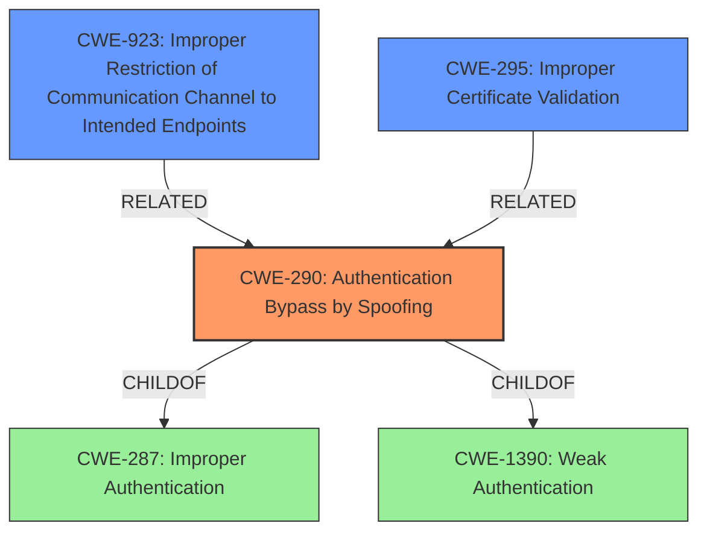

# Analysis Report for CVE-2021-36942

# Vulnerability Analysis Report: CVE-2021-36942

## Description


## Analysis (with Relationship Data)

# Summary
| CWE ID | CWE Name | Confidence | CWE Abstraction Level | CWE Vulnerability Mapping Label | CWE-Vulnerability Mapping Notes |
|---|---|---|---|---|---|
| CWE-290 | Authentication Bypass by Spoofing | 0.8 | Base | Primary | Allowed |
| CWE-923 | Improper Restriction of Communication Channel to Intended Endpoints | 0.6 | Class | Secondary | Allowed-with-Review |
| CWE-295 | Improper Certificate Validation | 0.5 | Base | Secondary | Allowed |

## Evidence and Confidence

*   **Confidence Score:** 0.8
*   **Evidence Strength:** HIGH

## Relationship Analysis
The primary CWE is CWE-290 Authentication Bypass by Spoofing, which is a base-level CWE and a child of CWE-287 (Improper Authentication) and CWE-1390 (Weak Authentication). The vulnerability involves **spoofing**, specifically related to NTLM relay attacks. CWE-923 (Improper Restriction of Communication Channel to Intended Endpoints) is considered because the EFSRPC interface is not properly restricted. CWE-295 (Improper Certificate Validation) is potentially relevant because the attack leads to obtaining certificates and can be related to certificate validation issues, though it's a less direct match.



## Vulnerability Chain
The chain of events for this vulnerability is as follows:
1.  **Root Cause:** **Lack of Proper Authentication/Authorization** in the `EfsRpcOpenFileRaw` function, allowing anonymous invocation. This is the fundamental **weakness** that allows the attack to proceed.
2.  **Vulnerability:** NTLM Relay Vulnerability due to the ability to relay NTLM authentication requests.
3.  **Exploitation:** Abuse of EFSRPC to trigger NTLM authentication.
4.  **Impact:** Active Directory Compromise, leading to full control of the domain.

The primary CWE, CWE-290, addresses the authentication bypass. The secondary CWEs, CWE-923 and CWE-295, cover the improper restriction of communication channels and improper certificate validation, respectively, which are consequences or contributing factors to the primary vulnerability.

## Summary of Analysis
The initial assessment focused on the **spoofing** aspect of the vulnerability, leading to the selection of CWE-290. The analysis of the CVE Reference Links Content Summary confirmed that the root cause involves a **lack of proper authentication/authorization**, allowing an attacker to relay NTLM authentication requests. This aligns well with the description of CWE-290 (Authentication Bypass by Spoofing). The graph relationships highlight the connection between authentication bypass and other related weaknesses, such as improper certificate validation (CWE-295) and improper restriction of communication channels (CWE-923).

The selection of CWE-290 is based on the following evidence:
*   "**Spoofing**" mentioned in the Vulnerability Description.
*   "Lack of Proper Authentication/Authorization" as the root cause in the CVE Reference Links Content Summary.
*   NTLM Relay Vulnerability, which is a form of authentication bypass.

The decision to include CWE-923 and CWE-295 as secondary CWEs is based on their relevance to the attack chain and their presence in the Retriever Results. While CWE-290 is the most direct match for the **spoofing** aspect, CWE-923 addresses the **weakness** in restricting the EFSRPC interface, and CWE-295 relates to the certificate-based impact of the attack.

The selected CWEs are at the optimal level of specificity because they accurately represent the root cause and contributing factors of the vulnerability. CWE-290 is a base-level CWE that directly addresses the authentication bypass, while CWE-923 and CWE-295 provide additional context regarding the improper restriction of communication channels and certificate validation issues.

Relevant CWE Information:

# Enhanced Context (25 CWEs)

## CWE-290: Authentication Bypass by Spoofing
**Abstraction:** Base
**Status:** Incomplete

### Description
This attack-focused weakness is caused by incorrectly implemented authentication schemes that are subject to spoofing attacks.

### Extended Description
Not provided

### Alternative Terms
None

### Relationships
ChildOf -> CWE-1390
ChildOf -> CWE-287

### Mapping Guidance
**Usage:** Allowed
**Rationale:** This CWE entry is at the Base level of abstraction, which is a preferred level of abstraction for mapping to the root causes of vulnerabilities.

## CWE-923: Improper Restriction of Communication Channel to Intended Endpoints
**Abstraction:** Class
**Status:** Draft

### Description
The product establishes a communication channel to (or from) an endpoint for privileged or protected operations, but it does not properly ensure that it is communicating with the correct endpoint.

### Extended Description
Not provided

### Alternative Terms
None

### Relationships
ParentOf -> CWE-291

### Mapping Guidance
**Usage:** Allowed-with-Review
**Rationale:** This CWE entry is a Class and might have Base-level children that would be more appropriate

## CWE-295: Improper Certificate Validation
**Abstraction:** Base
**Status:** Draft

### Description
The product does not validate, or incorrectly validates, a certificate.

### Extended Description
When a certificate is invalid or malicious, it might allow an attacker to spoof a trusted entity by interfering in the communication path between the host and client. The product might connect to a malicious host while believing it is a trusted host, or the product might be deceived into accepting spoofed data that appears to originate from a trusted host.

### Alternative Terms
None

### Relationships
ChildOf -> CWE-287

### Mapping Guidance
**Usage:** Allowed
**Rationale:** This CWE entry is at the Base level of abstraction, which is a preferred level of abstraction for mapping to the root causes of vulnerabilities.


## CWE Relationship Analysis

Current CWEs represent these abstraction levels: .


### Vulnerability Chain Analysis

**Chain starting from CWE-290:**
- 290 (Authentication Bypass by Spoofing) - ROOT


**Chain starting from CWE-923:**
- 923 (Improper Restriction of Communication Channel to Intended Endpoints) - ROOT


### CWE Relationship Diagram

```mermaid
graph TD
    classDef primary fill:#f96,stroke:#333,stroke-width:2px
    classDef secondary fill:#69f,stroke:#333
    classDef tertiary fill:#9e9,stroke:#333
```


*Report generated on 2025-03-31 05:05:13*
