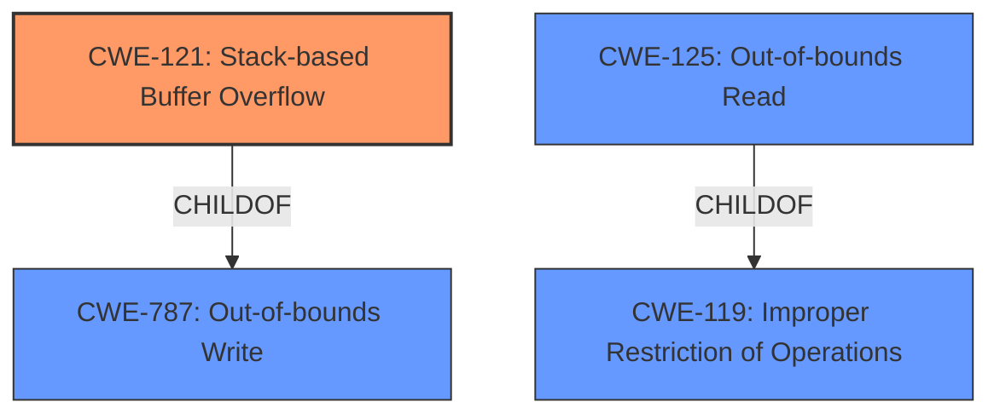

# Analysis Report for CVE-2021-37020

# Vulnerability Analysis Report: CVE-2021-37020

## Description


## Analysis (with Relationship Data)

# Summary
| CWE ID | CWE Name | Confidence | CWE Abstraction Level | CWE Vulnerability Mapping Label | CWE-Vulnerability Mapping Notes |
|---|---|---|---|---|---|
| CWE-121 | Stack-based Buffer Overflow | 1.0 | Variant | Primary | Allowed |
| CWE-125 | Out-of-bounds Read | 0.7 | Base | Secondary | Allowed |

## Evidence and Confidence

*   **Confidence Score:** 0.85
*   **Evidence Strength:** HIGH

## Relationship Analysis
The primary CWE is CWE-121, which is a `Variant` of CWE-787 (Out-of-bounds Write) and CWE-788. CWE-125 (Out-of-bounds Read) is a `Base` level CWE and a `ChildOf` CWE-119 (Improper Restriction of Operations within the Bounds of a Memory Buffer). The vulnerability description explicitly states a "stack-based buffer overflow" as the **weakness**, which is a more specific type of buffer overflow than a generic out-of-bounds write. The impact is stated as "out-of-bounds read". The chosen CWEs reflect the specific type of buffer overflow and its resulting impact.



## Vulnerability Chain
The vulnerability chain starts with the **stack-based buffer overflow** (**weakness**), leading to the impact of an out-of-bounds read.
- CWE-121: Stack-based Buffer Overflow (Root Cause)
- CWE-125: Out-of-bounds Read (Impact)

## Summary of Analysis
The initial assessment identified CWE-121 as the primary weakness due to the explicit mention of "stack-based buffer overflow" in the vulnerability description. The secondary weakness, CWE-125, was identified as the resulting impact. The retriever results and CWE specifications support this classification.

The vulnerability description key phrases clearly state the **weakness** as a "stack-based buffer overflow" and the "impact" as an out-of-bounds read. This information is directly used to select CWE-121 and CWE-125 respectively.

The graph relationships show that CWE-121 is a more specific type of out-of-bounds write, making it a better fit than the more general CWE-787. CWE-125 accurately represents the resulting out-of-bounds read. These selections are at the optimal level of specificity, as they directly correspond to the vulnerability's described **weakness** and impact.

Relevant CWE Information:

# Enhanced Context (25 CWEs)

## CWE-124: Buffer Underwrite ('Buffer Underflow')
**Abstraction Level**: Base
**Similarity Score**: 0.78
**Source**: dense
- *Reason for not selecting*: The vulnerability description doesn't talk about buffer underwrite. It talks about stack-based buffer overflow leading to out-of-bounds read.

## CWE-131: Incorrect Calculation of Buffer Size
**Abstraction Level**: Base
**Similarity Score**: 0.76
**Source**: dense
- *Reason for not selecting*: While incorrect buffer size calculation can lead to buffer overflows, the description doesn't mention this. It focuses on a stack-based overflow.

## CWE-191: Integer Underflow (Wrap or Wraparound)
**Abstraction Level**: Base
**Similarity Score**: 0.76
**Source**: dense
- *Reason for not selecting*: The description doesn't mention integer underflow.

## CWE-805: Buffer Access with Incorrect Length Value
**Abstraction Level**: Base
**Similarity Score**: 0.76
**Source**: dense
- *Reason for not selecting*: While potentially related, the description focuses on a stack-based overflow, not specifically an incorrect length value.

## CWE-680: Integer Overflow to Buffer Overflow
**Abstraction Level**: Compound
**Similarity Score**: 0.76
**Source**: dense
- *Reason for not selecting*: The description doesn't mention integer overflow as a root cause.

## CWE-126: Buffer Over-read
**Abstraction Level**: Variant
**Similarity Score**: 0.74
**Source**: dense
- *Reason for not selecting*: CWE-125 is more appropriate since the vulnerability description specifies Out-of-bounds Read.

## CWE-193: Off-by-one Error
**Abstraction Level**: Base
**Similarity Score**: 0.74
**Source**: dense
- *Reason for not selecting*: The description doesn't mention off-by-one errors.

## CWE-190: Integer Overflow or Wraparound
**Abstraction Level**: Base
**Similarity Score**: 0.74
**Source**: dense
- *Reason for not selecting*: The description doesn't mention integer overflow.

## CWE-127: Buffer Under-read
**Abstraction Level**: Variant
**Similarity Score**: 0.73
**Source**: dense
- *Reason for not selecting*: The description doesn't mention buffer under-read.

## CWE-125: Out-of-bounds Read
**Abstraction Level**: Base
**Similarity Score**: 0.73
**Source**: dense
- *Reason for selecting*: The impact of the stack-based buffer overflow is described as an Out-of-bounds Read, making this CWE relevant.

## CWE-190: Integer Overflow or Wraparound
**Abstraction Level**: Base
**Similarity Score**: 6551.47
**Source**: sparse
- *Reason for not selecting*: The description doesn't mention integer overflow.

## CWE-125: Out-of-bounds Read
**Abstraction Level**: Base
**Similarity Score**: 6107.82
**Source**: sparse
- *Reason for selecting*: The impact of the stack-based buffer overflow is described as an Out-of-bounds Read, making this CWE relevant.

## CWE-193: Off-by-one Error
**Abstraction Level**: Base
**Similarity Score**: 6076.35
**Source**: sparse
- *Reason for not selecting*: The description doesn't mention off-by-one errors.

## CWE-131: Incorrect Calculation of Buffer Size
**Abstraction Level**: Base
**Similarity Score**: 5881.64
**Source**: sparse
- *Reason for not selecting*: While incorrect buffer size calculation can lead to buffer overflows, the description doesn't mention this.

## CWE-1284: Improper Validation of Specified Quantity in Input
**Abstraction Level**: Base
**Similarity Score**: 5874.80
**Source**: sparse
- *Reason for not selecting*: The description doesn't mention improper validation of input quantity.

## CWE-128: Wrap-around Error
**Abstraction Level**: base
**Similarity Score**: 5.03
**Source**: graph
- *Reason for not selecting*: The description doesn't mention wrap-around errors.

## CWE-120: Buffer Copy without Checking Size of Input ('Classic Buffer Overflow')
**Abstraction Level**: base
**Similarity Score**: 4.82
**Source**: graph
- *Reason for not selecting*: CWE-121 is a more specific variant of buffer overflow (stack-based), so it's a better fit.

## CWE-195: Signed to Unsigned Conversion Error
**Abstraction Level**: variant
**Similarity Score**: 4.53
**Source**: graph
- *Reason for not selecting*: The description doesn't mention signed to unsigned conversion errors.

## CWE-123: Write-what-where Condition
**Abstraction Level**: base
**Similarity Score**: 4.33
**Source**: graph
- *Reason for not selecting*: While a potential consequence, the description doesn't explicitly mention a write-what-where condition.

## CWE-170: Improper Null Termination
**Abstraction Level**: base
**Similarity Score**: 4.33
**Source**: graph
- *Reason for not selecting*: The description doesn't mention improper null termination.

## CWE-1284: Improper Validation of Specified Quantity in Input
**Abstraction Level**: base
**Similarity Score**: 4.33
**Source**: graph
- *Reason for not selecting*: The description doesn't mention improper validation of input quantity.

## CWE-617: Reachable Assertion


## CWE Relationship Analysis

Current CWEs represent these abstraction levels: .


### Vulnerability Chain Analysis

**Chain starting from CWE-121:**
- 121 (Stack-based Buffer Overflow) - ROOT


**Chain starting from CWE-119:**
- 119 (Improper Restriction of Operations within the Bounds of a Memory Buffer) - ROOT


### CWE Relationship Diagram

```mermaid
graph TD
    classDef primary fill:#f96,stroke:#333,stroke-width:2px
    classDef secondary fill:#69f,stroke:#333
    classDef tertiary fill:#9e9,stroke:#333
```


*Report generated on 2025-03-31 08:32:49*
