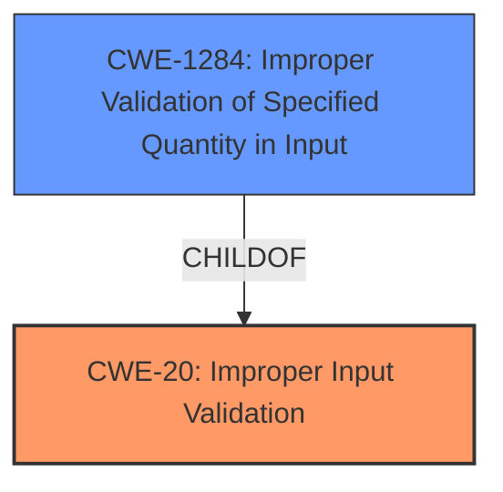

# Enhanced Analysis for CVE-2021-37094

# Summary
| CWE ID | CWE Name | Confidence | CWE Abstraction Level | CWE Vulnerability Mapping Label | CWE-Vulnerability Mapping Notes |
|---|---|---|---|---|---|
| CWE-20 | Improper Input Validation | 0.75 | Class | Primary | Discouraged |
| CWE-1284 | Improper Validation of Specified Quantity in Input | 0.65 | Base | Secondary | Allowed |

## Evidence and Confidence

*   **Confidence Score:** 0.7
*   **Evidence Strength:** MEDIUM

## Relationship Analysis
The primary relationship impacting the decision is that CWE-1284 is a ChildOf CWE-20. While CWE-1284 is more specific and preferred, the provided evidence is not strong enough to confirm that the improper input validation is specifically related to a "Specified Quantity". Thus, CWE-20 is chosen as the primary, with CWE-1284 as a possible secondary.



## Vulnerability Chain
The chain of events starts with **Improper Input Validation**, which leads to a system denial of service.

## Summary of Analysis
The initial analysis identified **Improper Input Validation** as the **rootcause** of the vulnerability, leading to a system denial of service. The Retriever Results also point to CWE-20 as the top candidate. However, CWE-20 is a Class-level CWE and is discouraged from being used. The other top matches are all Base-level CWEs. The vulnerability description key phrase is "**Improper Input Validation**", pointing to a validation issue.

The evidence is based on the "Vulnerability Description Key Phrases" which states the **rootcause** as "**Improper Input Validation**".

CWE-20 is chosen as the primary because the description explicitly mentions "**Improper Input Validation**". However, since CWE-20 is discouraged, a more specific CWE is desirable. CWE-1284 "Improper Validation of Specified Quantity in Input" is a child of CWE-20 and a good secondary candidate. Since the description lacks specific details about the type of input that is not being properly validated (e.g., quantity, index, type), a more precise mapping to a child CWE of CWE-20 is not possible with high confidence.

Relevant CWE Information:

# Enhanced Context (25 CWEs)

## CWE-20: Improper Input Validation
**Abstraction:** Class
**Status:** Stable

### Description
The product receives input or data, but it does
        not validate or incorrectly validates that the input has the
        properties that are required to process the data safely and
        correctly.

### Mapping Guidance
**Usage:** Discouraged

## CWE-1284: Improper Validation of Specified Quantity in Input
**Abstraction:** Base
**Status:** Incomplete

### Description
The product receives input that is expected to specify a quantity (such as size or length), but it does not validate or incorrectly validates that the quantity has the required properties.

### Mapping Guidance
**Usage:** Allowed
###
Here's an explanation of the selected CWEs:

*   **CWE-20: Improper Input Validation**
    *   **Technical Explanation:** The vulnerability description explicitly states "**Improper Input Validation**" as the **rootcause**. This aligns directly with the CWE-20 description, which covers scenarios where a product receives input but does not validate or incorrectly validates its properties.
    *   **Security Implications:** **Improper Input Validation** can lead to various security issues, including denial of service, code execution, or information disclosure. In this case, it leads to a system denial of service.
    *   **Relationship Analysis:** CWE-20 is a Class-level CWE. While it is a direct match to the description, it's generally preferred to use more specific Base or Variant-level CWEs when possible. However, the lack of specific details prevents a more precise mapping.
    *   **Mapping Guidance Influence:** The MITRE mapping guidance discourages the use of CWE-20 due to its broad nature and suggests considering more specific children. Despite this, CWE-20 is selected as the primary due to the direct mention of "**Improper Input Validation**" in the vulnerability description.
    *   **Confidence:** Confidence is 0.75 because while the description directly mentions **Improper Input Validation**, it lacks the specificity desired for a high-confidence mapping.
*   **CWE-1284: Improper Validation of Specified Quantity in Input**
    *   **Technical Explanation:** The vulnerability could be related to a missing or **incorrect** validation of a "Specified Quantity in Input". If the input is related to a quantity and is not validated, a denial of service could occur.
    *   **Security Implications:** If a quantity is not properly validated, an attacker could specify a malicious quantity (e.g., excessively large size), leading to resource exhaustion and denial of service.
    *   **Relationship Analysis:** CWE-1284 is a child of CWE-20, making it a more specific candidate.
    *   **Mapping Guidance Influence:** The MITRE mapping guidance allows the use of CWE-1284.
    *   **Confidence:** Confidence is 0.65 because there isn't explicit evidence that this vulnerability is related to a quantity.

CWEs considered but not used:

*   CWE-190, CWE-191, CWE-197, CWE-681, CWE-131, CWE-1289, CWE-680, CWE-682, CWE-606, CWE-129, CWE-789, CWE-839, CWE-41, CWE-843, CWE-22, CWE-770, CWE-73, CWE-1257, CWE-839, CWE-787, CWE-1287, CWE-125, CWE-248, CWE-1286, CWE-1285: These CWEs were considered, but they did not align as directly with the vulnerability description as CWE-20. There was insufficient evidence to support a more specific mapping to these CWEs.


## CWE Relationship Analysis

Current CWEs represent these abstraction levels: .


### Vulnerability Chain Analysis

**Chain starting from CWE-1257:**
- 1257 (Improper Access Control Applied to Mirrored or Aliased Memory Regions) - ROOT


**Chain starting from CWE-41:**
- 41 (Improper Resolution of Path Equivalence) - ROOT


### CWE Relationship Diagram

```mermaid
graph TD
    classDef primary fill:#f96,stroke:#333,stroke-width:2px
    classDef secondary fill:#69f,stroke:#333
    classDef tertiary fill:#9e9,stroke:#333
```