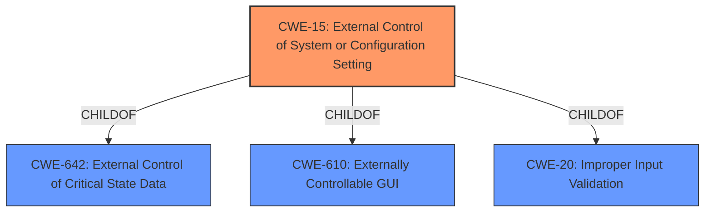

# Raw Analyzer Response for CVE-2021-37112

# Summary
| CWE ID | CWE Name | Confidence | CWE Abstraction Level | CWE Vulnerability Mapping Label | CWE-Vulnerability Mapping Notes |
|---|---|---|---|---|---|
| CWE-15 | External Control of System or Configuration Setting | 0.8 | Base | Allowed | Primary CWE |

## Evidence and Confidence

*   **Confidence Score:** 0.8
*   **Evidence Strength:** MEDIUM

## Relationship Analysis
The primary CWE, CWE-15, is a base-level CWE which is a child of CWE-642 (External Control of Critical State Data) and CWE-610 (Externally Controllable GUI). These relationships indicate a hierarchical structure where CWE-15 is a specific instance of a broader class of vulnerabilities. The choice of CWE-15 reflects the specific nature of the vulnerability related to system or configuration settings being externally controlled.

## Vulnerability Chain
The vulnerability chain involves **External Control of System or Configuration Setting** (CWE-15) which leads to Firmware leak, indicating a compromise in the system's integrity.

## Summary of Analysis
The initial analysis pointed towards CWE-15 (External Control of System or Configuration Setting) due to the vulnerability description explicitly mentioning "External Control of System or Configuration Setting". The key phrase from the vulnerability description supports this selection.

The vulnerability description states: "Hisuite module has a External Control of System or Configuration Setting vulnerability. Successful exploitation of this vulnerability may lead to Firmware leak."

The selection of CWE-15 is based on the explicit mention of "External Control of System or Configuration Setting" in the vulnerability description and the fact that CWE-15 is a base-level CWE, which is preferred for mapping.

Relevant CWE Information:
*   **CWE-15: External Control of System or Configuration Setting**
    *   **Description:** One or more system settings or configuration elements can be externally controlled by a user.
    *   **Mapping Guidance:** Usage: Allowed, Rationale: This CWE entry is at the Base level of abstraction, which is a preferred level of abstraction for mapping to the root causes of vulnerabilities.
    *   The vulnerability description explicitly mentions this weakness.

The retriever results also list CWE-15 as the top combined result from the sparse retriever, further supporting this choice.

I did not select CWE-200 since "Firmware Leak" is an impact and not a rootcause. CWE-284 and CWE-287 are too general.

The evidence provided supports the selection of CWE-15 as the primary CWE at the optimal level of specificity.