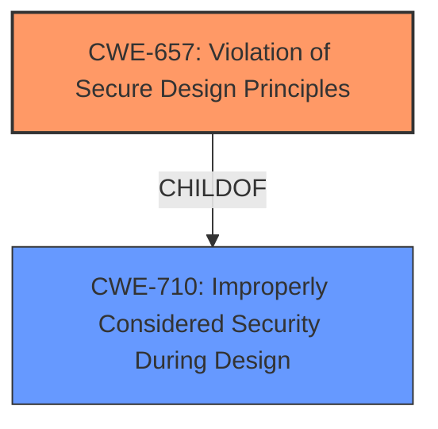

# Analysis for CVE-2021-37116

# Summary
| CWE ID | CWE Name | Confidence | CWE Abstraction Level | CWE Vulnerability Mapping Label | CWE-Vulnerability Mapping Notes |
|---|---|---|---|---|---|
| CWE-657 | Violation of Secure Design Principles | 0.8 | Class | Primary | Allowed-with-Review |

## Evidence and Confidence

*   **Confidence Score:** 0.8
*   **Evidence Strength:** MEDIUM

## Relationship Analysis
The primary CWE selected is CWE-657, which is a Class-level CWE. While it is generally preferable to choose Base or Variant level CWEs, the provided information does not offer sufficient detail to pinpoint a more specific weakness. CWE-657 is a child of CWE-710 (Improperly Considered Security During Design), indicating a high-level design flaw. No further relationships are evident from the vulnerability description.

## Vulnerability Chain
The chain of events is relatively simple:

1.  **Root Cause:** **Weaknesses Introduced During Design** (CWE-657)
2.  **Impact:** Change PIN of subscriber

## Summary of Analysis
The initial analysis focused on identifying the root cause of the vulnerability, which is described as "**Weaknesses Introduced During Design**". This directly aligns with CWE-657 (Violation of Secure Design Principles). The description of CWE-657 states: "The product violates well-established principles for secure design. This can introduce resultant weaknesses or make it easier for developers to introduce related weaknesses during implementation. Because code is centered around design, it can be resource-intensive to fix design problems."

The vulnerability description key phrases support this mapping as the **rootcause** is listed as "**Weaknesses Introduced During Design**". The "Retriever Results" also lists CWE-657 as the top combined result.

CWE-657 is a Class-level CWE, and the mapping guidance suggests examining its children for a better fit. However, the provided vulnerability description lacks the specificity needed to select a more detailed CWE. Therefore, CWE-657 is the most appropriate choice given the available information.

The final selection is based on the direct evidence of "**Weaknesses Introduced During Design**" and the corresponding definition of CWE-657. The graph relationships confirm that CWE-657 is a general category of design flaws, which aligns with the high-level nature of the vulnerability description.

Relevant CWE Information:

# Enhanced Context (25 CWEs)
The following CWEs were identified as potentially relevant to this vulnerability:

## CWE-657: Violation of Secure Design Principles
**Abstraction Level**: Class
**Similarity Score**: 0.79
**Source**: dense

**Description**:
The product violates well-established principles for secure design.

**Mapping Guidance**:
- Usage: Discouraged
- Rationale: This CWE entry is a level-1 Class (i.e., a child of a Pillar). It might have lower-level children that would be more appropriate

## CWE-1251: Mirrored Regions with Different Values
**Abstraction Level**: Base
**Similarity Score**: 6672.21
**Source**: sparse

**Description**:
The product's architecture mirrors regions without ensuring that their contents always stay in sync.

**Mapping Guidance**:
- Usage: Allowed
- Rationale: This CWE entry is at the Base level of abstraction, which is a preferred level of abstraction for mapping to the root causes of vulnerabilities.

## CWE-1222: Insufficient Granularity of Address Regions Protected by Register Locks
**Abstraction Level**: Variant
**Similarity Score**: 0.152
**Source**: sparse

**Description**:
The product defines a large address region protected from modification by the same register lock control bit. This results in a conflict between the functional requirement that some addresses need to be writable by software during operation and the security requirement that the system configuration lock bit must be set during the boot process.

**Mapping Guidance**:
- Usage: Allowed
- Rationale: This CWE entry is at the Variant level of abstraction, which is a preferred level of abstraction for mapping to the root causes of vulnerabilities.

## CWE-1221: Incorrect Register Defaults or Module Parameters
**Abstraction Level**: Base
**Similarity Score**: 0.146
**Source**: sparse

**Description**:
Hardware description language code incorrectly defines register defaults or hardware Intellectual Property (IP) parameters to insecure values.

**Mapping Guidance**:
- Usage: Allowed
- Rationale: This CWE entry is at the Base level of abstraction, which is a preferred level of abstraction for mapping to the root causes of vulnerabilities.

## CWE-456: Missing Initialization of a Variable
**Abstraction Level**: Variant
**Similarity Score**: 0.146
**Source**: sparse

**Description**:
The product does not initialize critical variables, which causes the execution environment to use unexpected values.

**Mapping Guidance**:
- Usage: Allowed
- Rationale: This CWE entry is at the Variant level of abstraction, which is a preferred level of abstraction for mapping to the root causes of vulnerabilities.

## CWE-1299: Missing Protection Mechanism for Alternate Hardware Interface
**Abstraction Level**: Base
**Similarity Score**: 0.594
**Source**: dense

**Description**:
The lack of protections on alternate paths to access
                control-protected assets (such as unprotected shadow registers
                and other external facing unguarded interfaces) allows an
                attacker to bypass existing protections to the asset that are
		only performed against the primary path.

**Mapping Guidance**:
- Usage: Allowed
- Rationale: This CWE entry is at the Base level of abstraction, which is a preferred level of abstraction for mapping to the root causes of vulnerabilities.

## CWE-120: Buffer Copy without Checking Size of Input ('Classic Buffer Overflow')
**Abstraction Level**: Base
**Similarity Score**: 0.002
**Source**: graph

**Description**:
The product copies an input buffer to an output buffer without verifying that the size of the input buffer is less than the size of the output buffer, leading to a buffer overflow.

**Mapping Guidance**:
- Usage: Allowed-with-Review
- Rationale: There are some indications that this CWE ID might be misused and selected simply because it mentions "buffer overflow" - an increasingly vague term. This CWE entry is only appropriate for "Buffer Copy" operations (not buffer reads), in which where there is no "Checking [the] Size of Input", and (by implication of the copy) writing past the end of the buffer.

## CWE-636: Not Failing Securely ('Failing Open')
**Abstraction Level**: Class
**Similarity Score**: 0.143
**Source**: sparse

**Description**:
When the product encounters an error condition or failure, its design requires it to fall back to a state that is less secure than other options that are available, such as selecting the weakest encryption algorithm or using the most permissive access control restrictions.

**Mapping Guidance**:
- Usage: Allowed-with-Review
- Rationale: This CWE entry is a Class and might have Base-level children that would be more appropriate

## CWE-833: Deadlock
**Abstraction Level**: Base
**Similarity Score**: 0.143
**Source**: sparse

**Description**:
The product contains multiple threads or executable segments that are waiting for each other to release a necessary lock, resulting in deadlock.

**Mapping Guidance**:
- Usage: Allowed
- Rationale: This CWE entry is at the Base level of abstraction, which is a preferred level of abstraction for mapping to the root causes of vulnerabilities.

## CWE-287: Improper Authentication
**Abstraction Level**: Class
**Similarity Score**: 0.142
**Source**: sparse

**Description**:
When an actor claims to have a given identity, the product does not prove or insufficiently proves that the claim is correct.

**Mapping Guidance**:
- Usage: Discouraged
- Rationale: This CWE entry might be misused when lower-level CWE entries are likely to be applicable. It is a level-1 Class (i.e., a child of a Pillar).

### CWEs Considered But Not Used:
*   CWE-1251, CWE-1222, CWE-1221, CWE-456, CWE-1299, CWE-120, CWE-636, CWE-833, CWE-287: These were considered but not chosen because the vulnerability description is too generic, and the provided description did not have the specific context to use these more specific CWEs.