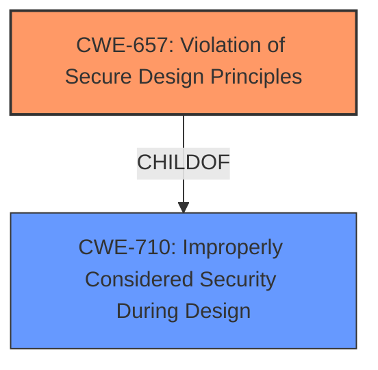

# Analysis for CVE-2021-37116

# Summary
| CWE ID | CWE Name | Confidence | CWE Abstraction Level | CWE Vulnerability Mapping Label | CWE-Vulnerability Mapping Notes |
|---|---|---|---|---|---|
| CWE-657 | Violation of Secure Design Principles | 0.8 | Class | Primary | Allowed-with-Review |

## Evidence and Confidence

*   **Confidence Score:** 0.8
*   **Evidence Strength:** MEDIUM

## Relationship Analysis
The primary CWE selected is CWE-657, which is a Class-level CWE. While it is generally preferable to choose Base or Variant level CWEs, the provided information does not offer sufficient detail to pinpoint a more specific weakness. CWE-657 is a child of CWE-710 (Improperly Considered Security During Design), indicating a high-level design flaw. No further relationships are evident from the vulnerability description.

## Vulnerability Chain
The chain of events is relatively simple:

1.  **Root Cause:** **Weaknesses Introduced During Design** (CWE-657)
2.  **Impact:** Change PIN of subscriber

## Summary of Analysis
The initial analysis focused on identifying the root cause of the vulnerability, which is described as "**Weaknesses Introduced During Design**". This directly aligns with CWE-657 (Violation of Secure Design Principles). The description of CWE-657 states: "The product violates well-established principles for secure design. This can introduce resultant weaknesses or make it easier for developers to introduce related weaknesses during implementation. Because code is centered around design, it can be resource-intensive to fix design problems."

The vulnerability description key phrases support this mapping as the **rootcause** is listed as "**Weaknesses Introduced During Design**". The "Retriever Results" also lists CWE-657 as the top combined result.

CWE-657 is a Class-level CWE, and the mapping guidance suggests examining its children for a better fit. However, the provided vulnerability description lacks the specificity needed to select a more detailed CWE. Therefore, CWE-657 is the most appropriate choice given the available information.

The final selection is based on the direct evidence of "**Weaknesses Introduced During Design**" and the corresponding definition of CWE-657. The graph relationships confirm that CWE-657 is a general category of design flaws, which aligns with the high-level nature of the vulnerability description.

Relevant CWE Information:

# Enhanced Context (25 CWEs)
The following CWEs were identified as potentially relevant to this vulnerability:

## CWE-657: Violation of Secure Design Principles
**Abstraction Level**: Class
**Similarity Score**: 0.79
**Source**: dense

**Description**:
The product violates well-established principles for secure design.

**Mapping Guidance**:
- Usage: Discouraged
- Rationale: This CWE entry is a level-1 Class (i.e., a child of a Pillar). It might have lower-level children that would be more appropriate

## CWE-1251: Mirrored Regions with Different Values
**Abstraction Level**: Base
**Similarity Score**: 6672.21
**Source**: sparse

**Description**:
The product's architecture mirrors regions without ensuring that their contents always stay in sync.

**Mapping Guidance**:
- Usage: Allowed
- Rationale: This CWE entry is at the Base level of abstraction, which is a preferred level of abstraction for mapping to the root causes of vulnerabilities.

## CWE-1222: Insufficient Granularity of Address Regions Protected by Register Locks
**Abstraction Level**: Variant
**Similarity Score**: 0.152
**Source**: sparse

**Description**:
The product defines a large address region protected from modification by the same register lock control bit. This results in a conflict between the functional requirement that some addresses need to be writable by software during operation and the security requirement that the system configuration lock bit must be set during the boot process.

**Mapping Guidance**:
- Usage: Allowed
- Rationale: This CWE entry is at the Variant level of abstraction, which is a preferred level of abstraction for mapping to the root causes of vulnerabilities.

## CWE-1221: Incorrect Register Defaults or Module Parameters
**Abstraction Level**: Base
**Similarity Score**: 0.146
**Source**: sparse

**Description**:
Hardware description language code incorrectly defines register defaults or hardware Intellectual Property (IP) parameters to insecure values.

**Mapping Guidance**:
- Usage: Allowed
- Rationale: This CWE entry is at the Base level of abstraction, which is a preferred level of abstraction for mapping to the root causes of vulnerabilities.

## CWE-456: Missing Initialization of a Variable
**Abstraction Level**: Variant
**Similarity Score**: 0.146
**Source**: sparse

**Description**:
The product does not initialize critical variables, which causes the execution environment to use unexpected values.

**Mapping Guidance**:
- Usage: Allowed
- Rationale: This CWE entry is at the Variant level of abstraction, which is a preferred level of abstraction for mapping to the root causes of vulnerabilities.

## CWE-1299: Missing Protection Mechanism for Alternate Hardware Interface
**Abstraction Level**: Base
**Similarity Score**: 0.594
**Source**: dense

**Description**:
The lack of protections on alternate paths to access
                control-protected assets (such as unprotected shadow registers
                and other external facing unguarded interfaces) allows an
                attacker to bypass existing protections to the asset that are
		only performed against the primary path.

**Mapping Guidance**:
- Usage: Allowed
- Rationale: This CWE entry is at the Base level of abstraction, which is a preferred level of abstraction for mapping to the root causes of vulnerabilities.

## CWE-120: Buffer Copy without Checking Size of Input ('Classic Buffer Overflow')
**Abstraction Level**: Base
**Similarity Score**: 0.002
**Source**: graph

**Description**:
The product copies an input buffer to an output buffer without verifying that the size of the input buffer is less than the size of the output buffer, leading to a buffer overflow.

**Mapping Guidance**:
- Usage: Allowed-with-Review
- Rationale: There are some indications that this CWE ID might be misused and selected simply because it mentions "buffer overflow" - an increasingly vague term. This CWE entry is only appropriate for "Buffer Copy" operations (not buffer reads), in which where there is no "Checking [the] Size of Input", and (by implication of the copy) writing past the end of the buffer.

## CWE-636: Not Failing Securely ('Failing Open')
**Abstraction Level**: Class
**Similarity Score**: 0.143
**Source**: sparse

**Description**:
When the product encounters an error condition or failure, its design requires it to fall back to a state that is less secure than other options that are available, such as selecting the weakest encryption algorithm or using the most permissive access control restrictions.

**Mapping Guidance**:
- Usage: Allowed-with-Review
- Rationale: This CWE entry is a Class and might have Base-level children that would be more appropriate

## CWE-833: Deadlock
**Abstraction Level**: Base
**Similarity Score**: 0.143
**Source**: sparse

**Description**:
The product contains multiple threads or executable segments that are waiting for each other to release a necessary lock, resulting in deadlock.

**Mapping Guidance**:
- Usage: Allowed
- Rationale: This CWE entry is at the Base level of abstraction, which is a preferred level of abstraction for mapping to the root causes of vulnerabilities.

## CWE-287: Improper Authentication
**Abstraction Level**: Class
**Similarity Score**: 0.142
**Source**: sparse

**Description**:
When an actor claims to have a given identity, the product does not prove or insufficiently proves that the claim is correct.

**Mapping Guidance**:
- Usage: Discouraged
- Rationale: This CWE entry might be misused when lower-level CWE entries are likely to be applicable. It is a level-1 Class (i.e., a child of a Pillar).

### CWEs Considered But Not Used:
*   CWE-1251, CWE-1222, CWE-1221, CWE-456, CWE-1299, CWE-120, CWE-636, CWE-833, CWE-287: These were considered but not chosen because the vulnerability description is too generic, and the provided description did not have the specific context to use these more specific CWEs.

# Enhanced Query for CVE-2021-37116

## Vulnerability Description
PCManager has a **Weaknesses Introduced During Design** vulnerability .Successful exploitation of this vulnerability may cause that the PIN of the subscriber is changed.

### Vulnerability Description Key Phrases
- **rootcause:** **Weaknesses Introduced During Design**
- **impact:** change PIN of subscriber
- **product:** PCManager

## Retriever Results

### Top Combined Results

| Rank | CWE ID | Name | Abstraction | Usage  | Retrievers | Individual Scores |
|------|--------|------|-------------|-------|------------|-------------------|
| 1 | 657 | Violation of Secure Design Principles | Class | Discouraged | sparse | 0.166 |
| 2 | 1251 | Mirrored Regions with Different Values | Base | Allowed | sparse | 0.154 |
| 3 | 1222 | Insufficient Granularity of Address Regions Protected by Register Locks | Variant | Allowed | sparse | 0.152 |
| 4 | 1221 | Incorrect Register Defaults or Module Parameters | Base | Allowed | sparse | 0.146 |
| 5 | 456 | Missing Initialization of a Variable | Variant | Allowed | sparse | 0.146 |
| 6 | 1299 | Missing Protection Mechanism for Alternate Hardware Interface | Base | Allowed | dense | 0.594 |
| 7 | 120 | Buffer Copy without Checking Size of Input ('Classic Buffer Overflow') | Base | Allowed-with-Review | graph | 0.002 |
| 8 | 636 | Not Failing Securely ('Failing Open') | Class | Allowed-with-Review | sparse | 0.143 |
| 9 | 833 | Deadlock | Base | Allowed | sparse | 0.143 |
| 10 | 287 | Improper Authentication | Class | Discouraged | sparse | 0.142 |

# Complete CWE Specifications

## CWE-657: Violation of Secure Design Principles
**Abstraction:** Class
**Status:** Draft

### Description
The product violates well-established principles for secure design.

### Extended Description
This can introduce resultant weaknesses or make it easier for developers to introduce related weaknesses during implementation. Because code is centered around design, it can be resource-intensive to fix design problems.

### Alternative Terms
None

### Relationships
ChildOf -> CWE-710

### Mapping Guidance
**Usage:** Discouraged
**Rationale:** This CWE entry is a level-1 Class (i.e., a child of a Pillar). It might have lower-level children that would be more appropriate
**Comments:** Examine children of this entry to see if there is a better fit
**Reasons:**
- Abstraction

### Additional Notes
**[Maintenance]** The Taxonomy_Mappings to ISA/IEC 62443 were added in CWE 4.10, but they are still under review and might change in future CWE versions. These draft mappings were performed by members of the "Mapping CWE to 62443" subgroup of the CWE-CAPEC ICS/OT Special Interest Group (SIG), and their work is incomplete as of CWE 4.10. The mappings are included to facilitate discussion and review by the broader ICS/OT community, and they are likely to change in future CWE versions.

### Observed Examples
- **CVE-2019-6260:** Baseboard Management Controller (BMC) device implements Advanced High-performance Bus (AHB) bridges that do not require authentication for arbitrary read and write access to the BMC's physical address space from the host, and possibly the network [REF-1138].
- **CVE-2007-5277:** The failure of connection attempts in a web browser resets DNS pin restrictions. An attacker can then bypass the same origin policy by rebinding a domain name to a different IP address. This was an attempt to "fail functional."
- **CVE-2006-7142:** Hard-coded cryptographic key stored in executable program.

## CWE-1251: Mirrored Regions with Different Values
**Abstraction:** Base
**Status:** Incomplete

### Description
The product's architecture mirrors regions without ensuring that their contents always stay in sync.

### Extended Description

Having mirrored regions with different values might result in the exposure of sensitive information or possibly system compromise.

In the interest of increased performance, one might need to duplicate a resource. A cache memory is a common example of this concept, which keeps a "local" copy of a data element in the high speed cache memory. Unfortunately, this speed improvement comes with a downside, since the product needs to ensure that the local copy always mirrors the original copy truthfully. If they get out of sync, the computational result is no longer true.

During hardware design, memory is not the only item which gets mirrored. There are many other entities that get mirrored, as well: registers, memory regions, and, in some cases, even whole computational units. For example, within a multi-core processor, if all memory accesses for each and every core goes through a single Memory-Management Unit (MMU) then the MMU will become a performance bottleneck. In such cases, duplicating local MMUs that will serve only a subset of the cores rather than all of them may resolve the performance issue. These local copies are also called "shadow copies" or "mirrored copies."

If the original resource never changed, local duplicate copies getting out of sync would never be an issue. However, the values of the original copy will sometimes change. When the original copy changes, the mirrored copies must also change, and change fast.

This situation of shadow-copy-possibly-out-of-sync-with-original-copy might occur as a result of multiple scenarios, including the following: 

  - After the values in the original copy change, due to some reason the original copy does not send the "update" request to its shadow copies.

  - After the values in the original copy change, the original copy dutifully sends the "update" request to its shadow copies, but due to some reason the shadow copy does not "execute" this update request.

  - After the values in the original copy change, the original copy sends the "update" request to its shadow copies, and the shadow copy executes this update request faithfully. However, during the small time period when the original copy has "new" values and the shadow copy is still holding the "old" values, an attacker can exploit the old values. Then it becomes a race condition between the attacker and the update process of who can reach the target, shadow copy first, and, if the attacker reaches first, the attacker wins.

  - The attacker might send a "spoofed" update request to the target shadow copy, pretending that this update request is coming from the original copy. This spoofed request might cause the targeted shadow copy to update its values to some attacker-friendly values, while the original copies remain unchanged by the attacker.

  - Suppose a situation where the original copy has a system of reverting back to its original value if it does not hear back from all the shadow copies that such copies have successfully completed the update request. In such a case, an attack might occur as follows: (1) the original copy might send an update request; (2) the shadow copy updates it; (3) the shadow copy sends back the successful completion message; (4) through a separate issue, the attacker is able to intercept the shadow copy's completion message. In this case, the original copy thinks that the update did not succeed, hence it reverts to its original value. Now there is a situation where the original copy has the "old" value, and the shadow copy has the "new" value.

### Alternative Terms
None

### Relationships
ChildOf -> CWE-1250

### Mapping Guidance
**Usage:** Allowed
**Rationale:** This CWE entry is at the Base level of abstraction, which is a preferred level of abstraction for mapping to the root causes of vulnerabilities.
**Comments:** Carefully read both the name and description to ensure that this mapping is an appropriate fit. Do not try to 'force' a mapping to a lower-level Base/Variant simply to comply with this preferred level of abstraction.
**Reasons:**
- Acceptable-Use

### Additional Notes
**[Research Gap]** Issues related to state and cache - creation, preservation, and update - are a significant gap in CWE that is expected to be addressed in future versions. It has relationships to concurrency and synchronization, incorrect behavior order, and other areas that already have some coverage in CWE, although the focus has typically been on independent processes on the same operating system - not on independent systems that are all a part of a larger system-of-systems.

## CWE-1222: Insufficient Granularity of Address Regions Protected by Register Locks
**Abstraction:** Variant
**Status:** Incomplete

### Description
The product defines a large address region protected from modification by the same register lock control bit. This results in a conflict between the functional requirement that some addresses need to be writable by software during operation and the security requirement that the system configuration lock bit must be set during the boot process.

### Extended Description

Integrated circuits and hardware IPs can expose the device configuration controls that need to be programmed after device power reset by a trusted firmware or software module (commonly set by BIOS/bootloader) and then locked from any further modification. In hardware design, this is commonly implemented using a programmable lock bit which enables/disables writing to a protected set of registers or address regions. When the programmable lock bit is set, the relevant address region can be implemented as a hardcoded value in hardware logic that cannot be changed later.

A problem can arise wherein the protected region definition is not granular enough. After the programmable lock bit has been set, then this new functionality cannot be implemented without change to the hardware design.

### Alternative Terms
None

### Relationships
ChildOf -> CWE-1220

### Mapping Guidance
**Usage:** Allowed
**Rationale:** This CWE entry is at the Variant level of abstraction, which is a preferred level of abstraction for mapping to the root causes of vulnerabilities.
**Comments:** Carefully read both the name and description to ensure that this mapping is an appropriate fit. Do not try to 'force' a mapping to a lower-level Base/Variant simply to comply with this preferred level of abstraction.
**Reasons:**
- Acceptable-Use

## CWE-1221: Incorrect Register Defaults or Module Parameters
**Abstraction:** Base
**Status:** Incomplete

### Description
Hardware description language code incorrectly defines register defaults or hardware Intellectual Property (IP) parameters to insecure values.

### Extended Description

Integrated circuits and hardware IP software programmable controls and settings are commonly stored in register circuits. These register contents have to be initialized at hardware reset to defined default values that are hard coded in the hardware description language (HDL) code of the hardware unit. Hardware descriptive languages also support definition of parameter variables, which can be defined in code during instantiation of the hardware IP module. Such parameters are generally used to configure a specific instance of a hardware IP in the design.

The system security settings of a hardware design can be affected by incorrectly defined default values or IP parameters. The hardware IP would be in an insecure state at power reset, and this can be exposed or exploited by untrusted software running on the system. Both register defaults and parameters are hardcoded values, which cannot be changed using software or firmware patches but must be changed in hardware silicon. Thus, such security issues are considerably more difficult to address later in the lifecycle. Hardware designs can have a large number of such parameters and register defaults settings, and it is important to have design tool support to check these settings in an automated way and be able to identify which settings are security sensitive.

### Alternative Terms
None

### Relationships
ChildOf -> CWE-1419

### Mapping Guidance
**Usage:** Allowed
**Rationale:** This CWE entry is at the Base level of abstraction, which is a preferred level of abstraction for mapping to the root causes of vulnerabilities.
**Comments:** Carefully read both the name and description to ensure that this mapping is an appropriate fit. Do not try to 'force' a mapping to a lower-level Base/Variant simply to comply with this preferred level of abstraction.
**Reasons:**
- Acceptable-Use

## CWE-456: Missing Initialization of a Variable
**Abstraction:** Variant
**Status:** Draft

### Description
The product does not initialize critical variables, which causes the execution environment to use unexpected values.

### Extended Description
Not provided

### Alternative Terms
None

### Relationships
ChildOf -> CWE-909
ChildOf -> CWE-665
ChildOf -> CWE-665
CanPrecede -> CWE-89
CanPrecede -> CWE-120
CanPrecede -> CWE-98
CanPrecede -> CWE-457

### Mapping Guidance
**Usage:** Allowed
**Rationale:** This CWE entry is at the Variant level of abstraction, which is a preferred level of abstraction for mapping to the root causes of vulnerabilities.
**Comments:** Carefully read both the name and description to ensure that this mapping is an appropriate fit. Do not try to 'force' a mapping to a lower-level Base/Variant simply to comply with this preferred level of abstraction.
**Reasons:**
- Acceptable-Use

### Additional Notes
**[Relationship]** This weakness is a major factor in a number of resultant weaknesses, especially in web applications that allow global variable initialization (such as PHP) with libraries that can be directly requested.

**[Research Gap]** It is highly likely that a large number of resultant weaknesses have missing initialization as a primary factor, but researcher reports generally do not provide this level of detail.

### Observed Examples
- **CVE-2020-6078:** Chain: The return value of a function returning a pointer is not checked for success (CWE-252) resulting in the later use of an uninitialized variable (CWE-456) and a null pointer dereference (CWE-476)
- **CVE-2009-2692:** Chain: Use of an unimplemented network socket operation pointing to an uninitialized handler function (CWE-456) causes a crash because of a null pointer dereference (CWE-476).
- **CVE-2020-20739:** A variable that has its value set in a conditional statement is sometimes used when the conditional fails, sometimes causing data leakage

## CWE-1299: Missing Protection Mechanism for Alternate Hardware Interface
**Abstraction:** Base
**Status:** Draft

### Description
The lack of protections on alternate paths to access
                control-protected assets (such as unprotected shadow registers
                and other external facing unguarded interfaces) allows an
                attacker to bypass existing protections to the asset that are
		only performed against the primary path.

### Extended Description

An asset inside a chip might have access-control protections through one interface. However, if all paths to the asset are not protected, an attacker might compromise the asset through alternate paths. These alternate paths could be through shadow or mirror registers inside the IP core, or could be paths from other external-facing interfaces to the IP core or SoC.

Consider an SoC with various interfaces such as UART, SMBUS, PCIe, USB, etc. If access control is implemented for SoC internal registers only over the PCIe interface, then an attacker could still modify the SoC internal registers through alternate paths by coming through interfaces such as UART, SMBUS, USB, etc. 

Alternatively, attackers might be able to bypass existing protections by exploiting unprotected, shadow registers. Shadow registers and mirror registers typically refer to registers that can be accessed from multiple addresses. Writing to or reading from the aliased/mirrored address has the same effect as writing to the address of the main register. They are typically implemented within an IP core or SoC to temporarily hold certain data. These data will later be updated to the main register, and both registers will be in synch. If the shadow registers are not access-protected, attackers could simply initiate transactions to the shadow registers and compromise system security. 

### Alternative Terms
None

### Relationships
PeerOf -> CWE-1191
ChildOf -> CWE-420
ChildOf -> CWE-288

### Mapping Guidance
**Usage:** Allowed
**Rationale:** This CWE entry is at the Base level of abstraction, which is a preferred level of abstraction for mapping to the root causes of vulnerabilities.
**Comments:** Carefully read both the name and description to ensure that this mapping is an appropriate fit. Do not try to 'force' a mapping to a lower-level Base/Variant simply to comply with this preferred level of abstraction.
**Reasons:**
- Acceptable-Use

### Observed Examples
- **CVE-2022-38399:** Missing protection mechanism on serial connection allows for arbitrary OS command execution.
- **CVE-2020-9285:** Mini-PCI Express slot does not restrict direct memory access.
- **CVE-2020-8004:** When the internal flash is protected by blocking access on the Data Bus (DBUS), it can still be indirectly accessed through the Instruction Bus (IBUS).

## CWE-120: Buffer Copy without Checking Size of Input ('Classic Buffer Overflow')
**Abstraction:** Base
**Status:** Incomplete

### Description
The product copies an input buffer to an output buffer without verifying that the size of the input buffer is less than the size of the output buffer, leading to a buffer overflow.

### Extended Description
A buffer overflow condition exists when a product attempts to put more data in a buffer than it can hold, or when it attempts to put data in a memory area outside of the boundaries of a buffer. The simplest type of error, and the most common cause of buffer overflows, is the "classic" case in which the product copies the buffer without restricting how much is copied. Other variants exist, but the existence of a classic overflow strongly suggests that the programmer is not considering even the most basic of security protections.

### Alternative Terms
Classic Buffer Overflow: This term was frequently used by vulnerability researchers during approximately 1995 to 2005 to differentiate buffer copies without length checks (which had been known about for decades) from other emerging weaknesses that still involved invalid accesses of buffers, as vulnerability researchers began to develop advanced exploitation techniques.
Unbounded Transfer

### Relationships
ChildOf -> CWE-119
ChildOf -> CWE-119
ChildOf -> CWE-119
ChildOf -> CWE-119
CanPrecede -> CWE-123
ChildOf -> CWE-20

### Mapping Guidance
**Usage:** Allowed-with-Review
**Rationale:** There are some indications that this CWE ID might be misused and selected simply because it mentions "buffer overflow" - an increasingly vague term. This CWE entry is only appropriate for "Buffer Copy" operations (not buffer reads), in which where there is no "Checking [the] Size of Input", and (by implication of the copy) writing past the end of the buffer.
**Comments:** If the vulnerability being analyzed involves out-of-bounds reads, then consider CWE-125 or descendants. For root cause analysis: if there is any input validation, consider children of CWE-20 such as CWE-1284. If there is a calculation error for buffer sizes, consider CWE-131 or similar.
**Reasons:**
- Frequent Misuse

### Additional Notes
**[Relationship]** At the code level, stack-based and heap-based overflows do not differ significantly, so there usually is not a need to distinguish them. From the attacker perspective, they can be quite different, since different techniques are required to exploit them.

**[Terminology]** Many issues that are now called "buffer overflows" are substantively different than the "classic" overflow, including entirely different bug types that rely on overflow exploit techniques, such as integer signedness errors, integer overflows, and format string bugs. This imprecise terminology can make it difficult to determine which variant is being reported.

### Observed Examples
- **CVE-2000-1094:** buffer overflow using command with long argument
- **CVE-1999-0046:** buffer overflow in local program using long environment variable
- **CVE-2002-1337:** buffer overflow in comment characters, when product increments a counter for a ">" but does not decrement for "<"

## CWE-636: Not Failing Securely ('Failing Open')
**Abstraction:** Class
**Status:** Draft

### Description
When the product encounters an error condition or failure, its design requires it to fall back to a state that is less secure than other options that are available, such as selecting the weakest encryption algorithm or using the most permissive access control restrictions.

### Extended Description
By entering a less secure state, the product inherits the weaknesses associated with that state, making it easier to compromise. At the least, it causes administrators to have a false sense of security. This weakness typically occurs as a result of wanting to "fail functional" to minimize administration and support costs, instead of "failing safe."

### Alternative Terms
Failing Open

### Relationships
ChildOf -> CWE-657
ChildOf -> CWE-755
PeerOf -> CWE-280

### Mapping Guidance
**Usage:** Allowed-with-Review
**Rationale:** This CWE entry is a Class and might have Base-level children that would be more appropriate
**Comments:** Examine children of this entry to see if there is a better fit
**Reasons:**
- Abstraction

### Additional Notes
**[Research Gap]** Since design issues are hard to fix, they are rarely publicly reported, so there are few CVE examples of this problem as of January 2008. Most publicly reported issues occur as the result of an implementation error instead of design, such as CVE-2005-3177 (Improper handling of large numbers of resources) or CVE-2005-2969 (inadvertently disabling a verification step, leading to selection of a weaker protocol).

### Observed Examples
- **CVE-2007-5277:** The failure of connection attempts in a web browser resets DNS pin restrictions. An attacker can then bypass the same origin policy by rebinding a domain name to a different IP address. This was an attempt to "fail functional."
- **CVE-2006-4407:** Incorrect prioritization leads to the selection of a weaker cipher. Although it is not known whether this issue occurred in implementation or design, it is feasible that a poorly designed algorithm could be a factor.

## CWE-833: Deadlock
**Abstraction:** Base
**Status:** Incomplete

### Description
The product contains multiple threads or executable segments that are waiting for each other to release a necessary lock, resulting in deadlock.

### Extended Description
Not provided

### Alternative Terms
None

### Relationships
ChildOf -> CWE-667
ChildOf -> CWE-662

### Mapping Guidance
**Usage:** Allowed
**Rationale:** This CWE entry is at the Base level of abstraction, which is a preferred level of abstraction for mapping to the root causes of vulnerabilities.
**Comments:** Carefully read both the name and description to ensure that this mapping is an appropriate fit. Do not try to 'force' a mapping to a lower-level Base/Variant simply to comply with this preferred level of abstraction.
**Reasons:**
- Acceptable-Use

### Observed Examples
- **CVE-1999-1476:** A bug in some Intel Pentium processors allow DoS (hang) via an invalid "CMPXCHG8B" instruction, causing a deadlock
- **CVE-2009-2857:** OS deadlock
- **CVE-2009-1961:** OS deadlock involving 3 separate functions

## CWE-287: Improper Authentication
**Abstraction:** Class
**Status:** Draft

### Description
When an actor claims to have a given identity, the product does not prove or insufficiently proves that the claim is correct.

### Extended Description
Not provided

### Alternative Terms
authentification: An alternate term is "authentification", which appears to be most commonly used by people from non-English-speaking countries.
AuthN: "AuthN" is typically used as an abbreviation of "authentication" within the web application security community. It is also distinct from "AuthZ," which is an abbreviation of "authorization." The use of "Auth" as an abbreviation is discouraged, since it could be used for either authentication or authorization.
AuthC: "AuthC" is used as an abbreviation of "authentication," but it appears to used less frequently than "AuthN."

### Relationships
ChildOf -> CWE-284
ChildOf -> CWE-284

### Mapping Guidance
**Usage:** Discouraged
**Rationale:** This CWE entry might be misused when lower-level CWE entries are likely to be applicable. It is a level-1 Class (i.e., a child of a Pillar).
**Comments:** Consider children or descendants, beginning with CWE-1390: Weak Authentication or CWE-306: Missing Authentication for Critical Function.
**Reasons:**
- Frequent Misuse
**Suggested Alternatives:**
- CWE-1390: Weak Authentication
- CWE-306: Missing Authentication for Critical Function

### Additional Notes
**[Relationship]** This can be resultant from SQL injection vulnerabilities and other issues.

**[Maintenance]** The Taxonomy_Mappings to ISA/IEC 62443 were added in CWE 4.10, but they are still under review and might change in future CWE versions. These draft mappings were performed by members of the "Mapping CWE to 62443" subgroup of the CWE-CAPEC ICS/OT Special Interest Group (SIG), and their work is incomplete as of CWE 4.10. The mappings are included to facilitate discussion and review by the broader ICS/OT community, and they are likely to change in future CWE versions.

### Observed Examples
- **CVE-2022-35248:** Chat application skips validation when Central Authentication Service (CAS) is enabled, effectively removing the second factor from two-factor authentication
- **CVE-2022-36436:** Python-based authentication proxy does not enforce password authentication during the initial handshake, allowing the client to bypass authentication by specifying a 'None' authentication type.
- **CVE-2022-30034:** Chain: Web UI for a Python RPC framework does not use regex anchors to validate user login emails (CWE-777), potentially allowing bypass of OAuth (CWE-1390).

