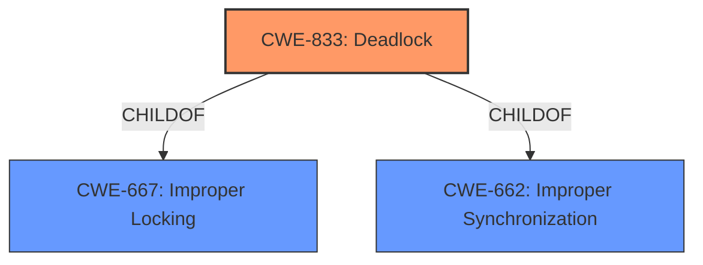

# Analysis Report for CVE-2021-3735

# Vulnerability Analysis Report: CVE-2021-3735

## Description


## Analysis (with Relationship Data)

# Summary
| CWE ID | CWE Name | Confidence | CWE Abstraction Level | CWE Vulnerability Mapping Label | CWE-Vulnerability Mapping Notes |
|---|---|---|---|---|---|
| CWE-833 | Deadlock | 1.0 | Base | Allowed | Primary CWE |

## Evidence and Confidence

*   **Confidence Score:** 1.0
*   **Evidence Strength:** HIGH

## Relationship Analysis
The primary relationship influencing the choice of CWE-833 is its base level of abstraction, which is preferred. CWE-833 is a child of CWE-667 (Improper Locking) and CWE-662 (Improper Synchronization), but since the vulnerability description specifically mentions a **deadlock**, CWE-833 is a more precise and appropriate choice than its parent classes.



## Vulnerability Chain
The vulnerability chain starts with the AHCI controller device receiving a host-to-device Register FIS packet from the guest, followed by a software reset (ahci_reset_port) which triggers the **deadlock** condition, ultimately leading to a denial of service (DoS).

## Summary of Analysis
The initial analysis strongly points to CWE-833 (**Deadlock**) as the primary CWE due to the explicit mention of a **deadlock** condition in the vulnerability description and CVE reference summary.

The vulnerability description states: "A **deadlock** issue was found in the AHCI controller device of QEMU. It occurs on a software reset (ahci_reset_port) while handling a host-to-device Register FIS (Frame Information Structure) packet from the guest. A privileged user inside the guest could use this flaw to hang the QEMU process on the host, resulting in a denial of service condition."

The CVE Reference Links Content Summary reinforces this: "The vulnerability is due to a **deadlock** in the AHCI controller device within QEMU during a software reset (ahci_reset_port) while processing a host-to-device Register FIS packet from the guest."

The graph relationships also confirm that **Deadlock** (CWE-833) is a more specific child of Improper Locking (CWE-667) and Improper Synchronization (CWE-662). Since the vulnerability is clearly a **deadlock**, choosing the base CWE-833 is optimal.

Relevant CWE Information:

# Enhanced Context (25 CWEs)
The following CWEs were identified as potentially relevant to this vulnerability:

## CWE-667: Improper Locking
**Abstraction Level**: Class
**Similarity Score**: 0.82
**Source**: dense

**Description**:
The product does not properly acquire or release a lock on a resource, leading to unexpected resource state changes and behaviors.

**Mapping Guidance**:
- Usage: Allowed-with-Review
- Rationale: This CWE entry is a Class and might have Base-level children that would be more appropriate

## CWE-662: Improper Synchronization
**Abstraction Level**: Class
**Similarity Score**: 0.81
**Source**: dense

**Description**:
The product utilizes multiple threads or processes to allow temporary access to a shared resource that can only be exclusive to one process at a time, but it does not properly synchronize these actions, which might cause simultaneous accesses of this resource by multiple threads or processes.

**Mapping Guidance**:
- Usage: Discouraged
- Rationale: This CWE entry is a level-1 Class (i.e., a child of a Pillar). It might have lower-level children that would be more appropriate

## CWE-833: Deadlock
**Abstraction Level**: Base
**Similarity Score**: 0.76
**Source**: dense

**Description**:
The product contains multiple threads or executable segments that are waiting for each other to release a necessary lock, resulting in deadlock.

**Mapping Guidance**:
- Usage: Allowed
- Rationale: This CWE entry is at the Base level of abstraction, which is a preferred level of abstraction for mapping to the root causes of vulnerabilities.

## CWE-362: Concurrent Execution using Shared Resource with Improper Synchronization ('Race Condition')
**Abstraction Level**: Class
**Similarity Score**: 0.76
**Source**: dense

**Description**:
The product contains a concurrent code sequence that requires temporary, exclusive access to a shared resource, but a timing window exists in which the shared resource can be modified by another code sequence operating concurrently.

**Mapping Guidance**:
- Usage: Allowed-with-Review
- Rationale: This CWE entry is a Class and might have Base-level children that would be more appropriate

## CWE-119: Improper Restriction of Operations within the Bounds of a Memory Buffer
**Abstraction Level**: Class
**Similarity Score**: 5712.11
**Source**: sparse

**Description**:
The product performs operations on a memory buffer, but it reads from or writes to a memory location outside the buffer's intended boundary. This may result in read or write operations on unexpected memory locations that could be linked to other variables, data structures, or internal program data.

**Mapping Guidance**:
- Usage: Discouraged
- Rationale: CWE-119 is commonly misused in low-information vulnerability reports when lower-level CWEs could be used instead, or when more details about the vulnerability are available.

### Considered but not used:
*   CWE-667 (Improper Locking) and CWE-662 (Improper Synchronization) - While related to concurrency issues, these are classes and the description specifically mentions a **deadlock**, making CWE-833 a better fit.
*   CWE-362 (Concurrent Execution using Shared Resource with Improper Synchronization ('Race Condition')) - While race conditions can lead to deadlocks, the description explicitly states a **deadlock**, making CWE-833 more accurate.
*   CWE-119 (Improper Restriction of Operations within the Bounds of a Memory Buffer), CWE-787 (Out-of-bounds Write), CWE-125 (Out-of-bounds Read), CWE-824 (Access of Uninitialized Pointer) - These CWEs relate to memory management issues, which are not the primary cause of this vulnerability.
*   CWE-835 (Loop with Unreachable Exit Condition ('Infinite Loop')) - While a **deadlock** can cause a hang, the root cause is not an infinite loop but the waiting for resources.
*   CWE-1256 (Improper Restriction of Software Interfaces to Hardware Features) - While this involves hardware features, the core issue is a **deadlock** during a software reset, not the improper restriction of interfaces.
*   CWE-909 (Missing Initialization of Resource) - This is not about missing initialization, but about a **deadlock** condition.


## CWE Relationship Analysis

Current CWEs represent these abstraction levels: .


### Vulnerability Chain Analysis

**Chain starting from CWE-833:**
- 833 (Deadlock) - ROOT


**Chain starting from CWE-835:**
- 835 (Loop with Unreachable Exit Condition ('Infinite Loop')) - ROOT


### CWE Relationship Diagram

```mermaid
graph TD
    classDef primary fill:#f96,stroke:#333,stroke-width:2px
    classDef secondary fill:#69f,stroke:#333
    classDef tertiary fill:#9e9,stroke:#333
```


*Report generated on 2025-03-30 17:22:57*
