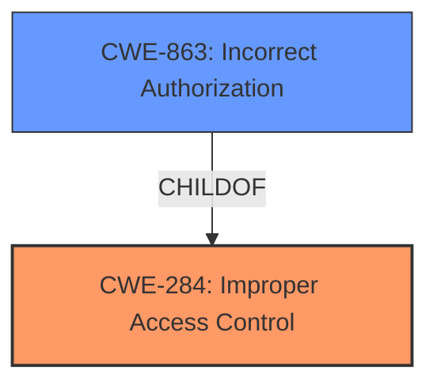

# Raw Analyzer Response for CVE-2021-37409

# Summary
| CWE ID   | CWE Name                                                | Confidence | CWE Abstraction Level | CWE Vulnerability Mapping Label | CWE-Vulnerability Mapping Notes |
| :-------- | :------------------------------------------------------ | :--------- | :-------------------- | :------------------------------ | :------------------------------ |
| CWE-284   | Improper Access Control                                 | 0.75       | Pillar                | Allowed                       | Primary CWE                     |
| CWE-863 | Incorrect Authorization | 0.5 | Class | Allowed-with-Review | Secondary Candidate |

## Evidence and Confidence

*   **Confidence Score:** 0.75
*   **Evidence Strength:** MEDIUM

## Relationship Analysis
The primary CWE selected is CWE-284, which is a Pillar-level CWE. There are several more specific CWEs that are children or descendants of this CWE that could be considered. CWE-863 is a child of CWE-284 and is also a Class level of abstraction.

## Vulnerability Chain
The vulnerability chain starts with **improper access control**, leading to a potential escalation of privilege.

## Summary of Analysis
The initial assessment identified **improper access control** as the root cause, leading to potential privilege escalation. The primary CWE match from the description is CWE-NVD-Other. However, the description itself includes "**Improper access control**" which suggests CWE-284. The summary of the CVE reference links also states, "**Root cause of vulnerability:** **Improper access control** in some Intel PROSet/Wireless WiFi and Killer WiFi products."

CWE-284 is a Pillar level CWE, and the mapping guidance suggests that it is discouraged. The comments suggest more specific CWEs such as CWE-863: Incorrect Authorization. Based on the description, it isn't clear if the access control mechanism is missing or incorrectly implemented. It's mentioned that a privileged user can enable escalation of privilege via local access. Since the user is privileged, it is likely the authorization check is incorrect, therefore CWE-863 may be a better fit.

However, without more information, the decision is to stay with the higher level CWE-284, as the evidence is not strong enough to move to the more specific CWE-863. This is based on the evidence provided only.

Relevant CWE Information:

# Enhanced Context (25 CWEs)
The following CWEs were identified as potentially relevant to this vulnerability:

## CWE-691: Insufficient Control Flow Management
**Abstraction Level**: Pillar
**Similarity Score**: 0.78

## CWE-693: Protection Mechanism Failure
**Abstraction Level**: Pillar
**Similarity Score**: 0.77

## CWE-703: Improper Check or Handling of Exceptional Conditions
**Abstraction Level**: Pillar
**Similarity Score**: 0.76

## CWE-664: Improper Control of a Resource Through its Lifetime
**Abstraction Level**: Pillar
**Similarity Score**: 0.76

## CWE-274: Improper Handling of Insufficient Privileges
**Abstraction Level**: Base
**Similarity Score**: 0.76

## CWE-653: Improper Isolation or Compartmentalization
**Abstraction Level**: Class
**Similarity Score**: 0.75

## CWE-667: Improper Locking
**Abstraction Level**: Class
**Similarity Score**: 0.75

## CWE-1220: Insufficient Granularity of Access Control
**Abstraction Level**: Base
**Similarity Score**: 0.75

## CWE-404: Improper Resource Shutdown or Release
**Abstraction Level**: Class
**Similarity Score**: 0.74

## CWE-280: Improper Handling of Insufficient Permissions or Privileges
**Abstraction Level**: Base
**Similarity Score**: 0.74

## CWE-119: Improper Restriction of Operations within the Bounds of a Memory Buffer
**Abstraction Level**: Class
**Similarity Score**: 5362.97

## CWE-1256: Improper Restriction of Software Interfaces to Hardware Features
**Abstraction Level**: Base
**Similarity Score**: 5267.05

## CWE-125: Out-of-bounds Read
**Abstraction Level**: Base
**Similarity Score**: 5093.85

## CWE-863: Incorrect Authorization
**Abstraction Level**: Class
**Similarity Score**: 5091.56

## CWE-1284: Improper Validation of Specified Quantity in Input
**Abstraction Level**: Base
**Similarity Score**: 5050.31

## CWE-193: Off-by-one Error
**Abstraction Level**: base
**Similarity Score**: 4.33

## CWE-125: Out-of-bounds Read
**Abstraction Level**: base
**Similarity Score**: 4.33

## CWE-787: Out-of-bounds Write
**Abstraction Level**: base
**Similarity Score**: 4.33

## CWE-822: Untrusted Pointer Dereference
**Abstraction Level**: base
**Similarity Score**: 4.33

## CWE-781: Improper Address Validation in IOCTL with METHOD_NEITHER I/O Control Code
**Abstraction Level**: variant
**Similarity Score**: 3.88

## CWE-322: Key Exchange without Entity Authentication
**Abstraction Level**: base
**Similarity Score**: 3.57

## CWE-1284: Improper Validation of Specified Quantity in Input
**Abstraction Level**: base
**Similarity Score**: 3.42

## CWE-1257: Improper Access Control Applied to Mirrored or Aliased Memory Regions
**Abstraction Level**: base
**Similarity Score**: 2.87

## CWE-1260: Improper Handling of Overlap Between Protected Memory Ranges
**Abstraction Level**: base
**Similarity Score**: 2.87

## CWE-825: Expired Pointer Dereference
**Abstraction Level**: base
**Similarity Score**: 2.87