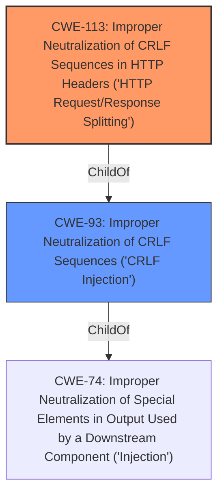

# Raw Analyzer Response for CVE-2021-37499

# Summary
| CWE ID | CWE Name | Confidence | CWE Abstraction Level | CWE Vulnerability Mapping Label | CWE-Vulnerability Mapping Notes |
|---|---|---|---|---|---|
| CWE-113 | Improper Neutralization of CRLF Sequences in HTTP Headers ('HTTP Request/Response Splitting') | 1.0 | Variant | Allowed | Primary CWE |
| CWE-93 | Improper Neutralization of CRLF Sequences ('CRLF Injection') | 0.75 | Base | Allowed | Secondary Candidate |

## Evidence and Confidence

*   **Confidence Score:** 0.9
*   **Evidence Strength:** HIGH

## Relationship Analysis
The primary relationship influencing the decision is the ChildOf relationship between CWE-113 and CWE-93. CWE-113 is a more specific variant of CWE-93, focusing on CRLF injection within HTTP headers, which directly matches the vulnerability description. The analysis also considered the suggested mappings and abstraction levels, opting for the most specific and appropriate variant.

## Vulnerability Chain
The vulnerability chain starts with the **improper input sanitization** of the password parameter, leading to **CRLF injection**, which allows for arbitrary HTTP header injection and potentially further exploitation like HTTP response splitting or session hijacking.

## Summary of Analysis
The initial analysis identified a **CRLF injection** vulnerability due to **improper input sanitization** in the RLM web interface, allowing remote attackers to inject arbitrary HTTP headers.

The primary CWE selected is CWE-113, "Improper Neutralization of CRLF Sequences in HTTP Headers ('HTTP Request/Response Splitting')." This is based on the vulnerability description explicitly mentioning **CRLF injection** leading to arbitrary HTTP header injection. The "CVE Reference Links Content Summary" section clearly states: "The core vulnerability is a CRLF injection flaw. This allows an attacker to insert CRLF characters (%0d%0a or \r\n) into HTTP headers." This directly aligns with the CWE-113 description, which focuses on improper neutralization of CRLF sequences specifically within HTTP headers. The selection of CWE-113 is further supported by its Variant abstraction level, which is preferred for specific vulnerabilities.

CWE-93, "Improper Neutralization of CRLF Sequences ('CRLF Injection')" was considered as it represents the general class of **CRLF injection** vulnerabilities. However, CWE-113 was preferred due to its specificity to HTTP headers, providing a more precise representation of the vulnerability. While CWE-93 is a parent of CWE-113, the evidence strongly supports the more specific variant.

Other CWEs considered but not used:
* CWE-79, "Improper Neutralization of Input During Web Page Generation ('Cross-site Scripting')" - While HTTP response splitting *could* lead to XSS, this is not the direct vulnerability.
* CWE-78, "Improper Neutralization of Special Elements used in an OS Command ('OS Command Injection')" - This is not relevant as the injection occurs in HTTP headers, not OS commands.
* CWE-74, "Improper Neutralization of Special Elements in Output Used by a Downstream Component ('Injection')" is a class-level CWE and not specific enough.

The selected CWEs are at the optimal level of specificity, providing a clear and accurate representation of the vulnerability based on the provided evidence.