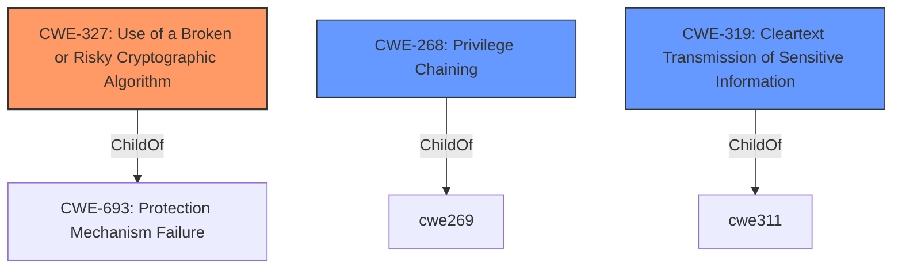

# Analysis Report for CVE-2021-37588

# Vulnerability Analysis Report: CVE-2021-37588

## Description


## Analysis (with Relationship Data)

# Summary
| CWE ID  | CWE Name                                                 | Confidence | CWE Abstraction Level | CWE Vulnerability Mapping Label | CWE-Vulnerability Mapping Notes |
| :-------- | :------------------------------------------------------- | :--------- | :-------------------- | :------------------------------ | :-------------------------------- |
| CWE-327 | Use of a Broken or Risky Cryptographic Algorithm       | 0.9        | Class                 | Primary CWE                    | Allowed-with-Review               |
| CWE-268 | Privilege Chaining                                     | 0.6        | Base                  | Secondary Candidate            | Allowed                           |
| CWE-319 | Cleartext Transmission of Sensitive Information       | 0.5        | Base                  | Secondary Candidate            | Allowed                           |

## Evidence and Confidence

*   **Confidence Score:** 0.8
*   **Evidence Strength:** HIGH

## Relationship Analysis
The primary CWE selected is CWE-327, which is a Class-level CWE. While it's generally preferred to select Base or Variant level CWEs, the evidence strongly suggests a fundamental flaw in the cryptographic algorithms used. CWE-327's description directly matches this scenario.

CWE-268 (Privilege Chaining) is considered because the vulnerability involves two users colluding to decrypt data, effectively chaining their privileges to achieve an unauthorized outcome. However, this is secondary to the core issue of the **broken cryptography**.

CWE-319 (Cleartext Transmission of Sensitive Information) is considered because the ultimate impact is the decryption of sensitive data, implying it could potentially be transmitted or stored in a vulnerable state. This is less directly supported by the evidence, as the primary issue is the decryption itself.



## Vulnerability Chain
The vulnerability chain starts with the **use of broken ABE schemes** (DAC-MACS, MA-ABE-YJ14, and YCT14) in the Charm library. This leads to the ability for attackers to decrypt ciphertext without proper keys. The involvement of two users could be seen as a privilege chaining aspect.

Flawed Design/Implementation -> **Broken Cryptographic Algorithm** (CWE-327) -> Decryption of Data -> Potential Exposure (CWE-319)

## Summary of Analysis
The initial analysis focused on identifying the root cause of the vulnerability. The evidence from the "CVE Reference Links Content Summary" clearly states that the root cause is the **flawed design of several ABE schemes**. The fact that these schemes are vulnerable to decryption attacks indicates a fundamental flaw in their cryptographic construction.

The selection of CWE-327 is heavily based on the following evidence:

*   "**Broken ABE Schemes:** The identified schemes (DAC-MACS, MA-ABE-YJ14, and YCT14) are vulnerable to decryption attacks. This indicates flaws in their cryptographic constructions."
*   "**Incorrect Transformations:** The attacks on multi-authority ABE schemes highlight errors made during the transformation of single-authority schemes into multi-authority ones."
*   "**Implementation flaws:** The implementation of the flawed schemes in the CHARM library makes them vulnerable to the identified attacks."

CWE-327, "Use of a Broken or Risky Cryptographic Algorithm", directly addresses this root cause. The CWE description states: "The product uses a broken or risky cryptographic algorithm or protocol." This aligns perfectly with the vulnerability description.

The graph relationships influenced the selection by highlighting the parent-child relationship between CWE-327 and CWE-693 (Protection Mechanism Failure), reinforcing that the vulnerability is due to a failure in the cryptographic protection mechanism.

The selected CWE is at the optimal level of specificity because it directly identifies the use of flawed cryptographic algorithms as the root cause. While other CWEs like CWE-319 (Cleartext Transmission) or CWE-268 (Privilege Chaining) could be considered, they represent secondary aspects or potential impacts rather than the core weakness.

Relevant CWE Information:

# Enhanced Context (25 CWEs)

## CWE-327: Use of a Broken or Risky Cryptographic Algorithm
**Abstraction Level**: Class
**Similarity Score**: 6500.24
**Source**: sparse

**Description**:
The product uses a broken or risky cryptographic algorithm or protocol.

**Mapping Guidance**:
- Usage: Allowed-with-Review
- Rationale: This CWE entry is a Class and might have Base-level children that would be more appropriate

## CWE-268: Privilege Chaining
**Abstraction Level**: Base
**Similarity Score**: 0.444
**Source**: dense

**Description**:
Two distinct privileges, roles, capabilities, or rights can be combined in a way that allows an entity to perform unsafe actions that would not be allowed without that combination.

**Mapping Guidance**:
- Usage: Allowed
- Rationale: This CWE entry is at the Base level of abstraction, which is a preferred level of abstraction for mapping to the root causes of vulnerabilities.

## CWE-319: Cleartext Transmission of Sensitive Information
**Abstraction Level**: Base
**Similarity Score**: 6210.27
**Source**: sparse

**Description**:
The product transmits sensitive or security-critical data in cleartext in a communication channel that can be sniffed by unauthorized actors.

**Mapping Guidance**:
- Usage: Allowed
- Rationale: This CWE entry is at the Base level of abstraction, which is a preferred level of abstraction for mapping to the root causes of vulnerabilities.


## CWE Relationship Analysis

Current CWEs represent these abstraction levels: .


### Vulnerability Chain Analysis

**Chain starting from CWE-327:**
- 327 (Use of a Broken or Risky Cryptographic Algorithm) - ROOT


**Chain starting from CWE-319:**
- 319 (Cleartext Transmission of Sensitive Information) - ROOT


### CWE Relationship Diagram

```mermaid
graph TD
    classDef primary fill:#f96,stroke:#333,stroke-width:2px
    classDef secondary fill:#69f,stroke:#333
    classDef tertiary fill:#9e9,stroke:#333
```


*Report generated on 2025-03-31 05:29:51*
