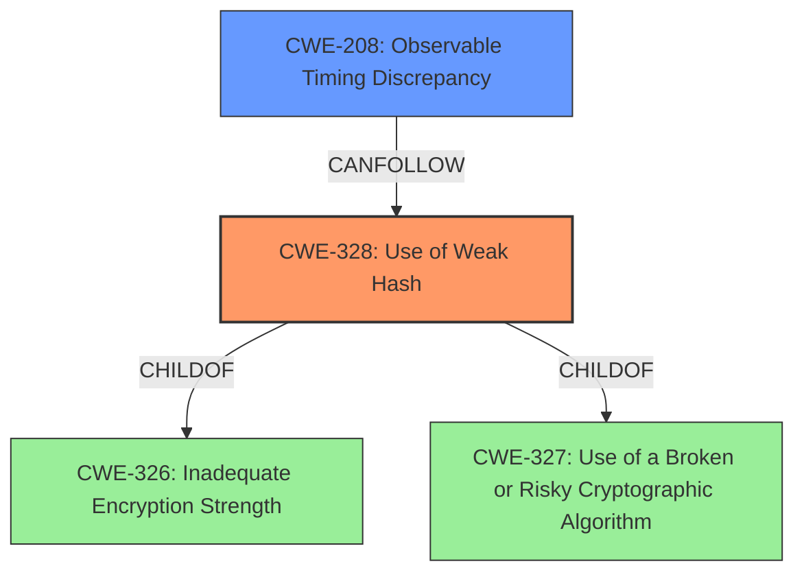

# Analysis for CVE-2021-37606

# Summary
| CWE ID | CWE Name | Confidence | CWE Abstraction Level | CWE Vulnerability Mapping Label | CWE-Vulnerability Mapping Notes |
|---|---|---|---|---|---|
| CWE-328 | Use of Weak Hash | 1.0 | Base | Primary | Allowed |
| CWE-208 | Observable Timing Discrepancy | 0.8 | Base | Secondary | Allowed |

## Evidence and Confidence

*   **Confidence Score:** 0.9
*   **Evidence Strength:** HIGH

## Relationship Analysis
The primary relationship is between CWE-328 and its parents, specifically CWE-326 and CWE-327. While CWE-327 (Use of a Broken or Risky Cryptographic Algorithm) is a parent, CWE-328 is more specific as it directly identifies the **weak hash** as the issue. CWE-208 (Observable Timing Discrepancy) is included because the vulnerability description mentions timing differences are used to infer collisions.

## Vulnerability Chain
The chain of events starts with the **use of a weak hash** (CWE-328). This **weakness** leads to the ability for an attacker to **recover the key**. The attacker can then **infer collisions** by **measuring timing differences** (CWE-208), especially in long-running web services.

## Summary of Analysis
The initial assessment, based on the vulnerability description and key phrases, pointed to a problem with key recovery due to a flaw in the hashing algorithm. The evidence from the CVE reference links content summary strongly supports that the **Meow hash 0.5/calico does not sufficiently thwart key recovery**. The retriever results confirmed that CWE-328 (Use of Weak Hash) is a strong candidate. The vulnerability description mentions timing differences so CWE-208 is added as a secondary weakness.

The analysis is heavily based on the provided evidence, specifically:

*   "**Meow hash 0.5/calico does not sufficiently thwart key recovery**" - This directly indicates a problem with the hashing algorithm's strength.
*   "an attacker who can query whether theres a collision in the bottom bits of the hashes of two messages, as demonstrated by an attack against a long-running web service that allows the attacker to infer collisions by measuring timing differences" - This supports the inclusion of CWE-208 because timing differences are being exploited.
*   "Insufficient AES Rounds", "Symmetry Properties", "Message Absorption Weaknesses", "Invertibility of Initial State" - These points detail the nature of the **weakness** in the hashing algorithm.
*   "Key Recovery: An attacker can recover the full 1024-bit key with about 2^49 queries to the hash function, even with a restricted model where the attacker can only check if the lowest bit of two hashes collide." - Again, key recovery is a prominent aspect of this vulnerability.

CWE-328 is chosen because the core issue is the use of a **weak hashing algorithm**, which allows for key recovery and collision inference. CWE-208 is added because **timing differences** are used to **infer collisions**, and is a component of the attack vector. Both CWEs are at the appropriate level of specificity (Base).

Other considered CWEs and why they were rejected:

*   CWE-327 (Use of a Broken or Risky Cryptographic Algorithm): While related, CWE-328 is more specific as it identifies the **weakness** at the hash level, not just at the broader cryptographic algorithm level.
*   CWE-759 (Use of a One-Way Hash without a Salt): This is too specific. The problem is not just the lack of a salt, but the inherent **weakness** of the hash itself.
*   CWE-330 (Use of Insufficiently Random Values): While randomness might be a factor in the hash's **weakness**, the primary problem is not insufficient randomness in the values themselves, but the **weakness** of the algorithm.