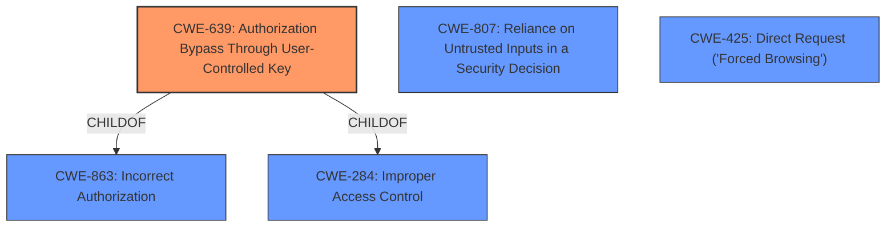

# Enhanced Analysis for CVE-2021-37791

# Summary
| CWE ID | CWE Name | Confidence | CWE Abstraction Level | CWE Vulnerability Mapping Label | CWE-Vulnerability Mapping Notes |
|---|---|---|---|---|---|
| CWE-639 | Authorization Bypass Through User-Controlled Key | 1 | Base | Allowed | Primary CWE |
| CWE-807 | Reliance on Untrusted Inputs in a Security Decision | 0.8 | Base | Allowed | Secondary CWE |
| CWE-425 | Direct Request ('Forced Browsing') | 0.7 | Base | Allowed | Secondary CWE |
| CWE-863 | Incorrect Authorization | 0.6 | Class | Allowed-with-Review | Secondary CWE |

## Evidence and Confidence

*   **Confidence Score:** 0.9
*   **Evidence Strength:** HIGH

## Relationship Analysis
The primary CWE is CWE-639, which is a child of CWE-863 (Incorrect Authorization) and CWE-284 (Improper Access Control). This indicates a hierarchical relationship where the more specific CWE-639 is chosen over its more general parents. CWE-807 (Reliance on Untrusted Inputs in a Security Decision) and CWE-425 (Direct Request) are included as secondary CWEs, providing additional context regarding the nature of the vulnerability.



## Vulnerability Chain
The chain of events is as follows:
1.  **Root Cause:** The application directly uses the `userCode` parameter from the request to access user data (CWE-639 Authorization Bypass Through User-Controlled Key, CWE-807 Reliance on Untrusted Inputs in a Security Decision) instead of relying on the authentication token.
2.  The system **fails to validate** if the user has the right to access the information associated with the provided userCode, demonstrating an ultra vires vulnerability.
3.  **Impact:** An attacker can manipulate the `userCode` parameter to access data of other users (CWE-425 Direct Request).

## Summary of Analysis
The initial assessment correctly identified **incorrect access control** as the root cause. The Retriever Results provided several candidate CWEs, with CWE-639 (Authorization Bypass Through User-Controlled Key) having a high relevance score. This CWE accurately describes the vulnerability where the `userCode` parameter, intended to be derived from the authentication token, is instead accepted directly from the API request, allowing unauthorized access.

The evidence is strong, as the "CVE Reference Links Content Summary" explicitly states that the vulnerability stems from the insecure implementation where the `userCode` parameter is accepted as a parameter in the API request. This aligns perfectly with the description of CWE-639.

The decision to select CWE-639 is further supported by the mapping guidance, which recommends using Base-level CWEs when appropriate. The hierarchical relationships show that CWE-639 is a child of the more general CWE-863 and CWE-284, making it a more specific and accurate classification.

CWE-807 (Reliance on Untrusted Inputs in a Security Decision) is included as a secondary CWE because the vulnerability involves relying on the untrusted `userCode` parameter for authorization.

CWE-425 (Direct Request) is also included because the attacker is directly requesting user data by manipulating the `userCode` parameter.

CWE-863 (Incorrect Authorization) was considered as a general authorization issue but was determined to be less specific than CWE-639.

CWE-287 (Improper Authentication) was not selected as the problem is not with authentication, but with authorization after a user is already authenticated.

The selected CWEs are at the optimal level of specificity, with CWE-639 capturing the core weakness and CWE-807 and CWE-425 providing additional context.

Relevant CWE Information:

# Enhanced Context (25 CWEs)

## CWE-807: Reliance on Untrusted Inputs in a Security Decision
**Abstraction Level**: Base
**Similarity Score**: 0.76
**Source**: dense

**Description**:
The product uses a protection mechanism that relies on the existence or values of an input, but the input can be modified by an untrusted actor in a way that bypasses the protection mechanism.

**Mapping Guidance**:
- Usage: Allowed
- Rationale: This CWE entry is at the Base level of abstraction, which is a preferred level of abstraction for mapping to the root causes of vulnerabilities.

## CWE-639: Authorization Bypass Through User-Controlled Key
**Abstraction Level**: Base
**Similarity Score**: 0.75
**Source**: dense

**Description**:
The system's authorization functionality does not prevent one user from gaining access to another user's data or record by modifying the key value identifying the data.

**Mapping Guidance**:
- Usage: Allowed
- Rationale: This CWE entry is at the Base level of abstraction, which is a preferred level of abstraction for mapping to the root causes of vulnerabilities.

## CWE-303: Incorrect Implementation of Authentication Algorithm
**Abstraction Level**: Base
**Similarity Score**: 0.75
**Source**: dense

**Description**:
The requirements for the product dictate the use of an established authentication algorithm, but the implementation of the algorithm is incorrect.

**Mapping Guidance**:
- Usage: Allowed
- Rationale: This CWE entry is at the Base level of abstraction, which is a preferred level of abstraction for mapping to the root causes of vulnerabilities.

## CWE-274: Improper Handling of Insufficient Privileges
**Abstraction Level**: Base
**Similarity Score**: 0.74
**Source**: dense

**Description**:
The product does not handle or incorrectly handles when it has insufficient privileges to perform an operation, leading to resultant weaknesses.

**Mapping Guidance**:
- Usage: Discouraged
- Rationale: This CWE entry could be deprecated in a future version of CWE.

## CWE-1390: Weak Authentication
**Abstraction Level**: Class
**Similarity Score**: 0.74
**Source**: dense

**Description**:
The product uses an authentication mechanism to restrict access to specific users or identities, but the mechanism does not sufficiently prove that the claimed identity is correct.

**Mapping Guidance**:
- Usage: Allowed-with-Review
- Rationale: This CWE entry is a Class and might have Base-level children that would be more appropriate

## CWE-472: External Control of Assumed-Immutable Web Parameter
**Abstraction Level**: Base
**Similarity Score**: 0.74
**Source**: dense

**Description**:
The web application does not sufficiently verify inputs that are assumed to be immutable but are actually externally controllable, such as hidden form fields.

**Mapping Guidance**:
- Usage: Allowed
- Rationale: This CWE entry is at the Base level of abstraction, which is a preferred level of abstraction for mapping to the root causes of vulnerabilities.

## CWE-302: Authentication Bypass by Assumed-Immutable Data
**Abstraction Level**: Base
**Similarity Score**: 0.74
**Source**: dense

**Description**:
The authentication scheme or implementation uses key data elements that are assumed to be immutable, but can be controlled or modified by the attacker.

**Mapping Guidance**:
- Usage: Allowed
- Rationale: This CWE entry is at the Base level of abstraction, which is a preferred level of abstraction for mapping to the root causes of vulnerabilities.

## CWE-1289: Improper Validation of Unsafe Equivalence in Input
**Abstraction Level**: Base
**Similarity Score**: 0.74
**Source**: dense

**Description**:
The product receives an input value that is used as a resource identifier or other type of reference, but it does not validate or incorrectly validates that the input is equivalent to a potentially-unsafe value.

**Mapping Guidance**:
- Usage: Allowed
- Rationale: This CWE entry is at the Base level of abstraction, which is a preferred level of abstraction for mapping to the root causes of vulnerabilities.

## CWE-280: Improper Handling of Insufficient Permissions or Privileges
**Abstraction Level**: Base
**Similarity Score**: 0.74
**Source**: dense

**Description**:
The product does not handle or incorrectly handles when it has insufficient privileges to access resources or functionality as specified by their permissions. This may cause it to follow unexpected code paths that may leave the product in an invalid state.

**Mapping Guidance**:
-


## CWE Relationship Analysis

Current CWEs represent these abstraction levels: .


### Vulnerability Chain Analysis

**Chain starting from CWE-425:**
- 425 (Direct Request ('Forced Browsing')) - ROOT


**Chain starting from CWE-472:**
- 472 (External Control of Assumed-Immutable Web Parameter) - ROOT


### CWE Relationship Diagram

```mermaid
graph TD
    classDef primary fill:#f96,stroke:#333,stroke-width:2px
    classDef secondary fill:#69f,stroke:#333
    classDef tertiary fill:#9e9,stroke:#333
```