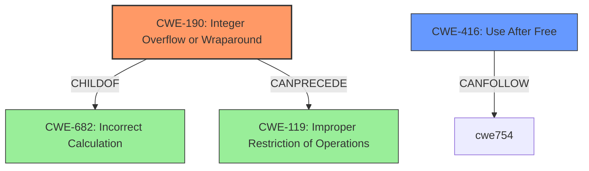

# Raw Analyzer Response for CVE-2021-3782

# Summary
| CWE ID | CWE Name | Confidence | CWE Abstraction Level | CWE Vulnerability Mapping Label | CWE-Vulnerability Mapping Notes |
|---|---|---|---|---|---|
| CWE-190 | Integer Overflow or Wraparound | 1.0 | Base | Primary | Allowed |
| CWE-416 | Use After Free | 0.9 | Variant | Secondary | Allowed |

## Evidence and Confidence

*   **Confidence Score:** 0.95
*   **Evidence Strength:** HIGH

## Relationship Analysis
The primary weakness is an integer overflow (CWE-190) in the reference count, which can lead to a use-after-free condition (CWE-416). CWE-190 is a base-level CWE, making it a good fit for directly representing the **root cause**. CWE-416, a variant, represents the impact of the overflow.

## Vulnerability Chain
The vulnerability chain starts with an integer overflow (**CWE-190**) in the reference count. This leads to a use-after-free condition (**CWE-416**) on the `wl_shm_pool` tracking structure.

## Summary of Analysis
The initial analysis correctly identifies the **reference count overflow** as a key issue. The "CVE Reference Links Content Summary" confirms that the **root cause** is an integer overflow in the reference count of shared memory objects, where the code uses a signed `int` which can be overflowed. This directly supports the selection of CWE-190. The overflow then leads to a use-after-free, making CWE-416 a secondary weakness.

The evidence for the integer overflow is:
- Vulnerability Description Key Phrases: "**rootcause:** **reference count overflow**"
- CVE Reference Links Content Summary: "**Root cause of vulnerability:** Integer overflow in the reference count of shared memory objects. The code uses a signed `int` for the reference count which can be overflowed by a malicious client."

The evidence for the use-after-free is:
- Vulnerability Description: "With the **reference count overflow**ing, a use-after-free can be constructed on the wl_shm_pool tracking structure"
- CVE Reference Links Content Summary: "**Weaknesses/vulnerabilities present:** Integer overflow leading to a use-after-free condition."

CWE-190 is at the base level of abstraction, making it suitable for direct mapping. CWE-416 is a variant, describing the impact of the initial overflow. The Retriever Results also list CWE-190 as the top candidate, further supporting this decision. The graph relationships helped visualize the chain of events from the overflow to the use-after-free.

**CWEs Considered but Not Used:**

*   **CWE-911: Improper Update of Reference Count:** While related to reference counting, this is a more general case. The vulnerability is specifically about the integer overflow in the reference count, making CWE-190 a more precise match.
*   **CWE-1284: Improper Validation of Specified Quantity in Input:** This CWE could be considered if the client-provided input directly influenced the number of buffer objects created. However, the primary issue is the overflow itself, not the validation of the quantity.
*   **CWE-770: Allocation of Resources Without Limits or Throttling:** This CWE is more relevant to DoS vulnerabilities where a system exhausts resources. While the overflow can lead to resource exhaustion, the **root cause** is the integer overflow.
*   **CWE-789: Memory Allocation with Excessive Size Value:** This CWE is relevant when allocating memory based on an untrusted, large size value, but it does not ensure that the size is within expected limits, allowing arbitrary amounts of memory to be allocated. This does not match the vulnerability description.

---

Relevant CWE Information:

# Enhanced Context (25 CWEs)

## CWE-789: Memory Allocation with Excessive Size Value
**Abstraction Level**: Variant
**Similarity Score**: 0.80
**Source**: dense

**Description**:
The product allocates memory based on an untrusted, large size value, but it does not ensure that the size is within expected limits, allowing arbitrary amounts of memory to be allocated.

**Mapping Guidance**:
- Usage: Allowed
- Rationale: This CWE entry is at the Variant level of abstraction, which is a preferred level of abstraction for mapping to the root causes of vulnerabilities.

## CWE-1325: Improperly Controlled Sequential Memory Allocation
**Abstraction Level**: Base
**Similarity Score**: 0.80
**Source**: dense

**Description**:
The product manages a group of objects or resources and performs a separate memory allocation for each object, but it does not properly limit the total amount of memory that is consumed by all of the combined objects.

**Mapping Guidance**:
- Usage: Allowed
- Rationale: This CWE entry is at the Base level of abstraction, which is a preferred level of abstraction for mapping to the root causes of vulnerabilities.

## CWE-404: Improper Resource Shutdown or Release
**Abstraction Level**: Class
**Similarity Score**: 0.77
**Source**: dense

**Description**:
The product does not release or incorrectly releases a resource before it is made available for re-use.

**Mapping Guidance**:
- Usage: Allowed-with-Review
- Rationale: This CWE entry is a Class and might have Base-level children that would be more appropriate

## CWE-131: Incorrect Calculation of Buffer Size
**Abstraction Level**: Base
**Similarity Score**: 0.77
**Source**: dense

**Description**:
The product does not correctly calculate the size to be used when allocating a buffer, which could lead to a buffer overflow.

**Mapping Guidance**:
- Usage: Allowed
- Rationale: This CWE entry is at the Base level of abstraction, which is a preferred level of abstraction for mapping to the root causes of vulnerabilities.

## CWE-191: Integer Underflow (Wrap or Wraparound)
**Abstraction Level**: Base
**Similarity Score**: 0.77
**Source**: dense

**Description**:
The product subtracts one value from another, such that the result is less than the minimum allowable integer value, which produces a value that is not equal to the correct result.

**Mapping Guidance**:
- Usage: Allowed
- Rationale: This CWE entry is at the Base level of abstraction, which is a preferred level of abstraction for mapping to the root causes of vulnerabilities.

## CWE-667: Improper Locking
**Abstraction Level**: Class
**Similarity Score**: 0.77
**Source**: dense

**Description**:
The product does not properly acquire or release a lock on a resource, leading to unexpected resource state changes and behaviors.

**Mapping Guidance**:
- Usage: Allowed-with-Review
- Rationale: This CWE entry is a Class and might have Base-level children that would be more appropriate

## CWE-226: Sensitive Information in Resource Not Removed Before Reuse
**Abstraction Level**: Base
**Similarity Score**: 0.76
**Source**: dense

**Description**:
The product releases a resource such as memory or a file so that it can be made available for reuse, but it does not clear or "zeroize" the information contained in the resource before the product performs a critical state transition or makes the resource available for reuse by other entities.

**Mapping Guidance**:
- Usage: Allowed
- Rationale: This CWE entry is at the Base level of abstraction, which is a preferred level of abstraction for mapping to the root causes of vulnerabilities.

## CWE-909: Missing Initialization of Resource
**Abstraction Level**: Class
**Similarity Score**: 0.76
**Source**: dense

**Description**:
The product does not initialize a critical resource.

**Mapping Guidance**:
- Usage: Allowed-with-Review
- Rationale: This CWE entry is a Class and might have Base-level children that would be more appropriate

## CWE-190: Integer Overflow or Wraparound
**Abstraction Level**: Base
**Similarity Score**: 0.76
**Source**: dense

**Description**:
The product performs a calculation that can
         produce an integer overflow or wraparound when the logic
         assumes that the resulting value will always be larger than
         the original value. This occurs when an integer value is
         incremented to a value that is too large to store in