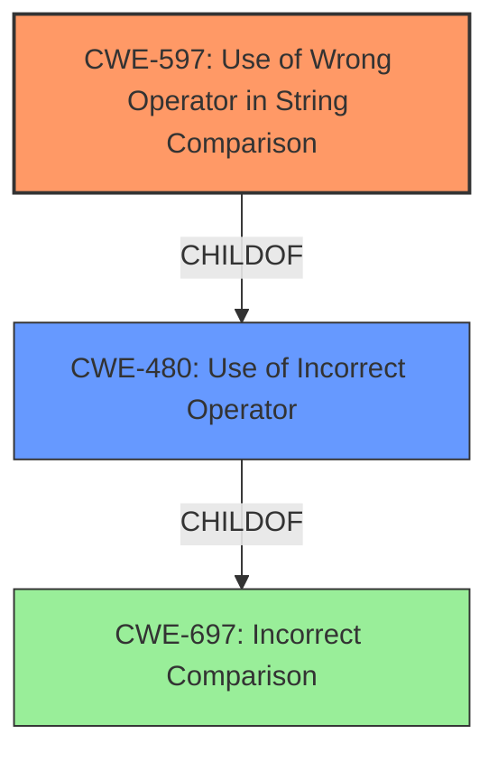

# Analysis for CVE-2021-3797

# Summary
| CWE ID | CWE Name | Confidence | CWE Abstraction Level | CWE Vulnerability Mapping Label | CWE-Vulnerability Mapping Notes |
|---|---|---|---|---|---|
| CWE-597 | Use of Wrong Operator in String Comparison | 0.9 | Variant | Allowed | Primary CWE. Matches the description's root cause. |
| CWE-480 | Use of Incorrect Operator | 0.7 | Base | Allowed | Secondary CWE.  More general than CWE-597, but still applicable. |
| CWE-697 | Incorrect Comparison | 0.5 | Pillar | Discouraged | Secondary CWE. Very high-level, but present in the description. |

## Evidence and Confidence

*   **Confidence Score:** 0.9
*   **Evidence Strength:** HIGH

## Relationship Analysis
The analysis centers on a hierarchical relationship with CWE-597 (Use of Wrong Operator in String Comparison) as a Variant of CWE-480 (Use of Incorrect Operator), which in turn relates to the high-level CWE-697 (Incorrect Comparison). The choice of CWE-597 is due to its specificity in addressing string comparisons, aligning directly with the vulnerability description, while CWE-480 is a more general case. The relationship shows a path from specific to general weaknesses, with CWE-597 offering the most accurate root cause.



## Vulnerability Chain
The chain starts with the **Use of Wrong Operator in String Comparison** (CWE-597), leading to an **Incorrect Comparison** (CWE-697), which results in a CSRF bypass due to the **flawed session token check**.

## Summary of Analysis
The initial assessment focused on the explicit mention of "**Use of Wrong Operator in String Comparison**" in the vulnerability description, which directly suggests CWE-597. The CVE Reference Links Content Summary confirms the presence of a **flawed session token check** which leads to a CSRF vulnerability, but the root cause lies in the incorrect operator usage.

The graph relationships influenced the decision to select CWE-597 as the primary CWE due to its specificity. While CWE-480 and CWE-697 are related, they are less precise.

The selected CWEs are at the optimal level of specificity because CWE-597 directly addresses the root cause described in the vulnerability.

Relevant CWE Information:

# Enhanced Context (25 CWEs)
The following CWEs were identified as potentially relevant to this vulnerability:

## CWE-697: Incorrect Comparison
**Abstraction Level**: Pillar
**Similarity Score**: 0.75
**Source**: dense

**Description**:
The product compares two entities in a security-relevant context, but the comparison is incorrect, which may lead to resultant weaknesses.

**Mapping Guidance**:
- Usage: Discouraged
- Rationale: This CWE entry is extremely high-level, a Pillar. However, sometimes this weakness is forced to be used due to the lack of in-depth weakness research. See Research Gaps.


## CWE-1254: Incorrect Comparison Logic Granularity
**Abstraction Level**: Base
**Similarity Score**: 0.74
**Source**: dense

**Description**:
The product's comparison logic is performed over a series of steps rather than across the entire string in one operation. If there is a comparison logic failure on one of these steps, the operation may be vulnerable to a timing attack that can result in the interception of the process for nefarious purposes.

**Mapping Guidance**:
- Usage: Allowed
- Rationale: This CWE entry is at the Base level of abstraction, which is a preferred level of abstraction for mapping to the root causes of vulnerabilities.


## CWE-1025: Comparison Using Wrong Factors
**Abstraction Level**: Base
**Similarity Score**: 0.73
**Source**: dense

**Description**:
The code performs a comparison between two entities, but the comparison examines the wrong factors or characteristics of the entities, which can lead to incorrect results and resultant weaknesses.

**Mapping Guidance**:
- Usage: Allowed
- Rationale: This CWE entry is at the Base level of abstraction, which is a preferred level of abstraction for mapping to the root causes of vulnerabilities.


## CWE-41: Improper Resolution of Path Equivalence
**Abstraction Level**: Base
**Similarity Score**: 0.72
**Source**: dense

**Description**:
The product is vulnerable to file system contents disclosure through path equivalence. Path equivalence involves the use of special characters in file and directory names. The associated manipulations are intended to generate multiple names for the same object.

**Mapping Guidance**:
- Usage: Allowed
- Rationale: This CWE entry is at the Base level of abstraction, which is a preferred level of abstraction for mapping to the root causes of vulnerabilities.


## CWE-668: Exposure of Resource to Wrong Sphere
**Abstraction Level**: Class
**Similarity Score**: 0.72
**Source**: dense

**Description**:
The product exposes a resource to the wrong control sphere, providing unintended actors with inappropriate access to the resource.

**Mapping Guidance**:
- Usage: Discouraged
- Rationale: CWE-668 is high-level and is often misused as a catch-all when lower-level CWE IDs might be applicable. It is sometimes used for low-information vulnerability reports [REF-1287]. It is a level-1 Class (i.e., a child of a Pillar). It is not useful for trend analysis.


## CWE-1023: Incomplete Comparison with Missing Factors
**Abstraction Level**: Class
**Similarity Score**: 0.72
**Source**: dense

**Description**:
The product performs a comparison between entities that must consider multiple factors or characteristics of each entity, but the comparison does not include one or more of these factors.

**Mapping Guidance**:
- Usage: Allowed-with-Review
- Rationale: This CWE entry is a Class and might have Base-level children that would be more appropriate


## CWE-1289: Improper Validation of Unsafe Equivalence in Input
**Abstraction Level**: Base
**Similarity Score**: 0.71
**Source**: dense

**Description**:
The product receives an input value that is used as a resource identifier or other type of reference, but it does not validate or incorrectly validates that the input is equivalent to a potentially-unsafe value.

**Mapping Guidance**:
- Usage: Allowed
- Rationale: This CWE entry is at the Base level of abstraction, which is a preferred level of abstraction for mapping to the root causes of vulnerabilities.


## CWE-703: Improper Check or Handling of Exceptional Conditions
**Abstraction Level**: Pillar
**Similarity Score**: 0.71
**Source**: dense

**Description**:
The product does not properly anticipate or handle exceptional conditions that rarely occur during normal operation of the product.

**Mapping Guidance**:
- Usage: Discouraged
- Rationale: This CWE entry is extremely high-level, a Pillar.


## CWE-682: Incorrect Calculation
**Abstraction Level**: Pillar
**Similarity Score**: 0.70
**Source**: dense

**Description**:
The product performs a calculation that generates incorrect or unintended results that are later used in security-critical decisions or resource management.

**Mapping Guidance**:
- Usage: Discouraged
- Rationale: This CWE entry is extremely high-level, a Pillar. In many cases, lower-level children or descendants are more appropriate. However, sometimes this weakness is forced to be used due to the lack of in-depth weakness research. See Research Gaps.


## CWE-187: Partial String Comparison
**Abstraction Level**: Variant
**Similarity Score**: 0.70
**Source**: dense

**Description**:
The product performs a comparison that only examines a portion of a factor before determining whether there is a match, such as a substring, leading to resultant weaknesses.

**Mapping Guidance**:
- Usage: Allowed
- Rationale: This CWE entry is at the Variant level of abstraction, which is a preferred level of abstraction for mapping to the root causes of vulnerabilities.


## CWE-1254: Incorrect Comparison Logic Granularity
**Abstraction Level**: Base
**Similarity Score**: 4847.54
**Source**: sparse

**Description**:
The product's comparison logic is performed over a series of steps rather than across the entire string in one operation. If there is a comparison logic failure on one of these steps, the operation may be vulnerable to a timing attack that can result in the interception of the process for nefarious purposes.

**Mapping Guidance**:
- Usage: Allowed
- Rationale: This CWE entry is

# Enhanced Query for CVE-2021-3797

## Vulnerability Description
hestiacp is vulnerable to **Use of Wrong Operator in String Comparison**

### Vulnerability Description Key Phrases
- **rootcause:** **Use of Wrong Operator in String Comparison**
- **product:** hestiacp

## CVE Reference Links Content Summary
```
{
  "vulnerability_details": {
    "root_cause": "The vulnerability lies in the improper implementation of CSRF (Cross-Site Request Forgery) protection in the Hestia Control Panel. The session token check was flawed, allowing an attacker to potentially bypass it.",
    "weaknesses": [
      "CSRF vulnerability due to flawed session token check.",
      "The code was susceptible to CSRF juggling where the attacker could manipulate the token."
    ],
    "impact": "An attacker could perform actions on behalf of a logged-in user without their consent. This could include actions such as adding, deleting, or modifying system configurations, databases, or user accounts.",
    "attack_vectors": [
      "An attacker could craft a malicious link or webpage that, when visited by a logged-in user, would send a forged request to the Hestia Control Panel.",
      "The attack relies on tricking a logged-in user into performing actions they didn't intend."
    ],
    "attacker_capabilities": [
      "The attacker does not need access to the user's session. However, they require the user to be authenticated to the application and perform an action they didn't intend.",
      "The attacker needs to be able to deliver the malicious request to the victim (e.g., through a link or a malicious website)."
     ]
  },
  "files_affected": [
    "install/upgrade/versions/1.4.13.sh",
    "web/add/cron/autoupdate/index.php",
    "web/add/cron/index.php",
    "web/add/cron/reports/index.php",
    "web/add/db/index.php",
    "web/add/dns/index.php",
    "web/add/firewall/banlist/index.php",
    "web/add/firewall/index.php",
    "web/add/firewall/ipset/index.php",
     "web/add/ip/index.php",
    "web/add/key/index.php",
    "web/add/mail/index.php",
    "web/add/package/index.php",
     "web/add/user/index.php",
    "web/add/web/index.php",
    "web/add/webapp/index.php",
     "web/bulk/backup/exclusions/index.php",
    "web/bulk/backup/index.php",
    "web/bulk/cron/index.php",
     "web/bulk/db/index.php",
    "web/bulk/dns/index.php",
     "web/bulk/firewall/banlist/index.php",
    "web/bulk/firewall/index.php",
    "web/bulk/firewall/ipset/index.php",
     "web/bulk/hestia/index.php",
    "web/bulk/ip/index.php",
     "web/bulk/mail/index.php",
    "web/bulk/package/index.php",
    "web/bulk/restore/index.php",
     "web/bulk/service/index.php",
    "web/bulk/user/index.php",
    "web/copy/package/index.php",
    "web/delete/backup/exclusion/index.php",
     "web/delete/backup/index.php",
    "web/delete/cron/autoupdate/index.php",
    "web/delete/cron/index.php",
     "web/delete/cron/reports/index.php",
    "web/delete/db/index.php",
    "web/delete/dns/index.php",
    "web/delete/firewall/banlist/index.php",
    "web/delete/firewall/index.php",
    "web/delete/firewall/ipset/index.php",
    "web/delete/ip/index.php",
     "web/delete/key/index.php",
    "web/delete/log/auth/index.php",
    "web/delete/log/index.php",
     "web/delete/mail/index.php",
    "web/delete/notification/index.php",
    "web/delete/package/index.php",
    "web/delete/user/index.php",
    "web/delete/web/cache/index.php",
     "web/delete/web/index.php",
    "web/download/backup/index.php",
    "web/download/web-log/index.php",
    "web/edit/backup/exclusions/index.php",
     "web/edit/cron/index.php",
    "web/edit/db/index.php",
    "web/edit/dns/index.php",
    "web/edit/firewall/index.php",
     "web/edit/ip/index.php",
    "web/edit/mail/index.php",
    "web/edit/package/index.php",
    "web/edit/server/apache2/index.php",
    "web/edit/server/bind9/index.php",
    "web/edit/server/clamav-daemon/index.php",
    "web/edit/server/cron/index.php",
     "web/edit/server/dovecot/index.php",
    "web/edit/server/exim/index.php",
    "web/edit/server/exim4/index.php",
    "web/edit/server/fail2ban/index.php",
    "web/edit/server/httpd/index.php",
    "web/edit/server/index.php",
    "web/edit/server/mariadb/index.php",
     "web/edit/server/mysql/index.php",
    "web/edit/server/mysqld/index.php",
     "web/edit/server/named/index.php",
    "web/edit/server/nginx/index.php",
     "web/edit/server/php-fpm/index.php",
    "web/edit/server/php/index.php",
    "web/edit/server/php5-fpm/index.php",
    "web/edit/server/postgresql/index.php",
    "web/edit/server/proftpd/index.php",
    "web/edit/server/spamassassin/index.php",
    "web/edit/server/spamd/index.php",
    "web/edit/server/ssh/index.php",
    "web/edit/server/theme/index.php",
     "web/edit/server/vsftpd/index.php",
    "web/edit/user/index.php",
     "web/edit/web/index.php",
    "web/generate/ssl/index.php",
    "web/inc/main.php",
    "web/inc/prevent_csrf.php",
    "web/login/index.php",
    "web/logout/index.php",
    "web/reset/index.php",
    "web/reset2fa/index.php",
     "web/restart/service/index.php",
    "web/restart/system/index.php",
    "web/schedule/backup/index.php",
    "web/schedule/restore/index.php",
    "web/search/index.php",
    "web/start/service/index.php",
    "web/stop/service/index.php",
    "web/suspend/cron/index.php",
    "web/suspend/db/index.php",
    "web/suspend/dns/index.php",
    "web/suspend/firewall/index.php",
    "web/suspend/mail/index.php",
    "web/suspend/user/index.php",
    "web/suspend/web/index.php",
    "web/unsuspend/cron/index.php",
    "web/unsuspend/db/index.php",
    "web/unsuspend/dns/index.php",
    "web/unsuspend/firewall/index.php",
    "web/unsuspend/mail/index.php",
    "web/unsuspend/user/index.php",
    "web/unsuspend/web/index.php",
     "web/update/hestia/index.php"
  ]
}
```

## Retriever Results

### Top Combined Results

| Rank | CWE ID | Name | Abstraction | Usage  | Retrievers | Individual Scores |
|------|--------|------|-------------|-------|------------|-------------------|
| 1 | 597 | Use of Wrong Operator in String Comparison | Variant | Allowed | sparse | 0.230 |
| 2 | 480 | Use of Incorrect Operator | Base | Allowed | sparse | 0.168 |
| 3 | 697 | Incorrect Comparison | Pillar | Discouraged | sparse | 0.148 |
| 4 | 1254 | Incorrect Comparison Logic Granularity | Base | Allowed | sparse | 0.139 |
| 5 | 625 | Permissive Regular Expression | Base | Allowed | sparse | 0.132 |
| 6 | 783 | Operator Precedence Logic Error | Base | Allowed | dense | 0.520 |
| 7 | 481 | Assigning instead of Comparing | Variant | Allowed | graph | 0.003 |
| 8 | 1023 | Incomplete Comparison with Missing Factors | Class | Allowed-with-Review | sparse | 0.130 |
| 9 | 208 | Observable Timing Discrepancy | Base | Allowed | sparse | 0.124 |
| 10 | 1025 | Comparison Using Wrong Factors | Base | Allowed | sparse | 0.124 |


# Complete CWE Specifications


## CWE-597: Use of Wrong Operator in String Comparison
**Abstraction:** Variant
**Status:** Draft

### Description
The product uses the wrong operator when comparing a string, such as using "==" when the .equals() method should be used instead.

### Extended Description
In Java, using == or != to compare two strings for equality actually compares two objects for equality rather than their string values for equality. Chances are good that the two references will never be equal. While this weakness often only affects program correctness, if the equality is used for a security decision, the unintended comparison result could be leveraged to affect program security.

### Alternative Terms
None

### Relationships
ChildOf -> CWE-595
ChildOf -> CWE-595
ChildOf -> CWE-480

### Mapping Guidance
**Usage:** Allowed
**Rationale:** This CWE entry is at the Variant level of abstraction, which is a preferred level of abstraction for mapping to the root causes of vulnerabilities.
**Comments:** Carefully read both the name and description to ensure that this mapping is an appropriate fit. Do not try to 'force' a mapping to a lower-level Base/Variant simply to comply with this preferred level of abstraction.
**Reasons:**
- Acceptable-Use


## CWE-480: Use of Incorrect Operator
**Abstraction:** Base
**Status:** Draft

### Description
The product accidentally uses the wrong operator, which changes the logic in security-relevant ways.

### Extended Description
These types of errors are generally the result of a typo by the programmer.

### Alternative Terms
None

### Relationships
ChildOf -> CWE-670

### Mapping Guidance
**Usage:** Allowed
**Rationale:** This CWE entry is at the Base level of abstraction, which is a preferred level of abstraction for mapping to the root causes of vulnerabilities.
**Comments:** Carefully read both the name and description to ensure that this mapping is an appropriate fit. Do not try to 'force' a mapping to a lower-level Base/Variant simply to comply with this preferred level of abstraction.
**Reasons:**
- Acceptable-Use


### Observed Examples
- **CVE-2022-3979:** Chain: data visualization program written in PHP uses the "!=" operator instead of the type-strict "!==" operator (CWE-480) when validating hash values, potentially leading to an incorrect type conversion (CWE-704)
- **CVE-2021-3116:** Chain: Python-based HTTP Proxy server uses the wrong boolean operators (CWE-480) causing an incorrect comparison (CWE-697) that identifies an authN failure if all three conditions are met instead of only one, allowing bypass of the proxy authentication (CWE-1390)


## CWE-697: Incorrect Comparison
**Abstraction:** Pillar
**Status:** Incomplete

### Description
The product compares two entities in a security-relevant context, but the comparison is incorrect, which may lead to resultant weaknesses.

### Extended Description


This Pillar covers several possibilities:


  - the comparison checks one factor incorrectly;

  - the comparison should consider multiple factors, but it does not check at least one of those factors at all;

  - the comparison checks the wrong factor.


### Alternative Terms
None

### Relationships
None

### Mapping Guidance
**Usage:** Discouraged
**Rationale:** This CWE entry is extremely high-level, a Pillar. However, sometimes this weakness is forced to be used due to the lack of in-depth weakness research. See Research Gaps.
**Comments:** Where feasible, consider children or descendants of this entry instead.
**Reasons:**
- Abstraction


### Additional Notes
**[Research Gap]** 

Weaknesses related to this Pillar appear to be under-studied, especially with respect to classification schemes. Input from academic and other communities could help identify and resolve gaps or organizational difficulties within CWE.


**[Maintenance]** This entry likely has some relationships with case sensitivity (CWE-178), but case sensitivity is a factor in other types of weaknesses besides comparison. Also, in cryptography, certain attacks are possible when certain comparison operations do not take place in constant time, causing a timing-related information leak (CWE-208).


### Observed Examples
- **CVE-2021-3116:** Chain: Python-based HTTP Proxy server uses the wrong boolean operators (CWE-480) causing an incorrect comparison (CWE-697) that identifies an authN failure if all three conditions are met instead of only one, allowing bypass of the proxy authentication (CWE-1390)
- **CVE-2020-15811:** Chain: Proxy uses a substring search instead of parsing the Transfer-Encoding header (CWE-697), allowing request splitting (CWE-113) and cache poisoning
- **CVE-2016-10003:** Proxy performs incorrect comparison of request headers, leading to infoleak


## CWE-1254: Incorrect Comparison Logic Granularity
**Abstraction:** Base
**Status:** Draft

### Description
The product's comparison logic is performed over a series of steps rather than across the entire string in one operation. If there is a comparison logic failure on one of these steps, the operation may be vulnerable to a timing attack that can result in the interception of the process for nefarious purposes.

### Extended Description


Comparison logic is used to compare a variety of objects including passwords, Message Authentication Codes (MACs), and responses to verification challenges. When comparison logic is implemented at a finer granularity (e.g., byte-by-byte comparison) and breaks in the case of a comparison failure, an attacker can exploit this implementation to identify when exactly the failure occurred. With multiple attempts, the attacker may be able to guesses the correct password/response to challenge and elevate their privileges.


### Alternative Terms
None

### Relationships
ChildOf -> CWE-208
ChildOf -> CWE-697

### Mapping Guidance
**Usage:** Allowed
**Rationale:** This CWE entry is at the Base level of abstraction, which is a preferred level of abstraction for mapping to the root causes of vulnerabilities.
**Comments:** Carefully read both the name and description to ensure that this mapping is an appropriate fit. Do not try to 'force' a mapping to a lower-level Base/Variant simply to comply with this preferred level of abstraction.
**Reasons:**
- Acceptable-Use


### Additional Notes
**[Maintenance]** CWE 4.16 removed a demonstrative example for a hardware module because it was inaccurate and unable to be adapted. The CWE team is developing an alternative.


### Observed Examples
- **CVE-2019-10482:** Smartphone OS uses comparison functions that are not in constant time, allowing side channels
- **CVE-2019-10071:** Java-oriented framework compares HMAC signatures using String.equals() instead of a constant-time algorithm, causing timing discrepancies
- **CVE-2014-0984:** Password-checking function in router terminates validation of a password entry when it encounters the first incorrect character, which allows remote attackers to obtain passwords via a brute-force attack that relies on timing differences in responses to incorrect password guesses, aka a timing side-channel attack.


## CWE-625: Permissive Regular Expression
**Abstraction:** Base
**Status:** Draft

### Description
The product uses a regular expression that does not sufficiently restrict the set of allowed values.

### Extended Description


This effectively causes the regexp to accept substrings that match the pattern, which produces a partial comparison to the target. In some cases, this can lead to other weaknesses. Common errors include:


  - not identifying the beginning and end of the target string

  - using wildcards instead of acceptable character ranges

  - others


### Alternative Terms
None

### Relationships
ChildOf -> CWE-185
PeerOf -> CWE-187
PeerOf -> CWE-184
PeerOf -> CWE-183

### Mapping Guidance
**Usage:** Allowed
**Rationale:** This CWE entry is at the Base level of abstraction, which is a preferred level of abstraction for mapping to the root causes of vulnerabilities.
**Comments:** Carefully read both the name and description to ensure that this mapping is an appropriate fit. Do not try to 'force' a mapping to a lower-level Base/Variant simply to comply with this preferred level of abstraction.
**Reasons:**
- Acceptable-Use


### Observed Examples
- **CVE-2021-22204:** Chain: regex in EXIF processor code does not correctly determine where a string ends (CWE-625), enabling eval injection (CWE-95), as exploited in the wild per CISA KEV.
- **CVE-2006-1895:** ".*" regexp leads to static code injection
- **CVE-2002-2175:** insertion of username into regexp results in partial comparison, causing wrong database entry to be updated when one username is a substring of another.


## CWE-783: Operator Precedence Logic Error
**Abstraction:** Base
**Status:** Draft

### Description
The product uses an expression in which operator precedence causes incorrect logic to be used.

### Extended Description
While often just a bug, operator precedence logic errors can have serious consequences if they are used in security-critical code, such as making an authentication decision.

### Alternative Terms
None

### Relationships
ChildOf -> CWE-670

### Mapping Guidance
**Usage:** Allowed
**Rationale:** This CWE entry is at the Base level of abstraction, which is a preferred level of abstraction for mapping to the root causes of vulnerabilities.
**Comments:** Carefully read both the name and description to ensure that this mapping is an appropriate fit. Do not try to 'force' a mapping to a lower-level Base/Variant simply to comply with this preferred level of abstraction.
**Reasons:**
- Acceptable-Use


### Observed Examples
- **CVE-2008-2516:** Authentication module allows authentication bypass because it uses "(x = call(args) == SUCCESS)" instead of "((x = call(args)) == SUCCESS)".
- **CVE-2008-0599:** Chain: Language interpreter calculates wrong buffer size (CWE-131) by using "size = ptr ? X : Y" instead of "size = (ptr ? X : Y)" expression.
- **CVE-2001-1155:** Chain: product does not properly check the result of a reverse DNS lookup because of operator precedence (CWE-783), allowing bypass of DNS-based access restrictions.


## CWE-481: Assigning instead of Comparing
**Abstraction:** Variant
**Status:** Draft

### Description
The code uses an operator for assignment when the intention was to perform a comparison.

### Extended Description
In many languages the compare statement is very close in appearance to the assignment statement and are often confused. This bug is generally the result of a typo and usually causes obvious problems with program execution. If the comparison is in an if statement, the if statement will usually evaluate the value of the right-hand side of the predicate.

### Alternative Terms
None

### Relationships
ChildOf -> CWE-480
CanPrecede -> CWE-697

### Mapping Guidance
**Usage:** Allowed
**Rationale:** This CWE entry is at the Variant level of abstraction, which is a preferred level of abstraction for mapping to the root causes of vulnerabilities.
**Comments:** Carefully read both the name and description to ensure that this mapping is an appropriate fit. Do not try to 'force' a mapping to a lower-level Base/Variant simply to comply with this preferred level of abstraction.
**Reasons:**
- Acceptable-Use


## CWE-1023: Incomplete Comparison with Missing Factors
**Abstraction:** Class
**Status:** Incomplete

### Description
The product performs a comparison between entities that must consider multiple factors or characteristics of each entity, but the comparison does not include one or more of these factors.

### Extended Description
An incomplete comparison can lead to resultant weaknesses, e.g., by operating on the wrong object or making a security decision without considering a required factor.

### Alternative Terms
None

### Relationships
ChildOf -> CWE-697

### Mapping Guidance
**Usage:** Allowed-with-Review
**Rationale:** This CWE entry is a Class and might have Base-level children that would be more appropriate
**Comments:** Examine children of this entry to see if there is a better fit
**Reasons:**
- Abstraction


### Observed Examples
- **CVE-2005-2782:** PHP remote file inclusion in web application that filters "http" and "https" URLs, but not "ftp".
- **CVE-2014-6394:** Product does not prevent access to restricted directories due to partial string comparison with a public directory


## CWE-208: Observable Timing Discrepancy
**Abstraction:** Base
**Status:** Incomplete

### Description
Two separate operations in a product require different amounts of time to complete, in a way that is observable to an actor and reveals security-relevant information about the state of the product, such as whether a particular operation was successful or not.

### Extended Description
In security-relevant contexts, even small variations in timing can be exploited by attackers to indirectly infer certain details about the product's internal operations. For example, in some cryptographic algorithms, attackers can use timing differences to infer certain properties about a private key, making the key easier to guess. Timing discrepancies effectively form a timing side channel.

### Alternative Terms
None

### Relationships
ChildOf -> CWE-203
CanPrecede -> CWE-385
CanPrecede -> CWE-327

### Mapping Guidance
**Usage:** Allowed
**Rationale:** This CWE entry is at the Base level of abstraction, which is a preferred level of abstraction for mapping to the root causes of vulnerabilities.
**Comments:** Carefully read both the name and description to ensure that this mapping is an appropriate fit. Do not try to 'force' a mapping to a lower-level Base/Variant simply to comply with this preferred level of abstraction.
**Reasons:**
- Acceptable-Use


### Additional Notes
**[Relationship]** Often primary in cryptographic applications and algorithms.

**[Maintenance]** CWE 4.16 removed a demonstrative example for a hardware module because it was inaccurate and unable to be adapted. The CWE team is developing an alternative.


### Observed Examples
- **CVE-2019-10071:** Java-oriented framework compares HMAC signatures using String.equals() instead of a constant-time algorithm, causing timing discrepancies
- **CVE-2019-10482:** Smartphone OS uses comparison functions that are not in constant time, allowing side channels
- **CVE-2014-0984:** Password-checking function in router terminates validation of a password entry when it encounters the first incorrect character, which allows remote attackers to obtain passwords via a brute-force attack that relies on timing differences in responses to incorrect password guesses, aka a timing side-channel attack.


## CWE-1025: Comparison Using Wrong Factors
**Abstraction:** Base
**Status:** Incomplete

### Description
The code performs a comparison between two entities, but the comparison examines the wrong factors or characteristics of the entities, which can lead to incorrect results and resultant weaknesses.

### Extended Description
This can lead to incorrect results and resultant weaknesses. For example, the code might inadvertently compare references to objects, instead of the relevant contents of those objects, causing two "equal" objects to be considered unequal.

### Alternative Terms
None

### Relationships
ChildOf -> CWE-697

### Mapping Guidance
**Usage:** Allowed
**Rationale:** This CWE entry is at the Base level of abstraction, which is a preferred level of abstraction for mapping to the root causes of vulnerabilities.
**Comments:** Carefully read both the name and description to ensure that this mapping is an appropriate fit. Do not try to 'force' a mapping to a lower-level Base/Variant simply to comply with this preferred level of abstraction.
**Reasons:**
- Acceptable-Use


