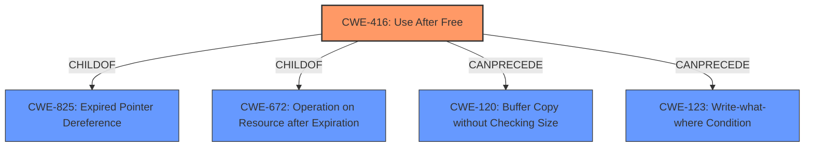

# Analysis for CVE-2021-37973

# Summary
| CWE ID | CWE Name | Confidence | CWE Abstraction Level | CWE Vulnerability Mapping Label | CWE-Vulnerability Mapping Notes |
|---|---|---|---|---|---|
| CWE-416 | Use After Free | 1.0 | Variant | Allowed | Primary CWE |

## Evidence and Confidence

*   **Confidence Score:** 1.0
*   **Evidence Strength:** HIGH

## Relationship Analysis
The primary CWE is CWE-416, Use After Free, which is a Variant level CWE. It is a child of CWE-825 (Expired Pointer Dereference) and CWE-672 (Operation on Resource after Expiration). This indicates that the vulnerability arises from using a pointer or resource after it has been freed or expired. There are also CANPRECEDE relationships to CWE-120 (Buffer Copy without Checking Size) and CWE-123 (Write-what-where Condition), suggesting that use-after-free can sometimes be a precursor to buffer overflows or arbitrary write conditions.

## Vulnerability Chain
The vulnerability chain starts with a **use after free** condition in the Portals component of Google Chrome. This allows a remote attacker, who has compromised the renderer process, to potentially perform a sandbox escape via a crafted HTML page. The chain is:

1.  **Root Cause:** **Use After Free** (CWE-416) in the Portals component.
2.  **Impact:** Sandbox escape, potentially leading to arbitrary code execution.

## Summary of Analysis
The analysis indicates a clear **use after free** vulnerability (CWE-416) in the Portals component of Google Chrome. The vulnerability description explicitly mentions "**use after free**" as the **rootcause**, and the CVE Reference Links Content Summary confirms this. The primary CWE match from similar CVE descriptions is also CWE-416. Retriever results also list CWE-416 as the top candidate.

The CWE-416 description aligns perfectly with the vulnerability, as it involves reusing memory after it has been freed. This can lead to unpredictable behavior and, in this case, a sandbox escape. The CWE is at the Variant level, which is the preferred level of abstraction.

Other CWEs were considered but were not selected because they did not accurately represent the **rootcause** of the vulnerability. For example, CWE-366 (Race Condition within a Thread) was considered because concurrency issues can sometimes lead to use-after-free conditions, but the description doesn't mention any explicit race condition. Similarly, CWE-122 (Heap-based Buffer Overflow) was considered, but the primary issue is the **use after free**, not a buffer overflow.

The final selection of CWE-416 is based on the explicit evidence of the **use after free** condition, its alignment with the CWE description, and its prevalence in similar vulnerabilities. This choice is at the optimal level of specificity, as it accurately reflects the **rootcause** of the vulnerability.