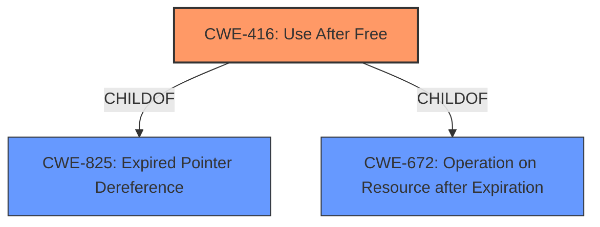

# Analysis for CVE-2021-37973

# Summary
| CWE ID | CWE Name | Confidence | CWE Abstraction Level | CWE Vulnerability Mapping Label | CWE-Vulnerability Mapping Notes |
|---|---|---|---|---|---|
| CWE-416 | Use After Free | 1.0 | Variant | Primary | Allowed |

## Evidence and Confidence

*   **Confidence Score:** 1.0
*   **Evidence Strength:** HIGH

## Relationship Analysis
The primary identified CWE is CWE-416 **Use After Free**, which is a Variant level CWE. It is related to CWE-825 **Expired Pointer Dereference** through a ChildOf relationship. It is also related to CWE-672 **Operation on Resource after Expiration** through a ChildOf relationship.

## Vulnerability Chain
The vulnerability chain starts with a **use after free** (**WEAKNESS**) condition in the Portals component of Google Chrome, leading to a potential sandbox escape. This means the initial flaw is the **improper** handling of memory, where freed memory is accessed again. The impact is a sandbox escape, allowing a remote attacker to potentially execute arbitrary code.

## Summary of Analysis
The primary CWE is CWE-416 **Use After Free**. This is based on the **Vulnerability Description Key Phrases**, which explicitly states "**rootcause:** **use after free**". The **CVE Reference Links Content Summary** also states "**Root cause of vulnerability**: Use after free" and "**Weaknesses/vulnerabilities present**: Use after free in Portals.". The description of CWE-416 perfectly matches this scenario: "The product reuses or references memory after it has been freed." This CWE is at the Variant level of abstraction, which is the preferred level. The mapping guidance for CWE-416 states "This CWE entry is at the Variant level of abstraction, which is a preferred level of abstraction for mapping to the root causes of vulnerabilities." I considered CWE-366 **Race Condition within a Thread**, CWE-122 **Heap-based Buffer Overflow**, and CWE-362 **Concurrent Execution using Shared Resource with Improper Synchronization ('Race Condition')**, but they do not directly apply to the root cause as clearly as CWE-416. The evidence clearly points to a **use after free** as the root cause, and therefore CWE-416 is the most appropriate and specific CWE.