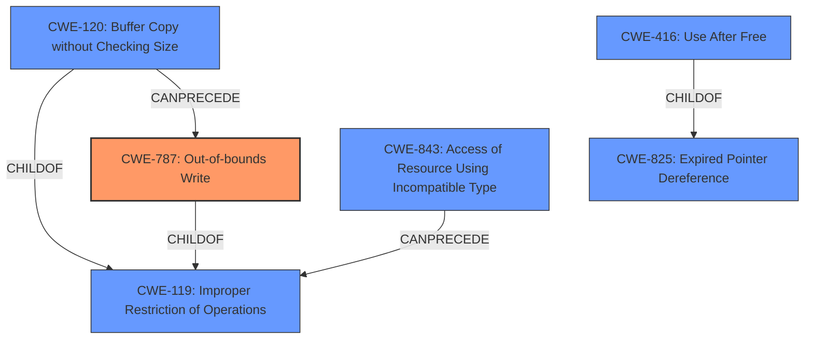

# Raw Analyzer Response for CVE-2021-37976

# Summary

| CWE ID  | CWE Name   | Confidence | CWE Abstraction Level | CWE Vulnerability Mapping Label | CWE-Vulnerability Mapping Notes |
|-----------------|-----------------------------------------------------------------|--------------------|--------------------------|---------------------------------------|---------------------------------------------------------------------------------------------|
| **CWE-787** | **Out-of-bounds Write** | 0.7  | Base  | Primary | Allowed |
| CWE-416 | Use After Free | 0.6  | Variant  | Secondary | Allowed |
| CWE-843 | Access of Resource Using Incompatible Type ('Type Confusion') | 0.5 | Base | Secondary | Allowed |

## Evidence and Confidence

*   **Confidence Score:** 0.7
*   **Evidence Strength:** MEDIUM

## Relationship Analysis
The primary weakness identified is CWE-787 (**Out-of-bounds Write**), which is a base-level CWE. CWE-787 has hierarchical relationships with other CWEs like CWE-119 (**Improper Restriction of Operations within the Bounds of a Memory Buffer**). CWE-416 (**Use After Free**) is a variant and ChildOf CWE-825 (**Expired Pointer Dereference**). CWE-120 (**Buffer Copy without Checking Size of Input**) can precede CWE-787, suggesting a possible chain. CWE-843 (**Access of Resource Using Incompatible Type**) can precede CWE-119.

## Vulnerability Chain
The vulnerability chain starts with an **inappropriate implementation** in memory, possibly related to how memory is managed or accessed. This leads to a potential **out-of-bounds write** (CWE-787) or **type confusion** (CWE-843), ultimately resulting in an information leak. A **use-after-free** (CWE-416) could also be a part of the chain, where memory is accessed after it has been freed.

## Summary of Analysis
The initial assessment considered the primary CWE match from similar CVE descriptions, which was CWE-NVD-noinfo, but this is a placeholder. The retriever results suggested CWE-416 (**Use After Free**), CWE-843 (**Access of Resource Using Incompatible Type**), and CWE-787 (**Out-of-bounds Write**).

Based on the vulnerability description and the CVE Reference Links Content Summary, the **inappropriate implementation** leads to an **information leak** from process memory. The retriever results point to memory corruption issues (CWE-416, CWE-843) and out-of-bounds write (CWE-787).

The evidence suggests that the **inappropriate implementation** most likely leads to memory corruption. Specifically, the ability to obtain sensitive information from process memory points to a memory safety issue such as writing beyond the allocated buffer (CWE-787) or type confusion (CWE-843), which can expose memory contents. A use-after-free (CWE-416) is also plausible if the **inappropriate implementation** involves improper memory management.

The selection of CWE-787, CWE-416, and CWE-843 is based on the evidence of memory corruption leading to information disclosure. These CWEs are at the base or variant level of abstraction, providing a detailed description of the weakness.

Relevant CWE Information:

# Enhanced Context (25 CWEs)

## CWE-41: Improper Resolution of Path Equivalence
**Abstraction Level**: Base
**Similarity Score**: 0.79
**Source**: dense

**Description**:
The product is vulnerable to file system contents disclosure through path equivalence. Path equivalence involves the use of special characters in file and directory names. The associated manipulations are intended to generate multiple names for the same object.

**Mapping Guidance**:
- Usage: Allowed
- Rationale: This CWE entry is at the Base level of abstraction, which is a preferred level of abstraction for mapping to the root causes of vulnerabilities.

## CWE-451: User Interface (UI) Misrepresentation of Critical Information
**Abstraction Level**: Class
**Similarity Score**: 0.78
**Source**: dense

**Description**:
The user interface (UI) does not properly represent critical information to the user, allowing the information - or its source - to be obscured or spoofed. This is often a component in phishing attacks.

**Mapping Guidance**:
- Usage: Allowed-with-Review
- Rationale: This CWE entry is a Class and might have Base-level children that would be more appropriate

## CWE-59: Improper Link Resolution Before File Access ('Link Following')
**Abstraction Level**: Base
**Similarity Score**: 0.77
**Source**: dense

**Description**:
The product attempts to access a file based on the filename, but it does not properly prevent that filename from identifying a link or shortcut that resolves to an unintended resource.

**Mapping Guidance**:
- Usage: Allowed
- Rationale: This CWE entry is at the Base level of abstraction, which is a preferred level of abstraction for mapping to the root causes of vulnerabilities.

## CWE-23: Relative Path Traversal
**Abstraction Level**: Base
**Similarity Score**: 0.77
**Source**: dense

**Description**:
The product uses external input to construct a pathname that should be within a restricted directory, but it does not properly neutralize sequences such as ".." that can resolve to a location that is outside of that directory.

**Mapping Guidance**:
- Usage: Allowed
- Rationale: This CWE entry is at the Base level of abstraction, which is a preferred level of abstraction for mapping to the root causes of vulnerabilities.

## CWE-668: Exposure of Resource to Wrong Sphere
**Abstraction Level**: Class
**Similarity Score**: 0.77
**Source**: dense

**Description**:
The product exposes a resource to the wrong control sphere, providing unintended actors with inappropriate access to the resource.

**Mapping Guidance**:
- Usage: Discouraged
- Rationale: CWE-668 is high-level and is often misused as a catch-all when lower-level CWE IDs might be applicable. It is sometimes used for low-information vulnerability reports [REF-1287]. It is a level-1 Class (i.e., a child of a Pillar). It is not useful for trend analysis.

## CWE-73: External Control of File Name or Path
**Abstraction Level**: Base
**Similarity Score**: 0.77
**Source**: dense

**Description**:
The product allows user input to control or influence paths or file names that are used in filesystem operations.

**Mapping Guidance**:
- Usage: Allowed
- Rationale: This CWE entry is at the Base level of abstraction, which is a preferred level of abstraction for mapping to the root causes of vulnerabilities.

## CWE-356: Product UI does not Warn User of Unsafe Actions
**Abstraction Level**: Base
**Similarity Score**: 0.77
**Source**: dense

**Description**:
The product's user interface does not warn the user before undertaking an unsafe action on behalf of that user. This makes it easier for attackers to trick users into inflicting damage to their system.

**Mapping Guidance**:
- Usage: Allowed
- Rationale: This CWE entry is at the Base level of abstraction, which is a preferred level of abstraction for mapping to the root causes of vulnerabilities.

## CWE-1289: Improper Validation of Unsafe Equivalence in Input
**Abstraction Level**: Base
**Similarity Score**: 0.76
**Source**: dense

**Description**:
The product receives an input value that is used as a resource identifier or other type of reference, but it does not validate or incorrectly validates that the input is equivalent to a potentially-unsafe value.

**Mapping Guidance**:
- Usage: Allowed
- Rationale: This CWE entry is at the Base level of abstraction, which is a preferred level of abstraction for mapping to the root causes of vulnerabilities.

## CWE-843: Access of Resource