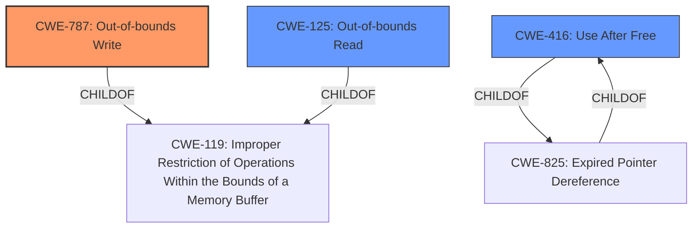

# Analysis Report for CVE-2021-37976

# Vulnerability Analysis Report: CVE-2021-37976

## Description


## Analysis (with Relationship Data)

# Summary
| CWE ID | CWE Name | Confidence | CWE Abstraction Level | CWE Vulnerability Mapping Label | CWE-Vulnerability Mapping Notes |
|---|---|---|---|---|---|
| CWE-787 | Out-of-bounds Write | 0.7 | Base | Allowed | Primary CWE |
| CWE-125 | Out-of-bounds Read | 0.5 | Base | Allowed | Secondary Candidate |
| CWE-416 | Use After Free | 0.4 | Variant | Allowed | Secondary Candidate |

## Evidence and Confidence

*   **Confidence Score:** 0.7
*   **Evidence Strength:** MEDIUM

## Relationship Analysis
The primary CWE, CWE-787, is a base-level CWE that describes an out-of-bounds write. CWE-125, Out-of-bounds Read, is a potential alternative if the **inappropriate implementation** caused a read instead of a write. CWE-416, Use After Free, is another potential cause of memory corruption. All three CWEs are related to memory management issues.



## Vulnerability Chain
The vulnerability chain starts with an **inappropriate implementation** in memory, which leads to memory corruption (out-of-bounds write). The impact is the potential disclosure of sensitive information from process memory.

## Summary of Analysis
The vulnerability description indicates an **inappropriate implementation** in the "Memory" component of Google Chrome, leading to the potential for a remote attacker to obtain sensitive information from process memory. The primary clue is the mention of "Memory" and "obtain potentially sensitive information from process memory". The vulnerability occurs due to an unspecified **inappropriate implementation**, but the impact is information disclosure due to memory corruption.

The primary CWE match from similar CVE descriptions is CWE-NVD-noinfo, but this is a placeholder and not informative. The top CWEs include CWE-787, which aligns with the memory corruption aspect of the vulnerability.

The retriever results also point to CWE-416 (Use After Free), CWE-843 (Type Confusion), CWE-125 (Out-of-bounds Read), CWE-122 (Heap-based Buffer Overflow), and CWE-787 (Out-of-bounds Write) as potential candidates.

Based on the information and the impact (information disclosure from process memory), a memory corruption issue is likely. Given the limited information about the specific coding error, CWE-787 (Out-of-bounds Write) is chosen as the primary CWE. It's a base-level CWE and accurately reflects the nature of the vulnerability. The confidence level is medium because the specific error is not detailed.

CWE-125 (Out-of-bounds Read) is a secondary candidate because the **inappropriate implementation** could have caused an out-of-bounds read instead of a write.

CWE-416 (Use After Free) is another possible candidate as use-after-free can lead to memory corruption and information disclosure.

CWE-451 (User Interface (UI) Misrepresentation of Critical Information) was considered but rejected. The vulnerability is not related to the user interface but rather to memory management within the browser's core.

CWE-346 (Origin Validation Error) was also considered but rejected. The vulnerability doesn't seem to be related to origin validation but rather a memory corruption issue.

The final selection of CWE-787 is based on the evidence of memory corruption and potential information disclosure, aligning with the CWE's description of an out-of-bounds write leading to exploitable conditions.


## CWE Relationship Analysis

Current CWEs represent these abstraction levels: .


### Vulnerability Chain Analysis

**Chain starting from CWE-787:**
- 787 (Out-of-bounds Write) - ROOT


**Chain starting from CWE-843:**
- 843 (Access of Resource Using Incompatible Type ('Type Confusion')) - ROOT


### CWE Relationship Diagram

```mermaid
graph TD
    classDef primary fill:#f96,stroke:#333,stroke-width:2px
    classDef secondary fill:#69f,stroke:#333
    classDef tertiary fill:#9e9,stroke:#333
```


*Report generated on 2025-04-01 18:55:41*
