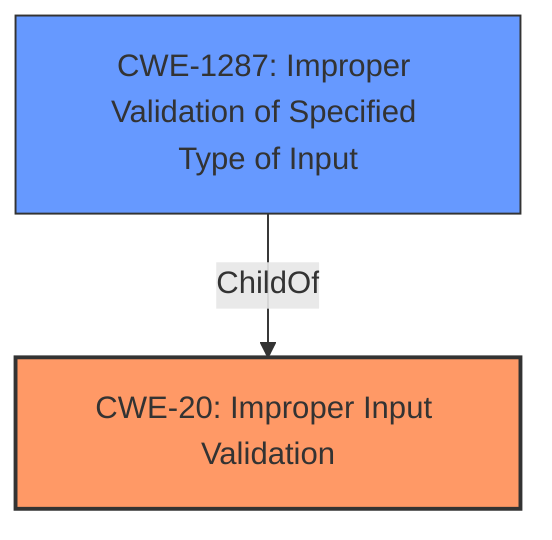

# Analysis Report for CVE-2021-37996

# Vulnerability Analysis Report: CVE-2021-37996

## Description


## Analysis (with Relationship Data)

# Summary
| CWE ID  | CWE Name                                                     | Confidence | CWE Abstraction Level | CWE Vulnerability Mapping Label | CWE-Vulnerability Mapping Notes |
| :-------- | :----------------------------------------------------------- | :--------- | :---------------------- | :------------------------------ | :------------------------------ |
| CWE-20  | Improper Input Validation                                    | 0.9        | Class                   | Primary                         | Discouraged                     |
| CWE-1287 | Improper Validation of Specified Type of Input               | 0.8        | Base                    | Secondary                       | Allowed                         |

## Evidence and Confidence

*   **Confidence Score:** 0.9
*   **Evidence Strength:** HIGH

## Relationship Analysis
The primary CWE is CWE-20 **Improper Input Validation**, a Class-level CWE. However, since the vulnerability description mentions "validation of untrusted input," a more specific CWE is warranted. CWE-1287 **Improper Validation of Specified Type of Input** is a Base-level CWE and a ChildOf CWE-20, making it a more precise classification. The relationship between CWE-20 and its children influenced the selection, providing a more granular view of the vulnerability.



## Vulnerability Chain
The chain of events starts with the **insufficient validation of untrusted input**, leading to the **bypassing of navigation restrictions**. The root cause is the lack of proper input validation, and the impact is the ability to bypass security measures.

## Summary of Analysis
The initial analysis focused on the **insufficient validation of untrusted input** as the root cause. The vulnerability description key phrases and CVE Reference Links Content Summary strongly support this. The Retriever Results also suggest CWE-20 **Improper Input Validation**, but this is a Class-level CWE, which is less specific.

The final decision is based on:

*   The vulnerability description: "**Insufficient validation of untrusted input** Downloads in Google Chrome prior to 95.0.4638.54 allowed a remote attacker to bypass navigation restrictions via a malicious file."
*   CVE Reference Links Content Summary: ""Root cause of vulnerability": "**Insufficient validation of untrusted input** in Downloads.""
*   The relationship between CWE-20 and CWE-1287, where CWE-1287 is a more specific child of CWE-20.

Therefore, the selected CWEs are at the optimal level of specificity, with CWE-20 as the primary, and CWE-1287 as a more detailed secondary classification.

Relevant CWE Information:

# Enhanced Context (25 CWEs)
The following CWEs were identified as potentially relevant to this vulnerability:

## CWE-1287: Improper Validation of Specified Type of Input
**Abstraction Level**: Base
**Similarity Score**: 3.64
**Source**: graph

**Description**:
CWE-1287: Improper Validation of Specified Type of Input

**Mapping Guidance**:
- Usage: Allowed
- Rationale: This CWE entry is at the Base level of abstraction, which is a preferred level of abstraction for mapping to the root causes of vulnerabilities.

**Relationships**:
- PEEROF -> CWE-843
- CHILDOF -> CWE-20
- PARENTOF -> CWE-1287

## Vulnerability Description
**Insufficient validation of untrusted input** Downloads in Google Chrome prior to 95.0.4638.54 allowed a remote attacker to bypass navigation restrictions via a malicious file.

### Vulnerability Description Key Phrases
- **rootcause:** **Insufficient validation of untrusted input**
- **impact:** bypass navigation restrictions
- **vector:** malicious file
- **attacker:** remote attacker
- **product:** Google Chrome
- **version:** prior to 95.0.4638.54
- **component:** Downloads

## CVE Reference Links Content Summary
```
{
  "Root cause of vulnerability": "Insufficient validation of untrusted input in Downloads.",
  "Weaknesses/vulnerabilities present": "Insufficient validation of untrusted input",
  "Impact of exploitation": "Arbitrary code execution, denial of service or information disclosure",
  "Attack vectors": "Untrusted input through downloads",
  "Required attacker capabilities/position": "Ability to provide malicious downloads."
}
```

## Retriever Results

### Top Combined Results

| Rank | CWE ID | Name | Abstraction | Usage  | Retrievers | Individual Scores |
|------|--------|------|-------------|-------|------------|-------------------|
| 1 | 356 | Product UI does not Warn User of Unsafe Actions | Base | Allowed | sparse | 0.256 |
| 2 | 451 | User Interface (UI) Misrepresentation of Critical Information | Class | Allowed-with-Review | sparse | 0.208 |
| 3 | 416 | Use After Free | Variant | Allowed | sparse | 0.193 |
| 4 | 116 | Improper Encoding or Escaping of Output | Class | Allowed-with-Review | sparse | 0.187 |
| 5 | 20 | Improper Input Validation | Class | Discouraged | sparse | 0.183 |
| 6 | 1021 | Improper Restriction of Rendered UI Layers or Frames | Base | Allowed | dense | 0.587 |
| 7 | 120 | Buffer Copy without Checking Size of Input ('Classic Buffer Overflow') | Base | Allowed-with-Review | graph | 0.003 |
| 8 | 843 | Access of Resource Using Incompatible Type ('Type Confusion') | Base | Allowed | sparse | 0.182 |
| 9 | 670 | Always-Incorrect Control Flow Implementation | Class | Allowed-with-Review | sparse | 0.177 |
| 10 | 138 | Improper Neutralization of Special Elements | Class | Discouraged | sparse | 0.171 |


## CWE Relationship Analysis

Current CWEs represent these abstraction levels: .


### Vulnerability Chain Analysis

**Chain starting from CWE-843:**
- 843 (Access of Resource Using Incompatible Type ('Type Confusion')) - ROOT


**Chain starting from CWE-20:**
- 20 (Improper Input Validation) - ROOT


### CWE Relationship Diagram

```mermaid
graph TD
    classDef primary fill:#f96,stroke:#333,stroke-width:2px
    classDef secondary fill:#69f,stroke:#333
    classDef tertiary fill:#9e9,stroke:#333
```


*Report generated on 2025-03-30 15:04:18*
