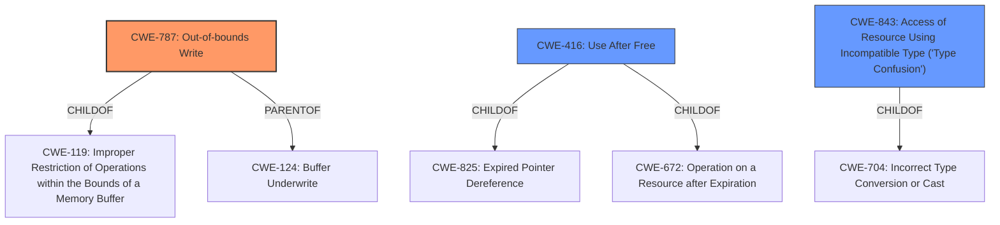

# Enhanced Analysis for CVE-2021-38003

# Summary
| CWE ID    | CWE Name                                                     | Confidence | CWE Abstraction Level | CWE Vulnerability Mapping Label | CWE-Vulnerability Mapping Notes |
| :-------- | :----------------------------------------------------------- | :--------- | :-------------------- | :------------------------------ | :------------------------------ |
| CWE-787   | Out-of-bounds Write                                          | 0.75       | Base                  | Primary                         | Allowed                       |
| CWE-416   | Use After Free                                               | 0.60       | Variant               | Secondary                       | Allowed                       |
| CWE-843   | Access of Resource Using Incompatible Type ('Type Confusion') | 0.50       | Base                  | Secondary                       | Allowed                       |

## Evidence and Confidence

*   **Confidence Score:** 0.70
*   **Evidence Strength:** MEDIUM

## Relationship Analysis
The primary CWE is CWE-787, which represents an out-of-bounds write. CWE-416 (Use After Free) and CWE-843 (Type Confusion) are considered as possible secondary weaknesses. CWE-787 is a base CWE and a parent of CWE-124 (Buffer Underwrite) and others. CWE-416 is a variant of CWE-825 (Expired Pointer Dereference) and CWE-672 (Operation on a Resource after Expiration). CWE-843 is a base CWE and a child of CWE-704 (Incorrect Type Conversion or Cast).



## Vulnerability Chain
The vulnerability chain starts with an **inappropriate implementation** in V8, potentially leading to heap corruption. This can manifest as an out-of-bounds write (CWE-787), or a use-after-free (CWE-416) if memory is freed and then accessed, or type confusion (CWE-843) if a resource is accessed using an incompatible type. The final impact is the ability for a remote attacker to exploit the heap corruption via a crafted HTML page, potentially leading to arbitrary code execution, denial of service, or information disclosure.

## Summary of Analysis
The initial assessment identified CWE-787 as the primary candidate due to the vulnerability description mentioning "heap corruption" and the similar CVE descriptions pointing to CWE-787. The **inappropriate implementation** in V8 is the **rootcause**, which leads to memory corruption on the heap.

The evidence supporting CWE-787 is derived from:
*   Vulnerability Description Key Phrases: "**rootcause:** **inappropriate implementation**, **impact:** heap corruption"
*   CVE Reference Links Content Summary: "The vulnerability is within the V8 JavaScript engine, so it is likely triggered by a website with malicious JavaScript code."
*   CWE for similar CVE Descriptions: "CWE-787 (Count: 77)"

CWE-416 (Use After Free) is considered as a possible secondary weakness, as heap corruption can sometimes involve freeing memory and then accessing it. The retriever result also suggests CWE-416.
CWE-843 (Type Confusion) is another possible secondary weakness, as the **inappropriate implementation** could involve accessing a resource using an incompatible type.

The selection of CWE-787 is at the optimal level of specificity because it directly addresses the out-of-bounds write condition resulting from the inappropriate implementation. The other CWEs are considered secondary because they are possible consequences of the heap corruption, but the primary issue is the out-of-bounds write.

CWE-120 (Buffer Copy without Checking Size of Input) was considered, but it is more specific to buffer copy operations, which is not explicitly mentioned in the vulnerability description. Also, its usage is "Allowed-with-Review" and the description mentions that the CWE ID is sometimes misused.
CWE-125 (Out-of-bounds Read) was also considered, but the impact is heap corruption which suggests writing, not reading, out of bounds.
CWE-123 (Write-what-where Condition) was considered, but the evidence points more directly to an out-of-bounds write than to the more general "write-what-where" condition.

Relevant CWE Information:
# Enhanced Context (25 CWEs)
The following CWEs were identified as potentially relevant to this vulnerability:

## CWE-1289: Improper Validation of Unsafe Equivalence in Input
**Abstraction Level**: Base
**Similarity Score**: 0.80
**Source**: dense

## CWE-356: Product UI does not Warn User of Unsafe Actions
**Abstraction Level**: Base
**Similarity Score**: 0.77
**Source**: dense

## CWE-451: User Interface (UI) Misrepresentation of Critical Information
**Abstraction Level**: Class
**Similarity Score**: 0.77
**Source**: dense

## CWE-843: Access of Resource Using Incompatible Type ('Type Confusion')
**Abstraction Level**: Base
**Similarity Score**: 0.77
**Source**: dense

## CWE-204: Observable Response Discrepancy
**Abstraction Level**: Base
**Similarity Score**: 0.77
**Source**: dense

## CWE-41: Improper Resolution of Path Equivalence
**Abstraction Level**: Base
**Similarity Score**: 0.76
**Source**: dense

## CWE-754: Improper Check for Unusual or Exceptional Conditions
**Abstraction Level**: Class
**Similarity Score**: 0.76
**Source**: dense

## CWE-404: Improper Resource Shutdown or Release
**Abstraction Level**: Class
**Similarity Score**: 0.76
**Source**: dense

## CWE-703: Improper Check or Handling of Exceptional Conditions
**Abstraction Level**: Pillar
**Similarity Score**: 0.76
**Source**: dense

## CWE-610: Externally Controlled Reference to a Resource in Another Sphere
**Abstraction Level**: Class
**Similarity Score**: 0.76
**Source**: dense

## CWE-125: Out-of-bounds Read
**Abstraction Level**: Base
**Similarity Score**: 4208.74
**Source**: sparse

## CWE-190: Integer Overflow or Wraparound
**Abstraction Level**: Base
**Similarity Score**: 4164.86
**Source**: sparse

## CWE-843: Access of Resource Using Incompatible Type ('Type Confusion')
**Abstraction Level**: Base
**Similarity Score**: 4113.76
**Source**: sparse

## CWE-252: Unchecked Return Value
**Abstraction Level**: Base
**Similarity Score**: 4057.42
**Source**: sparse

## CWE-367: Time-of-check Time-of-use (TOCTOU) Race Condition
**Abstraction Level**: Base
**Similarity Score**: 4028.14
**Source**: sparse

## CWE-123: Write-what-where Condition
**Abstraction Level**: base
**Similarity Score**: 4.82
**Source**: graph

## CWE-416: Use After Free
**Abstraction Level**: variant
**Similarity Score**: 4.33
**Source**: graph

## CWE-787: Out-of-bounds Write
**Abstraction Level**: base
**Similarity Score**: 4.33
**Source**: graph

## CWE-825: Expired Pointer Dereference
**Abstraction Level**: base
**Similarity Score**: 4.33
**Source**: graph

## CWE-125: Out-of-bounds Read
**Abstraction Level**: base
**Similarity Score**: 4.33
**Source**: graph

## CWE-120: Buffer Copy without Checking Size of Input ('Classic Buffer Overflow')
**Abstraction Level**: base
**Similarity Score**: 4.33


## CWE Relationship Analysis

Current CWEs represent these abstraction levels: .


### Vulnerability Chain Analysis

**Chain starting from CWE-754:**
- 754 (Improper Check for Unusual or Exceptional Conditions) - ROOT


**Chain starting from CWE-787:**
- 787 (Out-of-bounds Write) - ROOT


### CWE Relationship Diagram

```mermaid
graph TD
    classDef primary fill:#f96,stroke:#333,stroke-width:2px
    classDef secondary fill:#69f,stroke:#333
    classDef tertiary fill:#9e9,stroke:#333
```