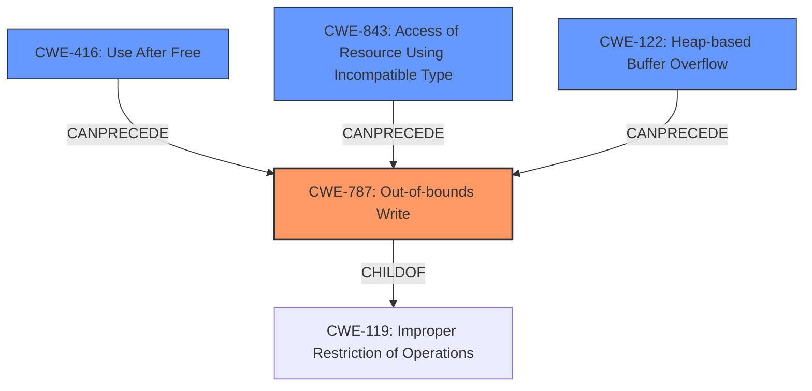

# Analysis Report for CVE-2021-38003

# Vulnerability Analysis Report: CVE-2021-38003

## Description


## Analysis (with Relationship Data)

# Summary
| CWE ID  | CWE Name                                                                 | Confidence | CWE Abstraction Level | CWE Vulnerability Mapping Label | CWE-Vulnerability Mapping Notes |
| :-------- | :----------------------------------------------------------------------- | :--------- | :---------------------- | :------------------------------ | :------------------------------ |
| CWE-787   | Out-of-bounds Write                                                      | 0.75       | Base                    | Primary                         | Allowed                       |
| CWE-416   | Use After Free                                                           | 0.5        | Variant                 | Secondary                       | Allowed                       |
| CWE-843   | Access of Resource Using Incompatible Type ('Type Confusion')            | 0.5        | Base                    | Secondary                       | Allowed                       |
| CWE-122   | Heap-based Buffer Overflow                                               | 0.5        | Variant                 | Secondary                       | Allowed                       |

## Evidence and Confidence

*   **Confidence Score:** 0.7
*   **Evidence Strength:** MEDIUM

## Relationship Analysis
The primary relationship influencing the decision is the parent-child relationship between CWE-119 (Improper Restriction of Operations within the Bounds of a Memory Buffer) and CWE-787 (Out-of-bounds Write). Since the vulnerability leads to heap corruption, CWE-787 is chosen as the primary CWE. CWE-416, CWE-843, and CWE-122 are considered as secondary CWEs because heap corruption could be caused by use-after-free, type confusion, or heap-based buffer overflow.



## Vulnerability Chain
The vulnerability chain starts with an **inappropriate implementation** in the V8 JavaScript engine. This **weakness** leads to **heap corruption**, potentially allowing a remote attacker to execute arbitrary code or cause a denial of service. The full chain, based on the primary CWE selection, is: **Inappropriate Implementation** -> **CWE-787 (Out-of-bounds Write)** -> **Heap Corruption**.

## Summary of Analysis
The analysis indicates that the root cause of the vulnerability is an **inappropriate implementation** within the V8 JavaScript engine, ultimately resulting in **heap corruption**. The primary CWE selected is CWE-787 (Out-of-bounds Write), as it directly reflects the heap corruption impact. The evidence supporting this is from the "Vulnerability Description Key Phrases" section, which mentions "heap corruption" and the "CVE Reference Links Content Summary" where the **root cause** is called "**inappropriate implementation** in V8".

The selection of CWE-787 is also supported by the "CWE for similar CVE Descriptions" section, which lists CWE-787 as one of the Top CWEs for similar vulnerabilities.

The retriever results also suggested CWE-416 (Use After Free), CWE-843 (Access of Resource Using Incompatible Type), and CWE-122 (Heap-based Buffer Overflow), which are included as secondary candidate CWEs because these are possible root causes of the heap corruption.

The final CWE selections are at the optimal level of specificity, with CWE-787 being a Base-level CWE that accurately describes the vulnerability, and CWE-416, CWE-843, and CWE-122 being Variant-level CWEs that present other possible ways that the vulnerability could have manifested.

Relevant CWE Information:

# Enhanced Context (25 CWEs)

## CWE-1289: Improper Validation of Unsafe Equivalence in Input
**Abstraction Level**: Base
**Similarity Score**: 0.80
**Source**: dense

**Description**:
The product receives an input value that is used as a resource identifier or other type of reference, but it does not validate or incorrectly validates that the input is equivalent to a potentially-unsafe value.
**Rationale for not selecting:** This CWE doesn't fit because there is no unsafe equivalence validation mentioned in the vulnerability description.

## CWE-356: Product UI does not Warn User of Unsafe Actions
**Abstraction Level**: Base
**Similarity Score**: 0.77
**Source**: dense

**Description**:
The product's user interface does not warn the user before undertaking an unsafe action on behalf of that user. This makes it easier for attackers to trick users into inflicting damage to their system.
**Rationale for not selecting:** The vulnerability is related to the V8 engine and not the UI, so this CWE is not applicable.

## CWE-451: User Interface (UI) Misrepresentation of Critical Information
**Abstraction Level**: Class
**Similarity Score**: 0.77
**Source**: dense

**Description**:
The user interface (UI) does not properly represent critical information to the user, allowing the information - or its source - to be obscured or spoofed. This is often a component in phishing attacks.
**Rationale for not selecting:** This CWE focuses on UI misrepresentation, which is not the focus of the described vulnerability.

## CWE-843: Access of Resource Using Incompatible Type ('Type Confusion')
**Abstraction Level**: Base
**Similarity Score**: 0.77
**Source**: dense

**Description**:
The product allocates or initializes a resource such as a pointer, object, or variable using one type, but it later accesses that resource using a type that is incompatible with the original type.
**Rationale for selecting:** This is a possible secondary CWE because type confusion could have resulted in heap corruption.

## CWE-204: Observable Response Discrepancy
**Abstraction Level**: Base
**Similarity Score**: 0.77
**Source**: dense

**Description**:
The product provides different responses to incoming requests in a way that reveals internal state information to an unauthorized actor outside of the intended control sphere.
**Rationale for not selecting:** This CWE is irrelevant as it focuses on observable response discrepancies, not heap corruption.

## CWE-41: Improper Resolution of Path Equivalence
**Abstraction Level**: Base
**Similarity Score**: 0.76
**Source**: dense

**Description**:
The product is vulnerable to file system contents disclosure through path equivalence. Path equivalence involves the use of special characters in file and directory names. The associated manipulations are intended to generate multiple names for the same object.
**Rationale for not selecting:** This CWE relates to file system path issues, not heap corruption in V8.

## CWE-754: Improper Check for Unusual or Exceptional Conditions
**Abstraction Level**: Class
**Similarity Score**: 0.76
**Source**: dense

**Description**:
The product does not check or incorrectly checks for unusual or exceptional conditions that are not expected to occur frequently during day to day operation of the product.
**Rationale for not selecting:** Too generic and doesn't point to the actual root cause of the heap corruption.

## CWE-404: Improper Resource Shutdown or Release
**Abstraction Level**: Class
**Similarity Score**: 0.76
**Source**: dense

**Description**:
The product does not release or incorrectly releases a resource before it is made available for re-use.
**Rationale for not selecting:** This CWE relates to resource management issues, which are not explicitly mentioned.

## CWE-703: Improper Check or Handling of Exceptional Conditions
**Abstraction Level**: Pillar
**Similarity Score**: 0.76
**Source**: dense

**Description**:
The product does not properly anticipate or handle exceptional conditions that rarely occur during normal operation of the product.
**Rationale for not selecting:** This CWE is too high-level and does not give specific information about the vulnerability.

## CWE-610: Externally Controlled Reference to a Resource in Another Sphere
**Abstraction Level**: Class
**Similarity Score**: 0.76
**Source**: dense

**Description**:
The product uses an externally controlled name or reference that resolves to a resource that is outside of the intended control sphere.
**Rationale for not selecting:** There is no externally controlled reference to resources outside the intended sphere.

## CWE-125: Out-of-bounds Read
**Abstraction Level**: Base
**Similarity Score**: 4208.74
**Source**: sparse

**Description**:
The product reads data past the end, or before the beginning, of the intended buffer.
**Rationale for not selecting:** The vulnerability description refers to "heap corruption," which


## CWE Relationship Analysis

Current CWEs represent these abstraction levels: .


### Vulnerability Chain Analysis

**Chain starting from CWE-41:**
- 41 (Improper Resolution of Path Equivalence) - ROOT


**Chain starting from CWE-356:**
- 356 (Product UI does not Warn User of Unsafe Actions) - ROOT


### CWE Relationship Diagram

```mermaid
graph TD
    classDef primary fill:#f96,stroke:#333,stroke-width:2px
    classDef secondary fill:#69f,stroke:#333
    classDef tertiary fill:#9e9,stroke:#333
```


*Report generated on 2025-03-31 05:18:23*
