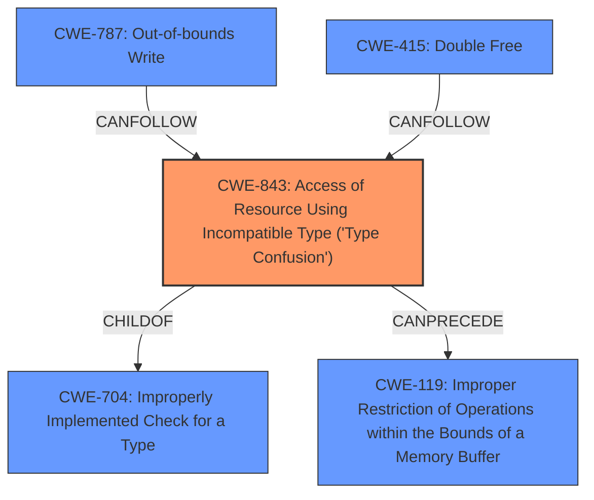

# Analysis for CVE-2021-38007

# Summary
| CWE ID | CWE Name | Confidence | CWE Abstraction Level | CWE Vulnerability Mapping Label | CWE-Vulnerability Mapping Notes |
|---|---|---|---|---|---|
| CWE-843 | Access of Resource Using Incompatible Type ('Type Confusion') | 1 | Base | Allowed | Primary CWE |
| CWE-787 | Out-of-bounds Write | 0.5 | Base | Allowed | Secondary Candidate |
| CWE-415 | Double Free | 0.3 | Variant | Allowed | Secondary Candidate |

## Evidence and Confidence

*   **Confidence Score:** 0.8
*   **Evidence Strength:** HIGH

## Relationship Analysis
The primary CWE selected is CWE-843, which is a Base level CWE. CWE-843 is related to CWE-704 (Type Confusion) through a ChildOf relationship. It can also precede CWE-119 (Improper Restriction of Operations within the Bounds of a Memory Buffer). CWE-787 (Out-of-bounds Write) was considered as a secondary CWE since it can be a consequence of type confusion. CWE-415 (Double Free) was also considered due to the potential for heap corruption.

## Vulnerability Chain
The vulnerability chain starts with a **type confusion** in the V8 JavaScript engine (CWE-843). This **confusion** can then lead to heap corruption, potentially resulting in arbitrary code execution. While not explicitly stated, heap corruption can manifest as an out-of-bounds write (CWE-787) or a double free (CWE-415), depending on the specific exploitation.

## Summary of Analysis
The initial analysis focused on the **root cause** indicated in the vulnerability description: **type confusion in V8**. The CVE Reference Links Content Summary further supports this by stating: "Root cause of vulnerability: Type **confusion** in V8, the JavaScript engine used by Chromium. Weaknesses/vulnerabilities present: Type **confusion**."

The primary CWE match from the "CWE for similar CVE Descriptions" section is CWE-843 (Access of Resource Using Incompatible Type ('Type Confusion')), which aligns perfectly with the vulnerability's **root cause**.

The Retriever Results also list CWE-843 as the top combined result with a score of 0.389. The CWE description states: "The product allocates or initializes a resource such as a pointer, object, or variable using one type, but it later accesses that resource using a type that is incompatible with the original type."

Other CWEs were considered, such as CWE-787 (Out-of-bounds Write) and CWE-415 (Double Free), as heap corruption can result in these types of memory corruption issues. However, these are considered secondary impacts rather than the primary **root cause**.

The selection of CWE-843 is based on the evidence from the vulnerability description, the CVE Reference Links Content Summary, and the Retriever Results. CWE-843 is at the Base level of abstraction, which is the preferred level. Therefore, CWE-843 is the optimal selection.

Relevant CWE Information:

# Enhanced Context (25 CWEs)

## CWE-415: Double Free
**Abstraction Level**: Variant
**Similarity Score**: 0.78
**Source**: dense

**Description**:
The product calls free() twice on the same memory address, potentially leading to modification of unexpected memory locations.

**Mapping Guidance**:
- Usage: Allowed
- Rationale: This CWE entry is at the Variant level of abstraction, which is a preferred level of abstraction for mapping to the root causes of vulnerabilities.
 - Considered because the vulnerability description mentions heap corruption. However, double free is a specific type of heap corruption, and the initial cause is type confusion.

## CWE-404: Improper Resource Shutdown or Release
**Abstraction Level**: Class
**Similarity Score**: 0.78
**Source**: dense

**Description**:
The product does not release or incorrectly releases a resource before it is made available for re-use.

**Mapping Guidance**:
- Usage: Allowed-with-Review
- Rationale: This CWE entry is a Class and might have Base-level children that would be more appropriate
 - Not directly related to the type confusion, which is the primary cause.

## CWE-226: Sensitive Information in Resource Not Removed Before Reuse
**Abstraction Level**: Base
**Similarity Score**: 0.78
**Source**: dense

**Description**:
The product releases a resource such as memory or a file so that it can be made available for reuse, but it does not clear or "zeroize" the information contained in the resource before the product performs a critical state transition or makes the resource available for reuse by other entities.

**Mapping Guidance**:
- Usage: Allowed
- Rationale: This CWE entry is at the Base level of abstraction, which is a preferred level of abstraction for mapping to the root causes of vulnerabilities.
 - This CWE is not applicable as the vulnerability is primarily about type confusion, not about sensitive information.

## CWE-366: Race Condition within a Thread
**Abstraction Level**: Base
**Similarity Score**: 0.77
**Source**: dense

**Description**:
If two threads of execution use a resource simultaneously, there exists the possibility that resources may be used while invalid, in turn making the state of execution undefined.

**Mapping Guidance**:
- Usage: Allowed
- Rationale: This CWE entry is at the Base level of abstraction, which is a preferred level of abstraction for mapping to the root causes of vulnerabilities.
 - Not directly related to the type confusion.

## CWE-843: Access of Resource Using Incompatible Type ('Type Confusion')
**Abstraction Level**: Base
**Similarity Score**: 0.77
**Source**: dense

**Description**:
The product allocates or initializes a resource such as a pointer, object, or variable using one type, but it later accesses that resource using a type that is incompatible with the original type.

**Mapping Guidance**:
- Usage: Allowed
- Rationale: This CWE entry is at the Base level of abstraction, which is a preferred level of abstraction for mapping to the root causes of vulnerabilities.
 - Selected as the primary CWE due to its direct relevance to the vulnerability description and evidence.

## CWE-667: Improper Locking
**Abstraction Level**: Class
**Similarity Score**: 0.76
**Source**: dense

**Description**:
The product does not properly acquire or release a lock on a resource, leading to unexpected resource state changes and behaviors.

**Mapping Guidance**:
- Usage: Allowed-with-Review
- Rationale: This CWE entry is a Class and might have Base-level children that would be more appropriate
 - Not directly related to the type confusion.

## CWE-131: Incorrect Calculation of Buffer Size
**Abstraction Level**: Base
**Similarity Score**: 0.76
**Source**: dense

**Description**:
The product does not correctly calculate the size to be used when allocating a buffer, which could lead to a buffer overflow.

**Mapping Guidance**:
- Usage: Allowed
- Rationale: This CWE entry is at the Base level of abstraction, which is a preferred level of abstraction for mapping to the root causes of vulnerabilities.
- This CWE is not directly related to the type confusion issue.

## CWE-125: Out-of-bounds Read
**Abstraction Level**: Base
**Similarity Score**: 0.75
**Source**: dense

**Description**:
The product reads data past the end, or before the beginning, of the intended buffer.

**Mapping Guidance**:
- Usage: Allowed
- Rationale: This CWE entry is at the Base level of abstraction, which is a preferred level of abstraction for mapping to the root causes of vulnerabilities.
 - Considered because the type confusion could potentially lead to an out-of-bounds read, but it is not the primary **root cause**.

## CWE-754: Improper Check for Unusual or Exceptional Conditions
**Abstraction Level**: Class
**Similarity Score**: 0.75
**Source**: dense

**Description**:
The product does not check or incorrectly checks for unusual or exceptional conditions that are