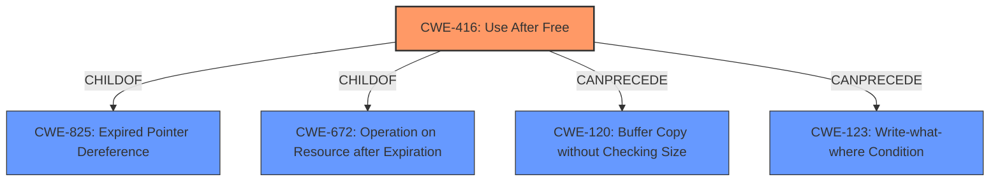

# Raw Analyzer Response for CVE-2021-38008

# Summary
| CWE ID | CWE Name | Confidence | CWE Abstraction Level | CWE Vulnerability Mapping Label | CWE-Vulnerability Mapping Notes |
|---|---|---|---|---|---|
| CWE-416 | Use After Free | 1.0 | Variant | Allowed | Primary CWE |

## Evidence and Confidence

*   **Confidence Score:** 1.0
*   **Evidence Strength:** HIGH

## Relationship Analysis
The primary identified CWE is CWE-416 (Use After Free), which is a variant-level CWE. It has parent-child relationships to CWE-825 (Expired Pointer Dereference) and CWE-672 (Operation on Resource after Expiration). There are also CanPrecede relationships to CWE-120 (Buffer Copy without Checking Size) and CWE-123 (Write-what-where Condition).

## Vulnerability Chain
The vulnerability chain begins with a **use-after-free** condition (CWE-416) which leads to heap corruption.
  - The root cause is the **use-after-free** in the `MediaStreamTrackGenerator` object when a cloned object is still referenced.
  - The impact is potential arbitrary code execution due to heap corruption.

## Summary of Analysis
The analysis is based on the provided vulnerability description and the CVE reference links content summary. The key phrase "rootcause: **use after free**" and the detailed explanation in the CVE Reference Links Content Summary provides strong evidence for CWE-416.

The CVE Reference Links Content Summary states: "A **use-after-free** vulnerability exists in the `MediaStreamTrackGenerator` object within Google Chrome's media handling functionality." and "The vulnerability arises when the `MediaStreamTrackGenerator` object is freed while a clone/copy of it is still being referenced." The summary also explicitly classifies the vulnerability as CWE-416: "The vulnerability is categorized as CWE-416, which is the standard classification for **use-after-free** vulnerabilities."

CWE-416 is at the Variant level of abstraction, which is preferred. The mapping guidance for CWE-416 states: "This CWE entry is at the Variant level of abstraction, which is a preferred level of abstraction for mapping to the root causes of vulnerabilities."

Other CWEs were considered from the Retriever Results, specifically CWE-787, CWE-362, and CWE-415.
- CWE-787 (Out-of-bounds Write) was considered because the impact of the **use-after-free** could potentially lead to an out-of-bounds write if the freed memory is reallocated and overwritten. However, the primary weakness is the **use-after-free** condition itself, so CWE-416 is more appropriate.
- CWE-362 (Concurrent Execution using Shared Resource with Improper Synchronization ('Race Condition')) was considered because **use-after-free** vulnerabilities can sometimes be related to race conditions. However, there is no explicit mention of concurrency issues in the vulnerability description.
- CWE-415 (Double Free) was considered because the CVE Reference Links Content Summary mentions a double free occuring during the onended event. However, the double free is a consequence of the initial **use-after-free**.

Therefore, CWE-416 is the most accurate and specific representation of the vulnerability's root cause.