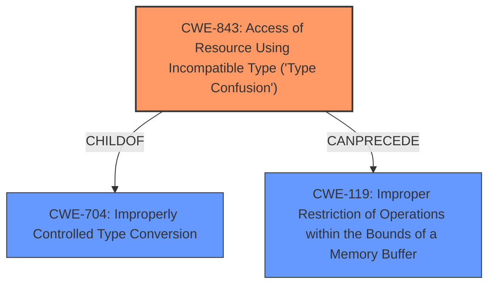

# Analysis for CVE-2021-38012

# Summary
| CWE ID | CWE Name | Confidence | CWE Abstraction Level | CWE Vulnerability Mapping Label | CWE-Vulnerability Mapping Notes |
|---|---|---|---|---|---|
| CWE-843 | Access of Resource Using Incompatible Type ('Type Confusion') | 1.0 | Base | Allowed | Primary CWE |

## Evidence and Confidence

*   **Confidence Score:** 1.0
*   **Evidence Strength:** HIGH

## Relationship Analysis
The primary CWE is CWE-843 **Type Confusion**, which is a base level CWE. It is related to CWE-704 (base class), and can precede CWE-119. The graph shows that CWE-843 is the main CWE and the other CWEs were not selected as they are not the best fit.

## Vulnerability Chain
The vulnerability chain consists of the root cause, **type confusion**, which leads to heap corruption.
- The chain starts with **Type Confusion** (CWE-843)
- Which leads to Heap corruption as the impact.

## Summary of Analysis
The vulnerability is due to **type confusion** in the V8 JavaScript engine in Google Chrome. This allows a remote attacker to potentially exploit heap corruption via a crafted HTML page.

The evidence for this is very strong:
*   The vulnerability description explicitly mentions "**type confusion**".
*   The vulnerability description key phrases lists "**type confusion**" as the rootcause.
*   The CVE Reference Links Content Summary section states: "Root cause of vulnerability: **Type Confusion** in V8" and "Weaknesses/vulnerabilities present: **Type confusion**".
*   The retriever results list CWE-843 as the top candidate with a similarity score of 0.700.

Therefore, the primary CWE is CWE-843 **Type Confusion**.

The other CWEs were considered, but were not selected because they are not the best fit for the vulnerability description.
- CWE-416 Use After Free - Not selected because there is no evidence of memory being freed and then reused.
- CWE-122 Heap-based Buffer Overflow - Not selected because the root cause is **type confusion**, and heap corruption is the impact.
- CWE-366 Race Condition within a Thread - Not selected because there is no mention of multiple threads.
- CWE-451 User Interface (UI) Misrepresentation of Critical Information - Not selected because this is not a UI issue.
- CWE-84 Improper Neutralization of Encoded URI Schemes in a Web Page - Not selected because the vulnerability is not due to improper neutralization of encoded URI schemes.
- CWE-123 Write-what-where Condition - Not selected because the root cause is **type confusion**, not an arbitrary write.
- CWE-204 Observable Response Discrepancy - Not selected because the vulnerability is not due to observable response discrepancies.
- CWE-125 Out-of-bounds Read - Not selected because the root cause is **type confusion**, not an out-of-bounds read.
- CWE-696 Incorrect Behavior Order - Not selected because the vulnerability is not due to incorrect behavior order.
- CWE-667 Improper Locking, CWE-843 Access of Resource Using Incompatible Type ('Type Confusion'), CWE-404 Improper Resource Shutdown or Release, CWE-653 Improper Isolation or Compartmentalization, CWE-754 Improper Check for Unusual or Exceptional Conditions, CWE-696 Incorrect Behavior Order, CWE-1289 Improper Validation of Unsafe Equivalence in Input, CWE-41 Improper Resolution of Path Equivalence, CWE-668 Exposure of Resource to Wrong Sphere, CWE-665 Improper Initialization, CWE-451 User Interface (UI) Misrepresentation of Critical Information, CWE-125 Out-of-bounds Read, CWE-190 Integer Overflow or Wraparound, CWE-843 Access of Resource Using Incompatible Type ('Type Confusion'), CWE-367 Time-of-check Time-of-use (TOCTOU) Race Condition, CWE-123 Write-what-where Condition, CWE-416 Use After Free, CWE-120 Buffer Copy without Checking Size of Input ('Classic Buffer Overflow'), CWE-787 Out-of-bounds Write, CWE-825 Expired Pointer Dereference, CWE-190 Integer Overflow or Wraparound, CWE-170 Improper Null Termination, CWE-1284 Improper Validation of Specified Quantity in Input, CWE-195 Signed to Unsigned Conversion Error, CWE-126 Buffer Over-read

The selected CWE is at the optimal level of specificity, as it directly describes the root cause of the vulnerability which is **type confusion**.