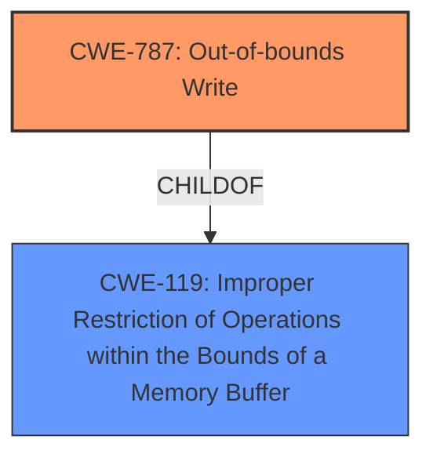

# Analysis Report for CVE-2021-38014

# Vulnerability Analysis Report: CVE-2021-38014

## Description


## Analysis (with Relationship Data)

# Summary
| CWE ID | CWE Name | Confidence | CWE Abstraction Level | CWE Vulnerability Mapping Label | CWE-Vulnerability Mapping Notes |
|---|---|---|---|---|---|
| CWE-787 | Out-of-bounds Write | 1.0 | Base | Allowed | Primary CWE |

## Evidence and Confidence

*   **Confidence Score:** 1.0
*   **Evidence Strength:** HIGH

## Relationship Analysis
The primary relationship that influenced the selection was the direct match of the vulnerability description to **CWE-787 (Out-of-bounds Write)**. **CWE-787 (Out-of-bounds Write)** is a child of **CWE-119 (Improper Restriction of Operations within the Bounds of a Memory Buffer)**, indicating a more general class of memory safety issues. While **CWE-119 (Improper Restriction of Operations within the Bounds of a Memory Buffer)** is a parent, **CWE-787 (Out-of-bounds Write)** is more specific and directly reflects the stated **rootcause** of the vulnerability.



## Vulnerability Chain
The vulnerability chain is relatively straightforward:
1.  **Root Cause:** **CWE-787 (Out-of-bounds Write)** - The software writes data outside the intended buffer.
2.  **Impact:** Heap corruption - The out-of-bounds write corrupts the heap memory.

## Summary of Analysis
The analysis strongly supports classifying this vulnerability as **CWE-787 (Out-of-bounds Write)**. The vulnerability description explicitly states "Out of bounds write", and the CVE Reference Links Content Summary confirms this as the **root cause**. The retriever results also list **CWE-787 (Out-of-bounds Write)** with a high score.

The decision is based on the direct evidence: "**Root cause of vulnerability**: **Out of bounds write**" from the CVE Reference Links Content Summary and "**rootcause**: **out of bounds write**" from the "Vulnerability Description Key Phrases".

While other CWEs like **CWE-125 (Out-of-bounds Read)** and **CWE-362 (Concurrent Execution using Shared Resource with Improper Synchronization ('Race Condition'))** appear in the "Top CWEs" and "Retriever Results", they do not accurately describe the **root cause** of this vulnerability. The primary weakness is a write operation outside the buffer's boundaries, making **CWE-787 (Out-of-bounds Write)** the most specific and appropriate classification.

The selected CWE is at the optimal level of specificity because it directly reflects the **root cause** described in the vulnerability description and reference links.


## CWE Relationship Analysis

Current CWEs represent these abstraction levels: .


### Vulnerability Chain Analysis

**Chain starting from CWE-787:**
- 787 (Out-of-bounds Write) - ROOT


**Chain starting from CWE-119:**
- 119 (Improper Restriction of Operations within the Bounds of a Memory Buffer) - ROOT


### CWE Relationship Diagram

```mermaid
graph TD
    classDef primary fill:#f96,stroke:#333,stroke-width:2px
    classDef secondary fill:#69f,stroke:#333
    classDef tertiary fill:#9e9,stroke:#333
```


*Report generated on 2025-03-30 18:27:44*
