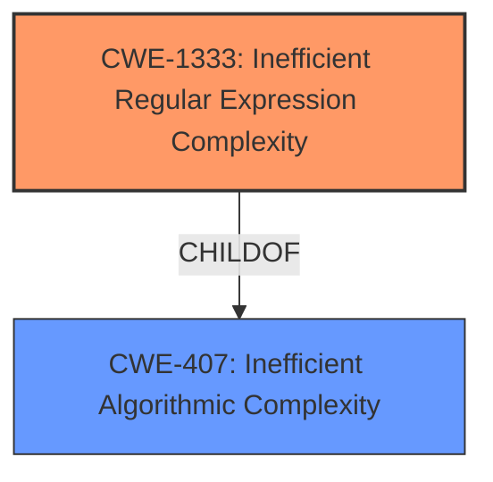

# Analysis Report for CVE-2021-3810

# Vulnerability Analysis Report: CVE-2021-3810

## Description


## Analysis (with Relationship Data)

# Summary
| CWE ID | CWE Name | Confidence | CWE Abstraction Level | CWE Vulnerability Mapping Label | CWE-Vulnerability Mapping Notes |
|---|---|---|---|---|---|
| CWE-1333 | Inefficient Regular Expression Complexity | 1.0 | Base | Allowed | Primary CWE |
| CWE-407 | Inefficient Algorithmic Complexity | 0.7 | Class | Allowed-with-Review | Secondary Candidate |

## Evidence and Confidence

*   **Confidence Score:** 0.9
*   **Evidence Strength:** HIGH

## Relationship Analysis
The primary relationship impacting the decision is that CWE-1333 [Inefficient Regular Expression Complexity] is a child of CWE-407 [Inefficient Algorithmic Complexity]. While CWE-407 is a broader category, CWE-1333 is a specific type of algorithmic inefficiency directly related to regular expressions, making it a more precise classification for this vulnerability.



## Vulnerability Chain
The vulnerability chain starts with the **inefficient regular expression** (**ROOTCAUSE**), which leads to excessive CPU consumption and ultimately results in a denial-of-service condition (**IMPACT**).

## Summary of Analysis
The initial analysis strongly suggests CWE-1333 [Inefficient Regular Expression Complexity] as the primary CWE. The vulnerability description explicitly mentions "Inefficient Regular Expression Complexity," and the CVE Reference Links Content Summary confirms that the root cause is a vulnerable regular expression pattern susceptible to ReDoS (Regular Expression Denial of Service). The code change in `src/node/util.ts` further supports this by indicating a modification in the regular expression pattern to address the potential denial of service.

> **Vulnerability Description Key Phrases**
> - **product:** componentcode-server

> **CVE Reference Links Content Summary**
> **Root Cause of Vulnerability:**
> The vulnerability is a Regular Expression Denial of Service (ReDoS) vulnerability... The vulnerability stems from an insecure regular expression used for stripping ANSI escape codes from strings.
>
> **Weaknesses/Vulnerabilities Present:**
> The core weakness is the vulnerable regular expression pattern that is susceptible to ReDoS. This pattern, intended to match ANSI escape codes, can lead to extremely long processing times when given a specially crafted malicious input string.

The retriever results also list CWE-1333 [Inefficient Regular Expression Complexity] as the top combined result, further strengthening the selection.

CWE-407 [Inefficient Algorithmic Complexity] was considered, but CWE-1333 [Inefficient Regular Expression Complexity] is more specific and accurately reflects the vulnerability's root cause, making it the preferred choice. The decision is based on direct evidence from the vulnerability description and supporting information in the CVE Reference Links Content Summary. The chosen CWE is at the optimal level of specificity, as it directly addresses the inefficient regular expression complexity, which is the root cause of the vulnerability.

Relevant CWE Information:

# Enhanced Context (25 CWEs)
The following CWEs were identified as potentially relevant to this vulnerability:

## CWE-1333: Inefficient Regular Expression Complexity
**Abstraction:** Base
**Status:** Draft

### Description
The product uses a regular expression with an inefficient, possibly exponential worst-case computational complexity that consumes excessive CPU cycles.

### Extended Description
Some regular expression engines have a feature called "backtracking". If the token cannot match, the engine "backtracks" to a position that may result in a different token that can match.
 Backtracking becomes a weakness if all of these conditions are met:
  - The number of possible backtracking attempts are exponential relative to the length of the input.
  - The input can fail to match the regular expression.
  - The input can be long enough.
 Attackers can create crafted inputs that intentionally cause the regular expression to use excessive backtracking in a way that causes the CPU consumption to spike. 

### Alternative Terms
ReDoS: ReDoS is an abbreviation of "Regular expression Denial of Service".
Regular Expression Denial of Service: While this term is attack-focused, this is commonly used to describe the weakness.
Catastrophic backtracking: This term is used to describe the behavior of the regular expression as a negative technical impact.

### Relationships
ChildOf -> CWE-407
ChildOf -> CWE-407

### Mapping Guidance
**Usage:** Allowed
**Rationale:** This CWE entry is at the Base level of abstraction, which is a preferred level of abstraction for mapping to the root causes of vulnerabilities.
**Comments:** Carefully read both the name and description to ensure that this mapping is an appropriate fit. Do not try to 'force' a mapping to a lower-level Base/Variant simply to comply with this preferred level of abstraction.
**Reasons:**
- Acceptable-Use

### Observed Examples
- **CVE-2020-5243:** server allows ReDOS with crafted User-Agent strings, due to overlapping capture groups that cause excessive backtracking.
- **CVE-2021-21317:** npm package for user-agent parser prone to ReDoS due to overlapping capture groups
- **CVE-2019-16215:** Markdown parser uses inefficient regex when processing a message, allowing users to cause CPU consumption and delay preventing processing of other messages.

**CWE-1333 Justification:**
The vulnerability directly matches the description of CWE-1333 [Inefficient Regular Expression Complexity]. The vulnerability stems from an inefficient regular expression, leading to excessive CPU consumption, which aligns perfectly with the CWE's definition. The security implication is a denial-of-service, and this CWE is at the base level of abstraction, which is appropriate.

## CWE-407: Inefficient Algorithmic Complexity
**Abstraction:** Class
**Status:** Incomplete

### Description
An algorithm in a product has an inefficient worst-case computational complexity that may be detrimental to system performance and can be triggered by an attacker, typically using crafted manipulations that ensure that the worst case is being reached.

### Extended Description
Not provided

### Alternative Terms
Quadratic Complexity: Used when the algorithmic complexity is related to the square of the number of inputs (N^2)

### Relationships
ChildOf -> CWE-405

### Mapping Guidance
**Usage:** Allowed-with-Review
**Rationale:** This CWE entry is a Class and might have Base-level children that would be more appropriate
**Comments:** Examine children of this entry to see if there is a better fit
**Reasons:**
- Abstraction

### Observed Examples
- **CVE-2021-32617:** C++ library for image metadata has "quadratic complexity" issue with unnecessarily repetitive parsing each time an invalid character is encountered
- **CVE-2020-10735:** Python has "quadratic complexity" issue when converting string to int with many digits in unexpected bases
- **CVE-2020-5243:** server allows ReDOS with crafted User-Agent strings, due to overlapping capture groups that cause excessive backtracking.

**CWE-407 Justification:**
While CWE-407 [Inefficient Algorithmic Complexity] is relevant, it is a broader class. The specific issue is related to regular expressions, making CWE-1333 [Inefficient Regular Expression Complexity] a more precise and appropriate classification.


## CWE Relationship Analysis

Current CWEs represent these abstraction levels: .


### Vulnerability Chain Analysis

**Chain starting from CWE-405:**
- 405 (Asymmetric Resource Consumption (Amplification)) - ROOT


**Chain starting from CWE-1333:**
- 1333 (Inefficient Regular Expression Complexity) - ROOT


### CWE Relationship Diagram

```mermaid
graph TD
    classDef primary fill:#f96,stroke:#333,stroke-width:2px
    classDef secondary fill:#69f,stroke:#333
    classDef tertiary fill:#9e9,stroke:#333
```


*Report generated on 2025-03-30 17:09:20*
