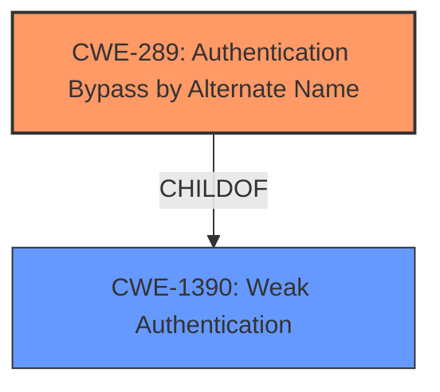

# Analysis for CVE-2021-3827

# Summary
| CWE ID | CWE Name | Confidence | CWE Abstraction Level | CWE Vulnerability Mapping Label | CWE-Vulnerability Mapping Notes |
|---|---|---|---|---|---|
| CWE-289 | Authentication Bypass by Alternate Name | 0.8 | Base | Allowed | Primary CWE |
| CWE-1390 | Weak Authentication | 0.6 | Class | Allowed-with-Review | Secondary Candidate |

## Evidence and Confidence

*   **Confidence Score:** 0.7
*   **Evidence Strength:** HIGH

## Relationship Analysis
The primary relationship influencing the decision is the hierarchical relationship where CWE-289 (Authentication Bypass by Alternate Name) is a child of CWE-1390 (Weak Authentication). The vulnerability is caused by the **default ECP binding flow allowing bypass of other authentication flows**, which directly relates to an authentication bypass. CWE-289 is more specific, indicating an authentication bypass based on an alternate name or path, which aligns with the ECP flow being an alternate authentication mechanism.

## Vulnerability Chain
The vulnerability chain starts with the **incorrect configuration** of the ECP binding flow, leading to **authentication bypass**, and ultimately resulting in a **confidentiality and integrity breach**.
  - **Root Cause:** **Default ECP binding flow allows other authentication flows to be bypassed**
  - **Weakness:** Authentication Bypass
  - **Impact:** Confidentiality and Integrity Breach

## Summary of Analysis
The initial analysis pointed towards an authentication bypass due to a misconfiguration, specifically related to the ECP binding flow. The evidence strongly suggests that the **default ECP binding flow allowing other authentication flows to be bypassed**, is the root cause.
Based on the vulnerability description, the retriever results, and the CWE specifications, the primary CWE is determined to be CWE-289 (Authentication Bypass by Alternate Name). This is because the ECP flow acts as an alternate authentication mechanism that bypasses the intended authentication flows, including MFA.
The graph relationships show that CWE-289 is a child of CWE-1390 (Weak Authentication), indicating a more specific type of authentication weakness. While CWE-1390 is a valid consideration, CWE-289 provides a more precise description of the vulnerability. The selection of CWE-289 is at the optimal level of specificity, as it directly reflects the vulnerability's root cause and mechanism.
The evidence from the vulnerability description and CVE Reference Links Content Summary clearly supports this classification:
- Vulnerability Description Key Phrases: "default ECP binding flow allows other authentication flows to be bypassed"
- CVE Reference Links Content Summary: "The vulnerability stems from the default configuration of the ECP (Enhanced Client or Proxy) SAML binding in Keycloak. This default setting allowed the ECP flow to bypass configured authentication flows, such as MFA."

Relevant CWE Information:

# Enhanced Context (25 CWEs)
The following CWEs were identified as potentially relevant to this vulnerability:

## CWE-289: Authentication Bypass by Alternate Name
**Abstraction Level**: Base
**Similarity Score**: 0.78
**Source**: dense

**Description**:
The product performs authentication based on the name of a resource being accessed, or the name of the actor performing the access, but it does not properly check all possible names for that resource or actor.

**Mapping Guidance**:
- Usage: Allowed
- Rationale: This CWE entry is at the Base level of abstraction, which is a preferred level of abstraction for mapping to the root causes of vulnerabilities.

## CWE-1390: Weak Authentication
**Abstraction Level**: Class
**Similarity Score**: 0.77
**Source**: dense

**Description**:
The product uses an authentication mechanism to restrict access to specific users or identities, but the mechanism does not sufficiently prove that the claimed identity is correct.

**Mapping Guidance**:
- Usage: Allowed-with-Review
- Rationale: This CWE entry is a Class and might have Base-level children that would be more appropriate

## CWE-863: Incorrect Authorization
**Abstraction Level**: Class
**Similarity Score**: 4784.45
**Source**: sparse

**Description**:
The product performs an authorization check when an actor attempts to access a resource or perform an action, but it does not correctly perform the check.

**Mapping Guidance**:
- Usage: Allowed-with-Review
- Rationale: This CWE entry is a Class and might have Base-level children that would be more appropriate

### Alternative CWE Considerations and Justifications:

-   **CWE-1390 (Weak Authentication)**: Considered as a broader category for authentication issues. While applicable, CWE-289 is more specific to the bypass mechanism.
-   **CWE-863 (Incorrect Authorization)**: Not selected because the primary issue is with authentication, not authorization. The ECP flow bypasses authentication, which precedes authorization.