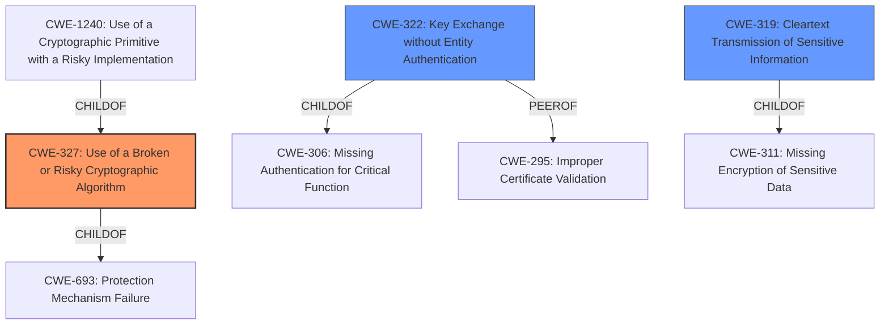

# Raw Analyzer Response for CVE-2021-38296

# Summary
| CWE ID | CWE Name | Confidence | CWE Abstraction Level | CWE Vulnerability Mapping Label | CWE-Vulnerability Mapping Notes |
|---|---|---|---|---|---|
| CWE-327 | Use of a Broken or Risky Cryptographic Algorithm | 0.9 | Class | Allowed-with-Review | Primary CWE |
| CWE-322 | Key Exchange without Entity Authentication | 0.7 | Base | Allowed | Secondary Candidate |
| CWE-319 | Cleartext Transmission of Sensitive Information | 0.6 | Base | Allowed | Secondary Candidate |

## Evidence and Confidence

*   **Confidence Score:** 0.8
*   **Evidence Strength:** HIGH

## Relationship Analysis
The primary CWE selected is CWE-327, which is a class-level CWE. While it is generally preferred to select a base or variant level CWE, the specifics of the broken protocol are not detailed enough to select a more specific CWE. CWE-327's parents include CWE-693 which is a weakness in functionality, and it also includes children which are more specific crypto flaws like CWE-1240. CWE-322 (Key Exchange without Entity Authentication) is a child of CWE-306 (Missing Authentication for Critical Function) and is a peer of CWE-295 (Improper Certificate Validation). CWE-319 (Cleartext Transmission of Sensitive Information) is a child of CWE-311 (Missing Encryption of Sensitive Data).

## Vulnerability Chain
The vulnerability chain starts with the use of a **bespoke mutual authentication protocol** (CWE-327), which leads to **full encryption key recovery**. This, in turn, allows an attacker to decrypt plaintext traffic offline. If the traffic was transmitted in cleartext, this would also be CWE-319.

## Summary of Analysis
The initial analysis identified the use of a **bespoke mutual authentication protocol** as the root cause, leading to **full encryption key recovery** and the ability to decrypt plaintext traffic offline. The CVE description states: "In versions 3.1.2 and earlier, it **uses a bespoke mutual authentication protocol** that allows for **full encryption key recovery**. After an initial interactive attack, this would allow someone to decrypt plaintext traffic offline."

The evidence from the CVE Reference Links Content Summary further supports this: "The vulnerability is due to an insecure implementation within Apache Spark... Insecure implementation of Apache Spark... Successful exploitation could allow an attacker to compromise the confidentiality, integrity, and availability of the system."

CWE-327 (Use of a Broken or Risky Cryptographic Algorithm) is the most appropriate primary CWE because the vulnerability stems from the use of a **bespoke mutual authentication protocol** which is an instance of a broken or risky cryptographic algorithm. The retriever results also had this CWE listed as a top candidate.

CWE-322 (Key Exchange without Entity Authentication) was considered as a possible secondary CWE because mutual authentication protocols also implement key exchanges.

CWE-319 (Cleartext Transmission of Sensitive Information) was also considered as a possible secondary CWE because the impact of the vulnerability is the ability to decrypt plaintext traffic.

The selected CWEs are at the optimal level of specificity given the available information. While it would be ideal to have a more specific CWE than CWE-327, the specifics of the broken protocol are not detailed enough to select a more specific CWE.