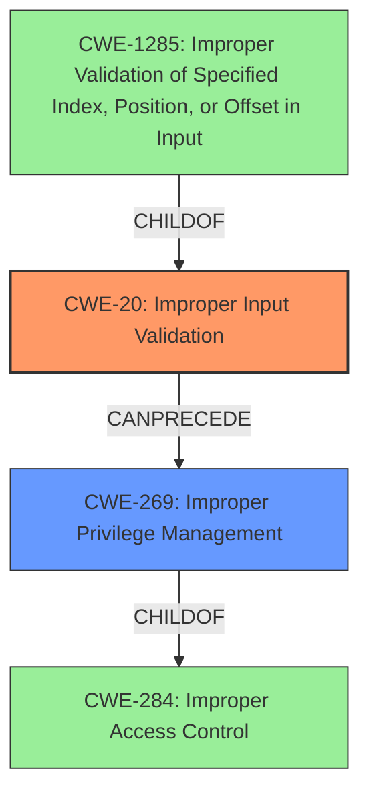

# Analysis for CVE-2021-38304

# Summary
| CWE ID | CWE Name | Confidence | CWE Abstraction Level | CWE Vulnerability Mapping Label | CWE-Vulnerability Mapping Notes |
|---|---|---|---|---|---|
| CWE-20 | Improper Input Validation | 0.9 | Class | Primary | Discouraged |
| CWE-269 | Improper Privilege Management | 0.5 | Class | Secondary | Discouraged |

## Evidence and Confidence

*   **Confidence Score:** 0.7
*   **Evidence Strength:** MEDIUM

## Relationship Analysis
The primary relationship is that CWE-20 [Improper Input Validation] is a class-level CWE that can lead to many different types of vulnerabilities. It is a parent of CWE-1285 [Improper Validation of Specified Index, Position, or Offset in Input]. The description clearly indicates that **improper input validation** is the root cause.
CWE-269 [Improper Privilege Management] is a class-level CWE which may be a secondary concern given that the impact is privilege escalation. CWE-269 is a child of CWE-284.

## Vulnerability Chain
The vulnerability chain starts with **improper input validation** (CWE-20), which leads to the potential for a privileged user to escalate their privileges.

## Summary of Analysis
The initial analysis identified **improper input validation** as the root cause, which aligns with the vulnerability description. The primary focus is on CWE-20 [Improper Input Validation] because the description states **"Improper input validation** in the National Instruments NI-PAL driver in versions 20.0.0 and prior may allow a privileged user to potentially enable escalation of privilege via local access."** The retriever results also list CWE-20 as a possible match. However, CWE-20 is a class-level CWE and is discouraged when a more specific CWE is available. The **impact** is that the privileged user can perform **escalation of privilege**, so CWE-269 [Improper Privilege Management] is also considered.

The graph relationships show that CWE-20 can precede CWE-269, indicating a potential chain where **improper input validation** leads to **improper privilege management**.

I am choosing to use CWE-20 [Improper Input Validation] as the primary CWE because the vulnerability description explicitly mentions it as the root cause. However, due to the high-level nature of the CWE, I am only assigning a confidence score of 0.9. CWE-269 [Improper Privilege Management] is a reasonable secondary candidate, but it describes the impact rather than the root cause.

Relevant CWE Information: