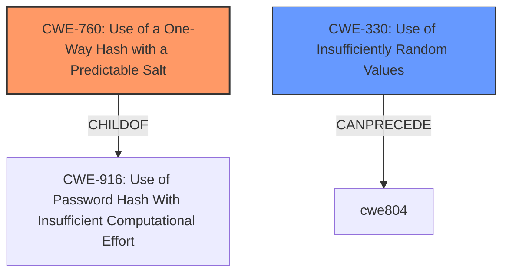

# Analysis Report for CVE-2021-38314

# Vulnerability Analysis Report: CVE-2021-38314

## Description


## Analysis (with Relationship Data)

# Summary
| CWE ID | CWE Name | Confidence | CWE Abstraction Level | CWE Vulnerability Mapping Label | CWE-Vulnerability Mapping Notes |
|---|---|---|---|---|---|
| CWE-760 | Use of a One-Way Hash with a Predictable Salt | 0.9 | Variant | Primary | Allowed |
| CWE-330 | Use of Insufficiently Random Values | 0.7 | Class | Secondary | Discouraged |

## Evidence and Confidence

*   **Confidence Score:** 0.9
*   **Evidence Strength:** HIGH

## Relationship Analysis
The primary CWE, CWE-760 (Use of a One-Way Hash with a Predictable Salt), is a Variant of CWE-916 (Use of Password Hash With Insufficient Computational Effort). This hierarchical relationship supports the selection of CWE-760 as it is more specific and directly addresses the use of a predictable salt. CWE-330 (Use of Insufficiently Random Values) is a higher-level Class that relates to the general issue of predictability, but CWE-760 is more precise. There isn't a clear chain relationship indicated in this vulnerability. The abstraction levels influenced the choice, favoring the Variant level (CWE-760) for its specificity over the Class level (CWE-330).



## Vulnerability Chain
The vulnerability chain starts with the **predictable AJAX actions** due to the **use of a one-way hash with a predictable salt (CWE-760)**. This leads to the disclosure of sensitive information, including the PHP version, active plugins and versions, and an unsalted md5 hash of the site's `AUTH_KEY` and `SECURE_AUTH_KEY`. The chain is:
1.  **Predictable Hash (CWE-760)**
2.  Sensitive Information Disclosure (Impact)

## Summary of Analysis
The analysis is based on the provided evidence, which clearly indicates the use of a predictable hash.

The vulnerability description states: "These AJAX actions could be used to retrieve a list of active plugins and their versions, the sites PHP version, and an unsalted md5 hash of sites `AUTH_KEY` concatenated with the `SECURE_AUTH_KEY`."

The CVE Reference Links Content Summary confirms: "The plugin registered several AJAX actions available to unauthenticated users that exposed sensitive information. These actions used a predictable hash based on the site's URL..."

The graph relationships emphasize the connection between CWE-760 and its parent, CWE-916, reinforcing the decision to choose the more specific Variant.

The selection of CWE-760 is at the optimal level of specificity because it directly addresses the root cause of the vulnerability: the use of a predictable salt in a one-way hash. While CWE-330 is related to the broader issue of insufficient randomness, it does not capture the specific flaw of using a predictable salt with a hashing algorithm.

Relevant CWE Information:

# Enhanced Context (25 CWEs)
The following CWEs were identified as potentially relevant to this vulnerability:

## CWE-330: Use of Insufficiently Random Values
**Abstraction Level**: Class
**Similarity Score**: 0.81
**Source**: dense

**Description**:
The product uses insufficiently random numbers or values in a security context that depends on unpredictable numbers.

**Mapping Guidance**:
- Usage: Discouraged
- Rationale: This CWE entry is a level-1 Class (i.e., a child of a Pillar). It might have lower-level children that would be more appropriate

CWE-330 was considered because the vulnerability involves using a predictable hash, which relates to the broader issue of insufficient randomness. However, it was not selected as the primary CWE because CWE-760 more specifically describes the flaw of using a predictable salt in a one-way hash. The mapping guidance discourages the use of this Class-level CWE when more specific children exist.

## CWE-328: Use of Weak Hash
**Abstraction Level**: Base
**Similarity Score**: 0.78
**Source**: dense

**Description**:
The product uses an algorithm that produces a digest (output value) that does not meet security expectations for a hash function that allows an adversary to reasonably determine the original input (preimage attack), find another input that can produce the same hash (2nd preimage attack), or find multiple inputs that evaluate to the same hash (birthday attack).

**Mapping Guidance**:
- Usage: Allowed
- Rationale: This CWE entry is at the Base level of abstraction, which is a preferred level of abstraction for mapping to the root causes of vulnerabilities.

CWE-328 was considered but not selected as the primary CWE because the issue is not with the strength of the hash algorithm itself, but rather with the predictability of the salt used in conjunction with the hash.

## CWE-760: Use of a One-Way Hash with a Predictable Salt
**Abstraction Level**: Variant
**Similarity Score**: 8164.89
**Source**: sparse

**Description**:
The product uses a one-way cryptographic hash against an input that should not be reversible, such as a password, but the product uses a predictable salt as part of the input.

**Mapping Guidance**:
- Usage: Allowed
- Rationale: This CWE entry is at the Variant level of abstraction, which is a preferred level of abstraction for mapping to the root causes of vulnerabilities.

CWE-760 is the selected primary CWE. The vulnerability description clearly states that the AJAX actions were based on a predictable hash of the site URL with a known salt value. This aligns directly with the CWE-760 description. The impact of this vulnerability is that an attacker can retrieve sensitive information by exploiting the predictable hash. The MITRE mapping guidance allows for this CWE as it is a Variant.


## CWE Relationship Analysis

Current CWEs represent these abstraction levels: .


### Vulnerability Chain Analysis

**Chain starting from CWE-916:**
- 916 (Use of Password Hash With Insufficient Computational Effort) - ROOT


**Chain starting from CWE-330:**
- 330 (Use of Insufficiently Random Values) - ROOT


### CWE Relationship Diagram

```mermaid
graph TD
    classDef primary fill:#f96,stroke:#333,stroke-width:2px
    classDef secondary fill:#69f,stroke:#333
    classDef tertiary fill:#9e9,stroke:#333
```


*Report generated on 2025-03-30 20:23:56*
