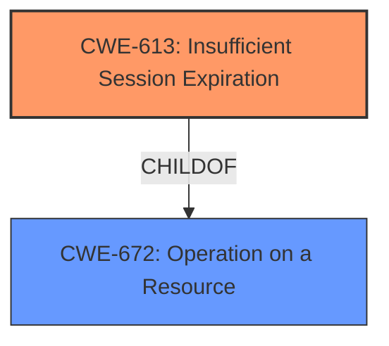

# Raw Analyzer Response for CVE-2021-3844

# Summary
| CWE ID | CWE Name | Confidence | CWE Abstraction Level | CWE Vulnerability Mapping Label | CWE-Vulnerability Mapping Notes |
|---|---|---|---|---|---|
| CWE-613 | Insufficient Session Expiration | 1.0 | Base | Allowed | Primary CWE |

## Evidence and Confidence

*   **Confidence Score:** 1.0
*   **Evidence Strength:** HIGH

## Relationship Analysis
The primary relationship considered was the hierarchical structure, specifically identifying CWE-613 as a Base level CWE under higher-level classes related to authentication and session management. No specific chain relationships were directly applicable from the description, but the potential for CWE-613 to precede other weaknesses related to authorization or data access was noted. The selection of CWE-613 was driven by its direct alignment with the vulnerability description and its recommended usage as a Base-level classification.

## Vulnerability Chain
The vulnerability chain is relatively straightforward:
1.  **Root Cause:** **Insufficient session expiration** (CWE-613).
2.  **Impact:** An attacker with compromised credentials can maintain unauthorized access after an administrator-initiated password reset, potentially leading to further damage.

## Summary of Analysis
The initial analysis correctly identified **insufficient session expiration** as the root cause. The vulnerability description explicitly states this as the core issue. The Retriever Results also strongly support this, with CWE-613 being the top-ranked suggestion.

The evidence from the "Vulnerability Description Key Phrases" section is:
*   **rootcause:** **insufficient session expiration**

The "CVE Reference Links Content Summary" section also supports this:
*   **Root Cause:** The vulnerability arises from insufficient session expiration within the Rapid7 InsightVM platform when not using the Platform Login.
*   **Weakness:** The core weakness is the lack of proper session management, leading to sessions not expiring when they should.

Given the explicit mention of "**insufficient session expiration**" and the high confidence in the mapping, CWE-613 is the most appropriate and specific choice.

Relevant CWE Information:

# Enhanced Context (25 CWEs)

## CWE-613: Insufficient Session Expiration
**Abstraction:** Base
**Status:** Incomplete

### Description
According to WASC, "Insufficient Session Expiration is when a web site permits an attacker to reuse old session credentials or session IDs for authorization."

### Mapping Guidance
**Usage:** Allowed
**Rationale:** This CWE entry is at the Base level of abstraction, which is a preferred level of abstraction for mapping to the root causes of vulnerabilities.

### Summary of Other CWEs Considered
*   **CWE-1390: Weak Authentication** - While related to authentication, the core issue isn't the authentication mechanism itself being weak, but rather the session management following authentication.
*   **CWE-287: Improper Authentication** - Similar to CWE-1390, this is too broad. The authentication process itself is not necessarily flawed, but the session handling after authentication is.
*   **CWE-863: Incorrect Authorization** - This is not about incorrect authorization checks but about the session not being invalidated after a password change.
*   **CWE-256: Plaintext Storage of a Password** - Irrelevant to the described vulnerability.
*   **CWE-384: Session Fixation** - This is a different type of session-related vulnerability and doesn't fit the description.
*   **CWE-942: Permissive Cross-domain Policy with Untrusted Domains** - This is specific to cross-domain policies and not relevant.
*   **CWE-290: Authentication Bypass by Spoofing** - This involves spoofing and isn't about session expiration.
*   **CWE-306: Missing Authentication for Critical Function** - Authentication exists, but the session isn't properly expired.

The selected CWE is at the optimal level of specificity because it directly addresses the **root cause** described in the vulnerability.