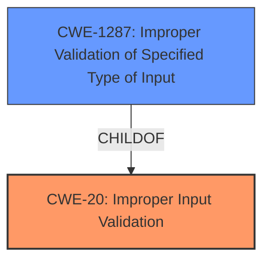

# Enhanced Analysis for CVE-2021-38455

# Summary
| CWE ID | CWE Name | Confidence | CWE Abstraction Level | CWE Vulnerability Mapping Label | CWE-Vulnerability Mapping Notes |
|---|---|---|---|---|---|
| CWE-20 | Improper Input Validation | 1 | Class | Primary | Allowed |
| CWE-1287 | Improper Validation of Specified Type of Input | 0.8 | Base | Secondary | Allowed |

## Evidence and Confidence

*   **Confidence Score:** 0.9
*   **Evidence Strength:** HIGH

## Relationship Analysis
The primary CWE is CWE-20, which is a class-level CWE. CWE-1287 is a child of CWE-20 and is more specific to the type of input that is not being validated. The relationship between these CWEs influenced the decision to include both, with CWE-20 representing the general class of the weakness and CWE-1287 providing a more specific description of the **improper validation**.



## Vulnerability Chain
The vulnerability chain begins with the **lack of input validation** (CWE-20), which leads to the possibility of an attacker providing arbitrary parameters. The **failure to check the type of the parameter or the value** (CWE-1287) is the direct cause for the vulnerability.

## Summary of Analysis
The initial analysis focused on the **lack of input validation** in the OS Service. The vulnerability description clearly states that the service "does not verify any given parameter" and "A user can supply any type of parameter that will be passed to inner calls without checking the type of the parameter or the value." This maps directly to CWE-20.

The Retriever Results suggested CWE-1287, "Improper Validation of Specified Type of Input," which is a Base level CWE and a child of CWE-20. Given the description's emphasis on the **failure to check the type or value of parameters**, CWE-1287 provides a more specific characterization of the weakness.

The chosen CWEs are at the appropriate level of specificity, with CWE-20 representing the general **improper input validation** and CWE-1287 detailing the specific **failure to validate the type of the input**.

Relevant CWE Information:

# Enhanced Context (25 CWEs)

## CWE-1289: Improper Validation of Unsafe Equivalence in Input
**Abstraction Level**: Base
**Similarity Score**: 0.80
**Source**: dense

**Description**:
The product receives an input value that is used as a resource identifier or other type of reference, but it does not validate or incorrectly validates that the input is equivalent to a potentially-unsafe value.
- *This CWE was considered but is not applicable, as the vulnerability description does not specify any validation based on equivalence to unsafe values.*

## CWE-184: Incomplete List of Disallowed Inputs
**Abstraction Level**: Base
**Similarity Score**: 0.78
**Source**: dense

**Description**:
The product implements a protection mechanism that relies on a list of inputs (or properties of inputs) that are not allowed by policy or otherwise require other action to neutralize before additional processing takes place, but the list is incomplete.
- *This CWE was considered but is not applicable because the description indicates that there is no validation done at all.*

## CWE-74: Improper Neutralization of Special Elements in Output Used by a Downstream Component ('Injection')
**Abstraction Level**: Class
**Similarity Score**: 0.77
**Source**: dense

**Description**:
The product constructs all or part of a command, data structure, or record using externally-influenced input from an upstream component, but it does not neutralize or incorrectly neutralizes special elements that could modify how it is parsed or interpreted when it is sent to a downstream component.
- *This CWE was considered but is not applicable because it is too generic.*

## CWE-138: Improper Neutralization of Special Elements
**Abstraction Level**: Class
**Similarity Score**: 0.77
**Source**: dense

**Description**:
The product receives input from an upstream component, but it does not neutralize or incorrectly neutralizes special elements that could be interpreted as control elements or syntactic markers when they are sent to a downstream component.
- *This CWE was considered but is not applicable because it is too generic.*

## CWE-73: External Control of File Name or Path
**Abstraction Level**: Base
**Similarity Score**: 0.77
**Source**: dense

**Description**:
The product allows user input to control or influence paths or file names that are used in filesystem operations.
- *This CWE was considered but is not applicable because it is not clear from the description that the external control relates to file names or paths.*

## CWE-807: Reliance on Untrusted Inputs in a Security Decision
**Abstraction Level**: Base
**Similarity Score**: 0.76
**Source**: dense

**Description**:
The product uses a protection mechanism that relies on the existence or values of an input, but the input can be modified by an untrusted actor in a way that bypasses the protection mechanism.
- *This CWE was considered but is not applicable because it is not clear if any security decision is being made.*

## CWE-183: Permissive List of Allowed Inputs
**Abstraction Level**: Base
**Similarity Score**: 0.76
**Source**: dense

**Description**:
The product implements a protection mechanism that relies on a list of inputs (or properties of inputs) that are explicitly allowed by policy because the inputs are assumed to be safe, but the list is too permissive - that is, it allows an input that is unsafe, leading to resultant weaknesses.
- *This CWE was considered but is not applicable because the description indicates that there is no validation done at all.*

## CWE-41: Improper Resolution of Path Equivalence
**Abstraction Level**: Base
**Similarity Score**: 0.76
**Source**: dense

**Description**:
The product is vulnerable to file system contents disclosure through path equivalence. Path equivalence involves the use of special characters in file and directory names. The associated manipulations are intended to generate multiple names for the same object.
- *This CWE was considered but is not applicable because it is not clear from the description that the external control relates to file names or paths.*

## CWE-134: Use of Externally-Controlled Format String
**Abstraction Level**: Base
**Similarity Score**: 0.75
**Source**: dense

**Description**:
The product uses a function that accepts a format string as an argument, but the format string originates from an external source.
- *This CWE was considered but is not applicable because it is not clear from the description that the vulnerability relates to the use of format strings.*

## CWE-1286: Improper Validation of Syntactic Correctness of Input
**Abstraction Level**: Base
**Similarity Score**: 0.75
**Source**: dense

**Description**:
The product receives input that is expected to be well-formed - i.e., to comply with a certain syntax - but it does not validate or incorrectly validates that the input complies with the syntax.
- *This CWE was considered but is not applicable because CWE-1287 is more directly applicable.*

## CWE-88: Improper Neutralization of Argument Delimiters in a Command ('Argument Injection')
**Abstraction Level**: Base
**Similarity Score**: 6422.64
**Source**: sparse

**Description**:
The product constructs a string for a command to be executed by a separate component
in another control sphere, but it does not properly delimit the
intended arguments, options, or switches within that command string.
- *This CWE was considered but is not applicable because it is not clear from the description that the external control relates to command arguments.*

## CWE-22: Improper Limitation of a Pathname to a Restricted Directory ('Path Traversal')
**Abstraction Level**: Base
**Similarity Score**: 6282.71
**Source**: sparse

**Description**:
The product uses external input to construct a pathname that is intended to identify a file or directory that is located underneath a restricted parent directory, but the product does not properly neutralize special elements within the pathname that can cause the pathname to resolve to a location that is outside of the restricted directory.
- *This CWE was considered but is not applicable because it is not clear from the description that the external control relates to file names or paths.*

## CWE-116: Improper Encoding or Escaping of Output
**Abstraction Level**: Class
**Similarity Score**: 6196.20
**Source**: sparse

**Description**:
The product prepares a structured message for communication with another component, but encoding or escaping of the data is either missing or done incorrectly. As a result, the intended structure of the message is not preserved.
- *This CWE was considered but is not applicable because it is not related to output encoding.*

## CWE-12


## CWE Relationship Analysis

Current CWEs represent these abstraction levels: .


### Vulnerability Chain Analysis

**Chain starting from CWE-41:**
- 41 (Improper Resolution of Path Equivalence) - ROOT


**Chain starting from CWE-184:**
- 184 (Incomplete List of Disallowed Inputs) - ROOT


### CWE Relationship Diagram

```mermaid
graph TD
    classDef primary fill:#f96,stroke:#333,stroke-width:2px
    classDef secondary fill:#69f,stroke:#333
    classDef tertiary fill:#9e9,stroke:#333
```