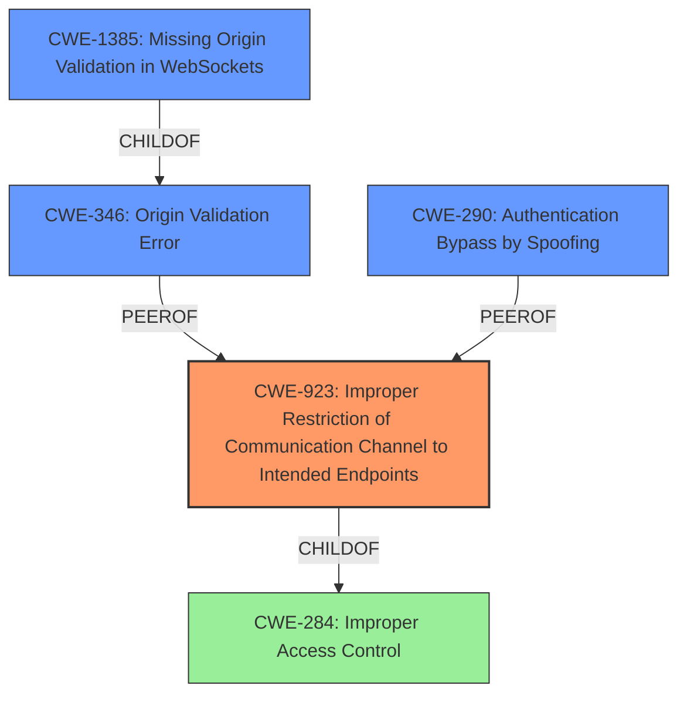

# Analysis for CVE-2021-38507

# Summary
| CWE ID | CWE Name | Confidence | CWE Abstraction Level | CWE Vulnerability Mapping Label | CWE-Vulnerability Mapping Notes |
|---|---|---|---|---|---|
| CWE-923 | Improper Restriction of Communication Channel to Intended Endpoints | 0.8 | Class | Allowed-with-Review | Primary CWE |
| CWE-346 | Origin Validation Error | 0.6 | Class | Allowed-with-Review | Secondary Candidate |
| CWE-290 | Authentication Bypass by Spoofing | 0.5 | Base | Allowed | Secondary Candidate |
| CWE-1385 | Missing Origin Validation in WebSockets | 0.5 | Variant | Allowed | Secondary Candidate |

## Evidence and Confidence

*   **Confidence Score:** 0.8
*   **Evidence Strength:** HIGH

## Relationship Analysis
The primary CWE, CWE-923 [Improper Restriction of Communication Channel to Intended Endpoints], is a Class-level CWE. The description aligns well with the vulnerability where the communication channel is not properly restricted leading to a bypass of the Same-Origin Policy.

CWE-923 [Improper Restriction of Communication Channel to Intended Endpoints] is a child of CWE-284 [Improper Access Control]. This hierarchical relationship indicates that improper access control is a broader category that encompasses the specific issue of restricting communication channels.

The other candidates, CWE-346 [Origin Validation Error], CWE-290 [Authentication Bypass by Spoofing], and CWE-1385 [Missing Origin Validation in WebSockets], are related to the concept of origin validation and authentication, suggesting that the vulnerability involves issues with verifying the source or identity of the communication.

## Vulnerability Chain
The vulnerability chain involves the **improper opportunistic encryption implementation** leading to a bypass of the Same-Origin Policy by connecting to an unintended port. This chain can be mapped as follows:

1.  **Root Cause:** **Improper opportunistic encryption implementation**
2.  **Weakness:** CWE-923 [Improper Restriction of Communication Channel to Intended Endpoints]
3.  **Impact:** Bypassing the Same-Origin Policy, potentially leading to information disclosure or other malicious activities.

## Summary of Analysis
The initial analysis focused on identifying the root cause and impact of the vulnerability. The **improper opportunistic encryption implementation** allows a network attacker to forward a connection to an unintended port, bypassing the Same-Origin Policy.

The Retriever Results suggested CWE-346 [Origin Validation Error], CWE-923 [Improper Restriction of Communication Channel to Intended Endpoints], CWE-1385 [Missing Origin Validation in WebSockets], CWE-451 [User Interface (UI) Misrepresentation of Critical Information], and CWE-290 [Authentication Bypass by Spoofing] as potential candidates.

After reviewing the CWE specifications, CWE-923 [Improper Restriction of Communication Channel to Intended Endpoints] was selected as the primary CWE because it accurately represents the vulnerability where the communication channel is not properly restricted, leading to a bypass of the Same-Origin Policy.

The following excerpt supports this decision:

*   "The Opportunistic Encryption feature of HTTP2 (RFC 8164) allows a connection to be transparently upgraded to TLS while retaining the visual properties of an HTTP connection, including being same-origin with unencrypted connections on port 80. However, if a second encrypted port on the same IP address (e.g. port 8443) did not opt-in to opportunistic encryption a network attacker could forward a connection from the browser to port 443 to port 8443, causing the browser to treat the content of port 8443 as same-origin with HTTP."

CWE-346 [Origin Validation Error], CWE-290 [Authentication Bypass by Spoofing], and CWE-1385 [Missing Origin Validation in WebSockets] were considered as secondary CWEs because they relate to origin validation and authentication issues.

CWE-451 [User Interface (UI) Misrepresentation of Critical Information] was not selected because the vulnerability does not directly involve misrepresentation of critical information in the user interface.

CWE-923 [Improper Restriction of Communication Channel to Intended Endpoints] is at the Class level, which is appropriate because there are no more specific Base or Variant level CWEs that accurately represent the vulnerability.