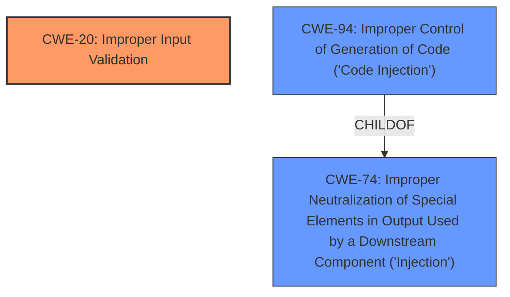

# Analysis for CVE-2021-38647

# Summary
| CWE ID | CWE Name | Confidence | CWE Abstraction Level | CWE Vulnerability Mapping Label | CWE-Vulnerability Mapping Notes |
|---|---|---|---|---|---|
| CWE-20 | Improper Input Validation | 0.9 | Class | Primary | Discouraged |
| CWE-94 | Improper Control of Generation of Code ('Code Injection') | 0.4 | Base | Secondary | Allowed-with-Review |

## Evidence and Confidence

*   **Confidence Score:** 0.9
*   **Evidence Strength:** HIGH

## Relationship Analysis
The primary CWE is CWE-20 **Improper Input Validation**, which is a class-level CWE. While it's discouraged to use class-level CWEs, the vulnerability description explicitly mentions "**improper input validation**" as the **rootcause**. The retriever results also list CWE-20 as the top result. CWE-20 has children CWEs, but based on the description, there is not enough information to be more specific.

The secondary CWE is CWE-94 **Improper Control of Generation of Code ('Code Injection')**. This CWE is considered because the impact is remote code execution. CWE-94 is a child of CWE-74 **Improper Neutralization of Special Elements in Output Used by a Downstream Component ('Injection')**. CWE-94 also has a usage of "Allowed-with-Review" because it is frequently misused.

## Vulnerability Chain
The vulnerability chain starts with **improper input validation** (CWE-20), which leads to remote code execution. It is possible that the input is used to generate code (CWE-94).

## Summary of Analysis
The initial assessment and criticism result in a primary classification of CWE-20 **Improper Input Validation** and a secondary classification of CWE-94 **Improper Control of Generation of Code ('Code Injection')**.

The assessment relies heavily on the explicit mention of "**improper input validation**" in the vulnerability description's key phrases. The phrase directly indicates the nature of the vulnerability. The description also has the phrase "remote code execution" for impact, which leads to the secondary classification of CWE-94.

The graph relationships highlight the hierarchical structure, with CWE-94 as a child of CWE-74, which is a more general injection category. Since CWE-94 is code injection, it is chosen as the secondary CWE.

The selected CWEs are at an appropriate level of specificity, with CWE-20 at the class level due to lack of more specific information and CWE-94 at the base level because the impact is code execution.

Relevant CWE Information:
- CWE-20: Improper Input Validation
- CWE-94: Improper Control of Generation of Code ('Code Injection')