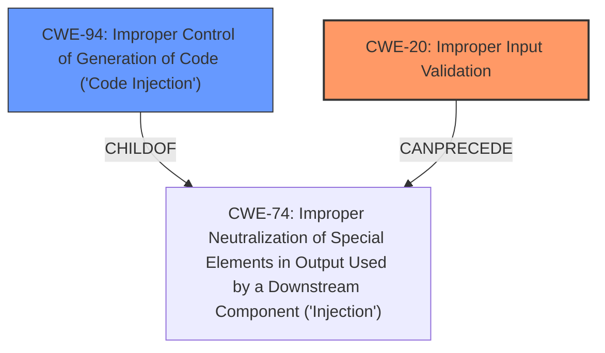

# Enhanced Analysis for CVE-2021-38647

# Summary
| CWE ID | CWE Name | Confidence | CWE Abstraction Level | CWE Vulnerability Mapping Label | CWE-Vulnerability Mapping Notes |
|---|---|---|---|---|---|
| CWE-20 | Improper Input Validation | 0.8 | Class | Primary | Discouraged |
| CWE-94 | Improper Control of Generation of Code ('Code Injection') | 0.5 | Base | Secondary | Allowed-with-Review |

## Evidence and Confidence

*   **Confidence Score:** 0.8
*   **Evidence Strength:** MEDIUM

## Relationship Analysis
The primary relationship that influenced the decision was the parent-child relationship between CWE-74 (Improper Neutralization of Special Elements in Output Used by a Downstream Component ('Injection')) and CWE-94 (Improper Control of Generation of Code ('Code Injection')), as well as the child relationship of CWE-20 to several more specific weaknesses. Because the vulnerability description highlights **improper input validation** as the root cause, CWE-20 was selected. CWE-94 was considered as a secondary weakness because the vulnerability leads to remote code execution, which is often associated with code injection.



## Vulnerability Chain
The vulnerability chain starts with **improper input validation** (CWE-20), which allows for the potential of code injection and ultimately leads to remote code execution.

## Summary of Analysis
The initial analysis focused on the **improper input validation** as the root cause, which is explicitly mentioned in the "Vulnerability Description Key Phrases".

> **Vulnerability Description Key Phrases**
> - **rootcause:** **improper input validation**
> - **impact:** remote code execution
> - **product:** Open Management Infrastructure

Based on this evidence, CWE-20 was selected as the primary CWE. However, the "impact" of remote code execution suggests that CWE-94 (Improper Control of Generation of Code ('Code Injection')) might also be relevant as a secondary weakness.

The MITRE mapping guidance discourages the use of CWE-20 because it is a high-level class and is frequently misused. However, it is the most appropriate based on the limited evidence.

CWE-94 was considered because the vulnerability results in remote code execution, but the provided information doesn't specify that the product intentionally constructs a code segment. Therefore, it is mapped as a secondary candidate.

Relevant CWE Information:

# Enhanced Context (25 CWEs)

## CWE-20: Improper Input Validation
**Abstraction:** Class
**Status:** Stable

### Description
The product receives input or data, but it does
        not validate or incorrectly validates that the input has the
        properties that are required to process the data safely and
        correctly.

### Extended Description
Input validation is a frequently-used technique for checking potentially dangerous inputs in order to ensure that the inputs are safe for processing within the code, or when communicating with other components. When software does not validate input properly, an attacker is able to craft the input in a form that is not expected by the rest of the application.

### Mapping Guidance
**Usage:** Discouraged
**Rationale:** CWE-20 is commonly misused in low-information vulnerability reports when lower-level CWEs could be used instead, or when more details about the vulnerability are available [REF-1287]. It is not useful for trend analysis. It is also a level-1 Class (i.e., a child of a Pillar).

## CWE-94: Improper Control of Generation of Code ('Code Injection')
**Abstraction:** Base
**Status:** Draft

### Description
The product constructs all or part of a code segment using externally-influenced input from an upstream component, but it does not neutralize or incorrectly neutralizes special elements that could modify the syntax or behavior of the intended code segment.

### Extended Description
When a product allows a user's input to contain code syntax, it might be possible for an attacker to craft the code in such a way that it will alter the intended control flow of the product. Such an alteration could lead to arbitrary code execution.

### Mapping Guidance
**Usage:** Allowed-with-Review
**Rationale:** This entry is frequently misused for vulnerabilities with a technical impact of "code execution," which does not by itself indicate a root cause weakness, since dozens of weaknesses can enable code execution.

### Summary of Other CWEs Considered:

*   **CWE-665: Improper Initialization** - Considered but not selected because the vulnerability description does not indicate issues with resource initialization.
*   **CWE-1284: Improper Validation of Specified Quantity in Input** - Considered but not selected because the description doesn't specify if the **improper input validation** is related to quantity.
*   **CWE-787: Out-of-bounds Write** - Considered because it was in the top CWEs list, but the vulnerability description doesn't provide enough information to support this.
*   **CWE-287: Improper Authentication** - Considered but not selected because the description doesn't indicate any authentication issues.
*   **CWE-770: Allocation of Resources Without Limits or Throttling** - Considered but not selected because the description doesn't indicate resource allocation issues.
*   **CWE-470: Use of Externally-Controlled Input to Select Classes or Code ('Unsafe Reflection')** - Considered but not selected because the description doesn't indicate unsafe reflection.
*   **CWE-190: Integer Overflow or Wraparound** - Considered but not selected because the description doesn't indicate integer overflow issues.
*   **CWE-95: Improper Neutralization of Directives in Dynamically Evaluated Code ('Eval Injection')** - Considered but not selected because the description doesn't indicate dynamic evaluation of code.
*   **CWE-1289: Improper Validation of Unsafe Equivalence in Input**, **CWE-184: Incomplete List of Disallowed Inputs**, **CWE-807: Reliance on Untrusted Inputs in a Security Decision**, **CWE-99: Improper Control of Resource Identifiers ('Resource Injection')**, **CWE-183: Permissive List of Allowed Inputs**, **CWE-915: Improperly Controlled Modification of Dynamically-Determined Object Attributes**, **CWE-691: Insufficient Control Flow Management**, **CWE-41: Improper Resolution of Path Equivalence**, **CWE-22: Improper Limitation of a Pathname to a Restricted Directory ('Path Traversal')**, **CWE-681: Incorrect Conversion between Numeric Types**, **CWE-123: Write-what-where Condition** - None of these were selected due to a lack of supporting evidence within the vulnerability description.


## CWE Relationship Analysis

Current CWEs represent these abstraction levels: .


### Vulnerability Chain Analysis

**Chain starting from CWE-470:**
- 470 (Use of Externally-Controlled Input to Select Classes or Code ('Unsafe Reflection')) - ROOT


**Chain starting from CWE-41:**
- 41 (Improper Resolution of Path Equivalence) - ROOT


### CWE Relationship Diagram

```mermaid
graph TD
    classDef primary fill:#f96,stroke:#333,stroke-width:2px
    classDef secondary fill:#69f,stroke:#333
    classDef tertiary fill:#9e9,stroke:#333
```