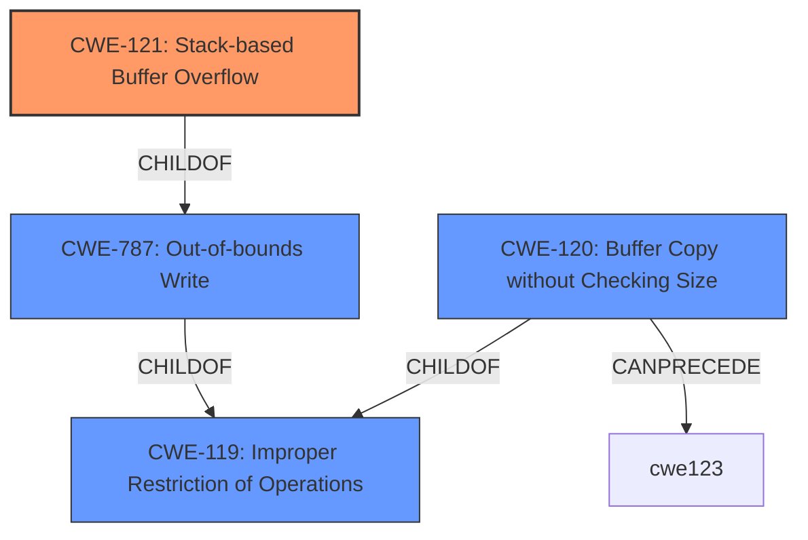

# Raw Analyzer Response for CVE-2021-38690

# Summary
| CWE ID | CWE Name | Confidence | CWE Abstraction Level | CWE Vulnerability Mapping Label | CWE-Vulnerability Mapping Notes |
|---|---|---|---|---|---|
| CWE-121 | Stack-based Buffer Overflow | 1.0 | Variant | Primary | Allowed |
| CWE-787 | Out-of-bounds Write | 0.7 | Base | Secondary | Allowed |
| CWE-120 | Buffer Copy without Checking Size of Input ('Classic Buffer Overflow') | 0.6 | Base | Secondary | Allowed-with-Review |
| CWE-119 | Improper Restriction of Operations within the Bounds of a Memory Buffer | 0.5 | Class | Secondary | Discouraged |

## Evidence and Confidence

*   **Confidence Score:** 0.8
*   **Evidence Strength:** HIGH

## Relationship Analysis
The primary CWE is CWE-121 Stack-based Buffer Overflow, a variant of CWE-787 Out-of-bounds Write. CWE-787 is a base-level CWE, while CWE-121 is a more specific variant, indicating that the overflow occurs specifically on the stack. Both are children of CWE-119 Improper Restriction of Operations within the Bounds of a Memory Buffer, a more general class. CWE-120 Buffer Copy without Checking Size of Input ('Classic Buffer Overflow') is also a child of CWE-119 and can precede CWE-123 Write-what-where Condition. The relationship shows a hierarchy moving from general buffer handling issues to specific stack-based overflows.

## Vulnerability Chain
The vulnerability chain starts with a **stack buffer overflow** due to **improper** or **missing** bounds checking when copying data to a buffer on the stack. This allows an attacker to overwrite memory, potentially leading to arbitrary code execution.

## Summary of Analysis
The initial assessment identified a **stack buffer overflow**, which aligns with CWE-121. The vulnerability description explicitly states "**stack buffer overflow**" which supports the selection of CWE-121. The CVE Reference Links Content Summary section also clearly states the "**Root cause of vulnerability**: Stack buffer overflow" and "**Weaknesses/vulnerabilities**: Stack buffer overflow vulnerability exists in QVR Elite, QVR Pro, and QVR Guard."

CWE-787 (Out-of-bounds Write) is considered as a closely related base CWE since it describes the nature of the **buffer overflow**. CWE-121 is a variant of CWE-787, and since the vulnerability is explicitly a **stack buffer overflow**, CWE-121 is a more precise and appropriate classification.

CWE-120 (Buffer Copy without Checking Size of Input) was considered, as it is a common cause of **buffer overflows**. However, since the vulnerability is specifically a **stack buffer overflow**, CWE-121 is a better fit.

CWE-119 (Improper Restriction of Operations within the Bounds of a Memory Buffer) is a class-level CWE that is too general for this vulnerability. While technically accurate, it doesn't provide enough specificity.

The selection of CWE-121 is based on the explicit description of the vulnerability as a **stack buffer overflow**. This evidence justifies the choice of the variant-level CWE, providing the most accurate and specific classification.