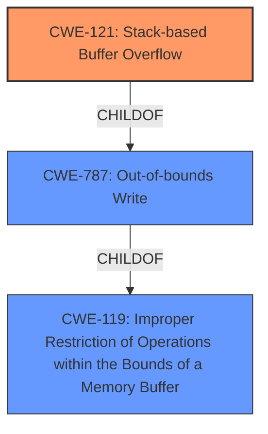

# Raw Analyzer Response for CVE-2021-38692

# Summary
| CWE ID  | CWE Name  | Confidence | CWE Abstraction Level | CWE Vulnerability Mapping Label | CWE-Vulnerability Mapping Notes |
|--------------|---------------------------------------------------------------------------------------------------|------------|-----------------------|-----------------------------------|-----------------------------------|
| CWE-121 | Stack-based Buffer Overflow | 1.0 | Variant | Allowed | Primary CWE |
| CWE-787 | Out-of-bounds Write | 0.7 | Base | Allowed | Secondary Candidate |
| CWE-119 | Improper Restriction of Operations within the Bounds of a Memory Buffer | 0.5 | Class | Discouraged | Secondary Candidate |

## Evidence and Confidence

*   **Confidence Score:** 0.9
*   **Evidence Strength:** HIGH

## Relationship Analysis
The primary relationship influencing the decision is the hierarchical relationship. CWE-121 (Stack-based Buffer Overflow) is a variant of CWE-787 (Out-of-bounds Write) and a child of CWE-119 (Improper Restriction of Operations within the Bounds of a Memory Buffer). Since the vulnerability description specifically mentions a **stack buffer overflow**, CWE-121 is the most specific and appropriate choice.

## Vulnerability Chain
The vulnerability chain starts with the **stack buffer overflow** (CWE-121) due to the program's failure to properly restrict operations within the bounds of the stack memory buffer. This leads to the ability to execute arbitrary code.
  - Root Cause: **stack buffer overflow** (CWE-121)
  - Impact: execute arbitrary code

## Summary of Analysis
The initial analysis identified a **stack buffer overflow** vulnerability. The Retriever Results suggested several potential CWEs, including CWE-119, CWE-120 and CWE-787. However, given the explicit mention of "stack" in the vulnerability description, CWE-121 (Stack-based Buffer Overflow) is the most precise and accurate classification.

The vulnerability description clearly states "A **stack buffer overflow** vulnerability has been reported... If exploited, this vulnerability allows attackers to execute arbitrary code." This evidence directly supports the selection of CWE-121.

CWE-121 is at the Variant level of abstraction, which is preferred when the evidence supports it. The relationship analysis confirms that CWE-121 is a child of CWE-787 and CWE-119, making it more specific.

Relevant CWE Information:

# Enhanced Context (25 CWEs)

## CWE-121: Stack-based Buffer Overflow
| **Abstraction Level** | Variant |
| **Name** | Stack-based Buffer Overflow |
| **Description** | A stack-based buffer overflow condition is a condition where the buffer being overwritten is allocated on the stack (i.e., is a local variable or, rarely, a parameter to a function). |

### CWE-121 Justification:
The vulnerability description states "A **stack buffer overflow** vulnerability has been reported". This indicates that the buffer being overflowed is allocated on the stack. CWE-121 is a Variant-level CWE specifically for stack-based buffer overflows, making it the most accurate choice.

### CWE-787 Justification:
CWE-787 (Out-of-bounds Write) is a base-level CWE that describes a general case of writing data past the end of a buffer. While a **stack buffer overflow** (CWE-121) is a specific type of out-of-bounds write, the description provides enough information to use the more precise CWE-121.

### CWE-119 Justification:
CWE-119 (Improper Restriction of Operations within the Bounds of a Memory Buffer) is a class-level CWE that describes the general problem of performing operations outside the intended boundaries of a memory buffer. While this CWE is related to the vulnerability, it is too broad and does not capture the specific nature of the **stack buffer overflow**. Therefore, it is not the most appropriate choice.

Other CWEs Considered but Not Used:

*   CWE-120 (Buffer Copy without Checking Size of Input): This CWE is specific to buffer copy operations where the size of the input is not checked. The vulnerability description does not provide enough information to determine if a buffer copy operation is involved.
*   CWE-20 (Improper Input Validation): This CWE is a high-level class that describes the general problem of improper input validation. While improper input validation may contribute to the vulnerability, it is not the root cause.