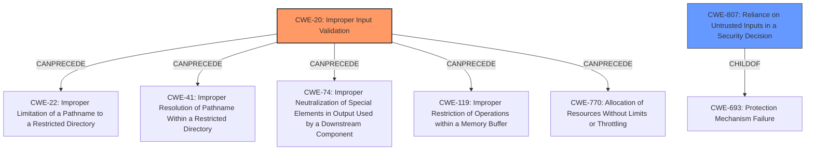

# Analysis Report for CVE-2021-38910

# Vulnerability Analysis Report: CVE-2021-38910

## Description


## Analysis (with Relationship Data)

# Summary
| CWE ID | CWE Name | Confidence | CWE Abstraction Level | CWE Vulnerability Mapping Label | CWE-Vulnerability Mapping Notes |
|---|---|---|---|---|---|
| CWE-20 | Improper Input Validation | 0.9 | Class | Primary | Discouraged |
| CWE-807 | Reliance on Untrusted Inputs in a Security Decision | 0.7 | Base | Secondary | Allowed |

## Evidence and Confidence

*   **Confidence Score:** 0.8
*   **Evidence Strength:** MEDIUM

## Relationship Analysis
The primary CWE selected is CWE-20 [Improper Input Validation], which is a Class-level CWE. Although discouraged, it is used because the vulnerability description explicitly mentions "**improper validation of input**." The secondary CWE is CWE-807 [Reliance on Untrusted Inputs in a Security Decision], which is a Base-level CWE and a more specific type of input validation issue. The graph relationships show that CWE-20 can precede several other CWEs, indicating its role as a general cause.



## Vulnerability Chain
The vulnerability chain starts with the **improper validation of input** (CWE-20), which leads to the bypass of security restrictions. A specially crafted JSON message is the attack vector. The chain could be expanded by assuming that the **improper validation** allows for JSON injection, but this is not explicitly stated.

## Summary of Analysis
The initial assessment identified CWE-20 [Improper Input Validation] as the primary weakness due to the explicit mention of "**improper validation of input**" in the vulnerability description. The phrase "By sending a specially crafted JSON message, an attacker could exploit this vulnerability to modify structure and fields" reinforces this selection. The Retriever Results also list CWE-20 as the top combined result.

CWE-20 is a Class-level CWE, and the mapping guidance discourages its use when more specific CWEs are available. However, in this case, the provided information is limited, and a more specific CWE cannot be confidently assigned. While the vulnerability is a reflected JSON injection issue, as stated in the "CVE Reference Links Content Summary", a specific CWE for JSON injection is not available in the provided data. Therefore, CWE-20 is selected as the primary CWE, with the understanding that more detailed information could lead to a more precise mapping.

CWE-807 [Reliance on Untrusted Inputs in a Security Decision] is considered as a secondary CWE. This is because the **improper validation** likely involves the application's reliance on untrusted input (the specially crafted JSON message) to make security decisions.

Other CWEs were considered but not used:

*   CWE-74 [Improper Neutralization of Special Elements in Output Used by a Downstream Component ('Injection')]: While this could be related to JSON injection, it is too broad and doesn't directly address the **improper validation** aspect.
*   CWE-1236 [Improper Neutralization of Formula Elements in a CSV File]: This is specific to CSV files and not applicable to JSON messages.
*   CWE-1284 [Improper Validation of Specified Quantity in Input]: This is too specific and doesn't apply to the general **improper validation** described.

The selection of CWE-20 is justified by the direct reference to **improper validation of input** in the vulnerability description and the Retriever Results. While CWE-20 is a general CWE, the lack of more specific information prevents a more precise mapping. The confidence in this mapping is high (0.9), but could be improved with more detailed information about the specific **validation** flaws.
The selection of CWE-807 is justified by the "CVE Reference Links Content Summary" indicating that the attacker is able to inject malicious data into the application, and the application's reliance on this malicious data. The confidence in this mapping is medium (0.7).


## CWE Relationship Analysis

Current CWEs represent these abstraction levels: .


### Vulnerability Chain Analysis

**Chain starting from CWE-693:**
- 693 (Protection Mechanism Failure) - ROOT


**Chain starting from CWE-41:**
- 41 (Improper Resolution of Path Equivalence) - ROOT


### CWE Relationship Diagram

```mermaid
graph TD
    classDef primary fill:#f96,stroke:#333,stroke-width:2px
    classDef secondary fill:#69f,stroke:#333
    classDef tertiary fill:#9e9,stroke:#333
```


*Report generated on 2025-03-31 08:02:08*
