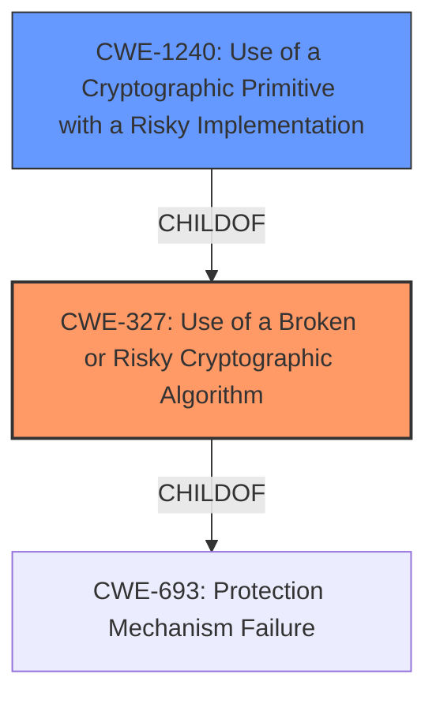

# Raw Analyzer Response for CVE-2021-38921

# Summary
| CWE ID  | CWE Name                                                        | Confidence | CWE Abstraction Level | CWE Vulnerability Mapping Label | CWE-Vulnerability Mapping Notes |
| :-------- | :-------------------------------------------------------------- | :--------- | :---------------------- | :------------------------------ | :------------------------------ |
| CWE-327 | Use of a Broken or Risky Cryptographic Algorithm             | 0.8        | Class                   | Allowed-with-Review             | Primary CWE                     |
| CWE-1240 | Use of a Cryptographic Primitive with a Risky Implementation | 0.6        | Base                    | Allowed                         | Secondary Candidate             |

## Evidence and Confidence

*   **Confidence Score:** 0.7
*   **Evidence Strength:** MEDIUM

## Relationship Analysis
The primary CWE selected is CWE-327, which is a Class-level CWE. CWE-1240 is a more specific Base-level CWE and a ChildOf CWE-327, but there is insufficient evidence to confirm that a non-standard or disallowed cryptographic implementation is the root cause. Thus, the higher-level CWE-327 is selected.

## Vulnerability Chain
The vulnerability chain starts with the **use of weaker than expected cryptographic algorithms** (CWE-327), which leads to the ability of an attacker to decrypt highly sensitive information.

## Summary of Analysis
The vulnerability description clearly states that the product uses **weaker than expected cryptographic algorithms**. The Retriever Results list CWE-327 as the top candidate, and it aligns well with the description. While CWE-1240 is also a strong candidate, the description doesn't explicitly mention non-standard or disallowed cryptographic implementations, so CWE-327 is more appropriate.

The evidence supporting this decision is primarily the **Vulnerability Description Key Phrases**, specifically the root cause: "**weaker than expected cryptographic algorithms**."

CWE-327 is a Class-level CWE, while CWE-1240 is a Base-level CWE. The mapping guidance for CWE-327 suggests examining its children for a better fit, but since the description does not include enough information to confidently say that the cryptographic algorithm is non-standard or disallowed, CWE-327 is selected because it is the most accurate and specific choice based on the available information.

Relevant CWE Information:

# Enhanced Context (25 CWEs)

## CWE-1240: Use of a Cryptographic Primitive with a Risky Implementation
**Abstraction Level**: Base
**Similarity Score**: 0.77
**Source**: dense

**Description**:
To fulfill the need for a cryptographic primitive, the product implements a cryptographic algorithm using a non-standard, unproven, or disallowed/non-compliant cryptographic implementation.

**Mapping Guidance**:
- Usage: Allowed
- Rationale: This CWE entry is at the Base level of abstraction, which is a preferred level of abstraction for mapping to the root causes of vulnerabilities.

## CWE-327: Use of a Broken or Risky Cryptographic Algorithm
**Abstraction Level**: Class
**Similarity Score**: 6131.42
**Source**: sparse

**Description**:
The product uses a broken or risky cryptographic algorithm or protocol.

**Mapping Guidance**:
- Usage: Allowed-with-Review
- Rationale: This CWE entry is a Class and might have Base-level children that would be more appropriate

## CWE-326: Inadequate Encryption Strength
**Abstraction Level**: Class
**Similarity Score**: 0.395

**Description**:
The product stores or transmits sensitive data using an encryption scheme that is theoretically sound, but is not strong enough for the level of protection required. While "weaker than expected" could imply inadequate encryption strength, the term "risky" in CWE-327 seems a better fit.

## CWE-338: Use of Cryptographically Weak Pseudo-Random Number Generator (PRNG)
**Abstraction Level**: Base

**Description**:
The product uses a Pseudo-Random Number Generator (PRNG) in a security context, but the PRNG's algorithm is not cryptographically strong. This is not applicable because the vulnerability description doesn't involve PRNGs.