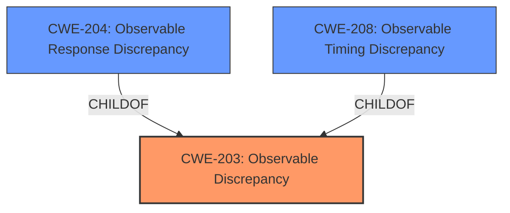

# Enhanced Analysis for CVE-2021-39021

# Summary
| CWE ID | CWE Name | Confidence | CWE Abstraction Level | CWE Vulnerability Mapping Label | CWE-Vulnerability Mapping Notes |
|---|---|---|---|---|---|
| CWE-203 | Observable Discrepancy | 0.9 | Base | Allowed | Primary CWE |
| CWE-204 | Observable Response Discrepancy | 0.7 | Base | Allowed | Secondary Candidate |
| CWE-208 | Observable Timing Discrepancy | 0.5 | Base | Allowed | Secondary Candidate |

## Evidence and Confidence

*   **Confidence Score:** 0.9
*   **Evidence Strength:** MEDIUM

## Relationship Analysis
The primary CWE selected is CWE-203 (**Observable Discrepancy**). It is a base CWE and is directly applicable to the vulnerability description which states that the system "behaves differently or sends different responses under different circumstances in a way that is observable to an unauthorized actor." CWE-204 (**Observable Response Discrepancy**) is a child of CWE-203 and could be a more specific classification if the different behavior was specifically related to responses, but this is not explicitly stated in the description. CWE-208 (**Observable Timing Discrepancy**) is also a child of CWE-203, but timing discrepancies are not mentioned in the vulnerability description.



## Vulnerability Chain
The vulnerability chain starts with the system exhibiting different behaviors or responses under different circumstances. This **WEAKNESS** allows an unauthorized actor to observe these differences. The observation can then be used to enumerate usernames. The **ROOT CAUSE** is the lack of consistent behavior or responses, leading to the impact of username enumeration.

## Summary of Analysis
The initial assessment identified CWE-203 as the most suitable primary CWE due to the vulnerability description explicitly mentioning different behaviors and responses. The retriever results also support this selection, with CWE-203 having the highest score. Other CWEs, such as CWE-204 and CWE-208, were considered but deemed less appropriate as they focus on specific types of discrepancies (response and timing, respectively), while the description is more general.

The final decision is based on the evidence provided in the vulnerability description and the retriever results. The graph relationships helped to understand the hierarchical relationships between the CWEs and select the most specific CWE that accurately represents the vulnerability. The selected CWE is at the optimal level of specificity, as it captures the essence of the vulnerability without being overly specific.

Relevant CWE Information:

# Enhanced Context (25 CWEs)
The following CWEs were identified as potentially relevant to this vulnerability:

## CWE-203: Observable Discrepancy
**Abstraction Level**: Base
**Similarity Score**: 0.78
**Source**: dense

**Description**:
The product behaves differently or sends different responses under different circumstances in a way that is observable to an unauthorized actor, which exposes security-relevant information about the state of the product, such as whether a particular operation was successful or not.

**Mapping Guidance**:
- Usage: Allowed
- Rationale: This CWE entry is at the Base level of abstraction, which is a preferred level of abstraction for mapping to the root causes of vulnerabilities.

## CWE-204: Observable Response Discrepancy
**Abstraction Level**: Base
**Similarity Score**: 0.79
**Source**: dense

**Description**:
The product provides different responses to incoming requests in a way that reveals internal state information to an unauthorized actor outside of the intended control sphere.

**Mapping Guidance**:
- Usage: Allowed
- Rationale: This CWE entry is at the Base level of abstraction, which is a preferred level of abstraction for mapping to the root causes of vulnerabilities.

## CWE-208: Observable Timing Discrepancy
**Abstraction Level**: Base
**Similarity Score**: 0.77
**Source**: dense

**Description**:
Two separate operations in a product require different amounts of time to complete, in a way that is observable to an actor and reveals security-relevant information about the state of the product, such as whether a particular operation was successful or not.

**Mapping Guidance**:
- Usage: Allowed
- Rationale: This CWE entry is at the Base level of abstraction, which is a preferred level of abstraction for mapping to the root causes of vulnerabilities.

The vulnerability description states: "IBM Guardium Data Encryption (GDE) 5.0.0.2 behaves differently or sends different responses under different circumstances in a way that is observable to an unauthorized actor, which could facilitate username enumeration."

This statement directly maps to the description of CWE-203 (**Observable Discrepancy**): "The product behaves differently or sends different responses under different circumstances in a way that is observable to an unauthorized actor, which exposes security-relevant information about the state of the product, such as whether a particular operation was successful or not."

The security implication is that an attacker can observe the different behaviors or responses to gain information about the system's internal state. This can lead to username enumeration, which is a security risk.

CWE-204 (**Observable Response Discrepancy**) was considered because it is a child of CWE-203 and focuses on different responses. However, the description does not specifically state that the different behavior is only related to responses, so CWE-203 is a better fit.

CWE-208 (**Observable Timing Discrepancy**) was also considered, but it focuses on timing differences, which are not mentioned in the description.

CWE-319 (**Cleartext Transmission of Sensitive Information**) was considered but it is unrelated to the description. The description does not mention anything about sensitive information being transmitted in cleartext.

CWE-799 (**Improper Control of Interaction Frequency**) was considered because it could be related to the number of requests that an attacker can send. However, the description does not mention anything about interaction frequency, so this CWE is not a good fit.


## CWE Relationship Analysis

Current CWEs represent these abstraction levels: .


### Vulnerability Chain Analysis

**Chain starting from CWE-208:**
- 208 (Observable Timing Discrepancy) - ROOT


**Chain starting from CWE-203:**
- 203 (Observable Discrepancy) - ROOT


### CWE Relationship Diagram

```mermaid
graph TD
    classDef primary fill:#f96,stroke:#333,stroke-width:2px
    classDef secondary fill:#69f,stroke:#333
    classDef tertiary fill:#9e9,stroke:#333
```