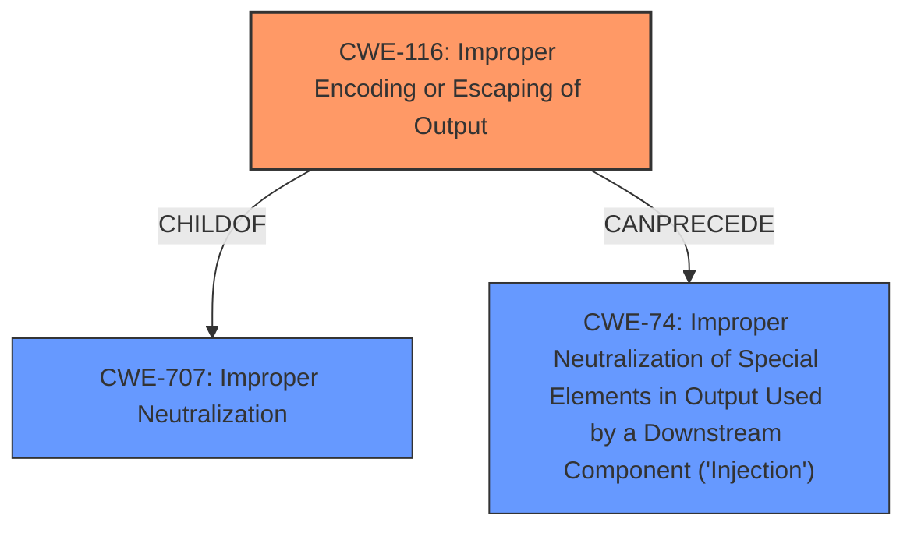

# Analysis Report for CVE-2021-39027

# Vulnerability Analysis Report: CVE-2021-39027

## Description


## Analysis (with Relationship Data)

# Summary
| CWE ID | CWE Name | Confidence | CWE Abstraction Level | CWE Vulnerability Mapping Label | CWE-Vulnerability Mapping Notes |
|---|---|---|---|---|---|
| CWE-116 | Improper Encoding or Escaping of Output | 1.0 | Class | Allowed-with-Review | Primary CWE |
| CWE-74 | Improper Neutralization of Special Elements in Output Used by a Downstream Component ('Injection') | 0.5 | Class | Discouraged | Secondary Candidate |

## Evidence and Confidence

*   **Confidence Score:** 0.75
*   **Evidence Strength:** HIGH

## Relationship Analysis
The primary CWE selected is CWE-116, which is a Class-level CWE. While it is preferable to select a Base or Variant level CWE, the description aligns directly with the Class-level description of CWE-116. CWE-116 is a child of CWE-707 (Improper Neutralization) and can precede CWE-74 (Improper Neutralization of Special Elements in Output Used by a Downstream Component ('Injection')). The potential for injection vulnerabilities due to improper encoding or escaping leads to considering CWE-74 as a secondary candidate, however, the provided information does not have enough information to support that.



## Vulnerability Chain
The vulnerability chain starts with the **missing** or **incorrect** encoding/escaping of data within structured messages. This leads to the potential impact of the intended structure of the message not being preserved. The chain could potentially extend to injection vulnerabilities if the improperly encoded data is later interpreted as commands by a downstream component.

## Summary of Analysis
The initial analysis focused on the vulnerability description which indicated that the **encoding or escaping of data is either missing or done incorrectly** in structured messages, leading to a loss of the intended structure. This aligns directly with CWE-116. The CVE Reference Links Content Summary reinforces this by stating the **root_cause** as "Missing data encoding issue" and listing "Missing data encoding" as a **weakness**.

The retriever results listed CWE-116 as the top candidate.

CWE-116 is a Class level CWE and the guidance recommends examining children of this entry to see if there is a better fit. However, there are no child CWEs and the description of CWE-116 closely matches the vulnerability.

The relationship analysis revealed that CWE-116 can precede CWE-74 (Improper Neutralization of Special Elements in Output Used by a Downstream Component ('Injection')). This means that the improper encoding or escaping could lead to injection vulnerabilities. While possible, this isn't explicitly stated in the vulnerability description, so CWE-74 is added as a secondary candidate with lower confidence.

The final decision is to classify this vulnerability as CWE-116 because it directly addresses the core issue of missing or incorrect encoding/escaping of output, with CWE-74 as a possible secondary. The evidence supports this classification, and the relationship analysis provides additional context.

Relevant CWE Information:

# Enhanced Context (25 CWEs)
The following CWEs were identified as potentially relevant to this vulnerability:

## CWE-74: Improper Neutralization of Special Elements in Output Used by a Downstream Component ('Injection')
**Abstraction Level**: Class
**Similarity Score**: 0.77
**Source**: dense

**Description**:
The product constructs all or part of a command, data structure, or record using externally-influenced input from an upstream component, but it does not neutralize or incorrectly neutralizes special elements that could modify how it is parsed or interpreted when it is sent to a downstream component.

**Mapping Guidance**:
- Usage: Discouraged
- Rationale: CWE-74 is high-level and often misused when lower-level weaknesses are more appropriate.

**Technical Explanation for CWE-116:**

*   **How the vulnerability's details match the CWE's characteristics:** The vulnerability description explicitly states that the **encoding or escaping of the data is either missing or done incorrectly**. The description for CWE-116 states: "The product prepares a structured message for communication with another component, but encoding or escaping of the data is either missing or done incorrectly. As a result, the intended structure of the message is not preserved."
*   **The security implications and potential impact:** The security implication is that the intended structure of the message is not preserved. This could lead to the receiving component misinterpreting the message or executing unintended commands.
*   **Any parent-child relationships or chain patterns that influenced your mapping:** CWE-116 is a child of CWE-707 and can precede CWE-74. This influenced the consideration of CWE-74 as a secondary candidate.
*   **Whether the weakness is primary or secondary in the vulnerability:** CWE-116 is the primary weakness.
*   **How the official MITRE mapping guidance influenced your decision:** The mapping guidance for CWE-116 suggests examining children to see if there is a better fit. However, there are no child CWEs.

**Technical Explanation for CWE-74:**

*   **How the vulnerability's details match the CWE's characteristics:** The vulnerability may result in injection if the lack of encoding or escaping allows an attacker to inject malicious commands into the downstream component.
*   **The security implications and potential impact:** The security implication is that an attacker could inject malicious commands that are executed by the downstream component.
*   **Any parent-child relationships or chain patterns that influenced your mapping:** CWE-116 can precede CWE-74.
*   **Whether the weakness is primary or secondary in the vulnerability:** CWE-74 is a secondary weakness.
*   **How the official MITRE mapping guidance influenced your decision:** The mapping guidance for CWE-74 discourages its use when lower-level weaknesses are more appropriate. In this case, CWE-116 is the more appropriate lower-level weakness as there is no confirmation that this leads to injection.

**Summary of Other CWEs Considered but Not Used:**

*   CWE-209 (Generation of Error Message Containing Sensitive Information): This CWE was considered because improper handling of data might lead to error messages containing sensitive information. However, the description doesn't explicitly state this, so it was not selected.
*   CWE-319 (Cleartext Transmission of Sensitive Information): This CWE was considered because the vulnerability involves data transmission. However, the issue isn't about cleartext transmission but rather the structure of the message not being preserved due to missing or incorrect encoding/escaping.
*   CWE-327 (Use of a Broken or Risky Cryptographic Algorithm) and CWE-311 (Missing Encryption of Sensitive Data): These CWEs relate to cryptography, but the vulnerability description does not mention any cryptographic issues.
*   CWE-756 (Missing Custom Error Page): This CWE is not relevant because the vulnerability is not related to error pages.
*   CWE-1236 (Improper Neutralization of Formula Elements in a CSV File): This CWE is specific to CSV files and is not relevant to the vulnerability.
*   CWE-307 (Improper Restriction of Excessive Authentication Attempts) and CWE-90 (Improper Neutralization of Special Elements used in an LDAP Query ('LDAP Injection')): These CWEs are not relevant to the vulnerability.
*   CWE-707 (Improper Neutralization): This is a Pillar level CWE and too generic.


## CWE Relationship Analysis

Current CWEs represent these abstraction levels: .


### Vulnerability Chain Analysis

**Chain starting from CWE-327:**
- 327 (Use of a Broken or Risky Cryptographic Algorithm) - ROOT


**Chain starting from CWE-209:**
- 209 (Generation of Error Message Containing Sensitive Information) - ROOT


### CWE Relationship Diagram

```mermaid
graph TD
    classDef primary fill:#f96,stroke:#333,stroke-width:2px
    classDef secondary fill:#69f,stroke:#333
    classDef tertiary fill:#9e9,stroke:#333
```


*Report generated on 2025-03-31 02:21:46*
