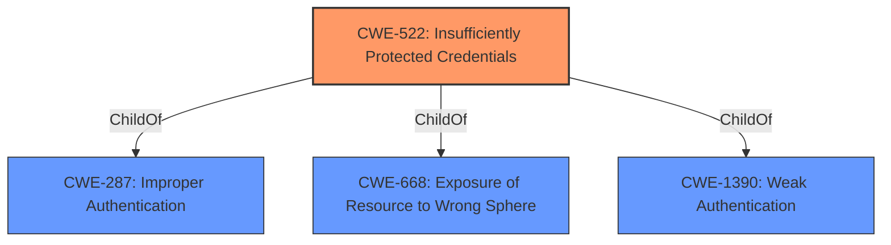

# Analysis Report for CVE-2021-39045

# Vulnerability Analysis Report: CVE-2021-39045

## Description


## Analysis (with Relationship Data)

# Summary
| CWE ID | CWE Name | Confidence | CWE Abstraction Level | CWE Vulnerability Mapping Label | CWE-Vulnerability Mapping Notes |
|---|---|---|---|---|---|
| CWE-522 | Insufficiently Protected Credentials | 1 | Class | Allowed-with-Review | Primary CWE |

## Evidence and Confidence

*   **Confidence Score:** 1
*   **Evidence Strength:** HIGH

## Relationship Analysis
The primary relationship that influenced the decision was the ChildOf relationship between CWE-522 and other CWEs like CWE-287 (Improper Authentication) and CWE-668 (Exposure of Resource to Wrong Sphere). This indicated that CWE-522 is a more specific type of authentication issue related to credential protection. The abstraction level of Class was selected as no more specific Base or Variant was a better fit.



## Vulnerability Chain
The vulnerability chain starts with the **autocomplete feature on password input fields** (**rootcause**) which leads to insufficiently protected credentials, and finally the disclosure of sensitive information (**impact**).

## Summary of Analysis
The initial analysis pointed towards CWE-522 as the most relevant CWE due to the **autocomplete feature on password input fields** which is a mechanism for storing and potentially disclosing credentials. The provided evidence clearly states: "**Root Cause of Vulnerability:** The vulnerability stems from a password field having the autocomplete attribute enabled." and "**Weaknesses/Vulnerabilities Present:** - Autocomplete enabled on password fields. This allows browsers to save and potentially autofill passwords, increasing the risk of unauthorized access if the device is compromised or accessed by an unintended user." This confirms the **rootcause** directly relates to how credentials are being handled. The "Retriever Results" also listed CWE-522 as the top candidate.

The relationship analysis helped to confirm that CWE-522 is an appropriate level of abstraction, sitting between more general authentication issues and specific credential storage/transmission problems.

The final decision is based on the evidence provided, the retriever results, and the relationship analysis, all supporting the selection of CWE-522 as the primary CWE.

The following CWEs were considered but not used:

*   CWE-319 (Cleartext Transmission of Sensitive Information): While the autocomplete feature can lead to credentials being transmitted, the primary weakness is in how they are stored and managed, not necessarily transmitted in cleartext.
*   CWE-209 (Generation of Error Message Containing Sensitive Information): This CWE relates to sensitive information being exposed in error messages, which is not the case here.
*   CWE-532 (Insertion of Sensitive Information into Log File): This CWE is about logging sensitive information, not about the autocomplete feature on password fields.
*   CWE-1004 (Sensitive Cookie Without 'HttpOnly' Flag): This CWE relates to cookies, which is not the mechanism being exploited here.
*   CWE-201 (Insertion of Sensitive Information Into Sent Data): The sensitive information is not being directly inserted into sent data, but is stored by the browser using the **autocomplete feature on password input fields**.


## CWE Relationship Analysis

Current CWEs represent these abstraction levels: .


### Vulnerability Chain Analysis

**Chain starting from CWE-201:**
- 201 (Insertion of Sensitive Information Into Sent Data) - ROOT


**Chain starting from CWE-209:**
- 209 (Generation of Error Message Containing Sensitive Information) - ROOT


### CWE Relationship Diagram

```mermaid
graph TD
    classDef primary fill:#f96,stroke:#333,stroke-width:2px
    classDef secondary fill:#69f,stroke:#333
    classDef tertiary fill:#9e9,stroke:#333
```


*Report generated on 2025-03-30 21:39:37*
