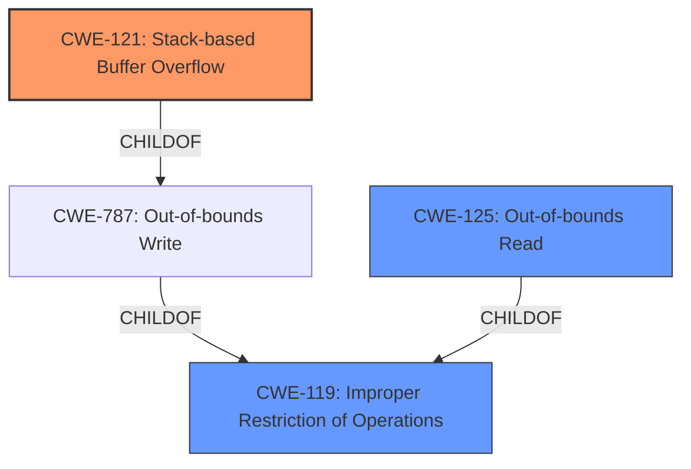

# Analysis for CVE-2021-39048

# Summary

| CWE ID | CWE Name | Confidence | CWE Abstraction Level | CWE Vulnerability Mapping Label | CWE-Vulnerability Mapping Notes |
|---|---|---|---|---|---|
| CWE-121 | Stack-based Buffer Overflow | 1.0 | Variant | Primary | Allowed |
| CWE-125 | Out-of-bounds Read | 0.5 | Base | Secondary | Allowed |
| CWE-119 | Improper Restriction of Operations within the Bounds of a Memory Buffer | 0.4 | Class | Secondary | Discouraged |

## Evidence and Confidence

*   **Confidence Score:** 0.8
*   **Evidence Strength:** HIGH

## Relationship Analysis
The primary CWE is CWE-121, which is a variant of CWE-787 (Out-of-bounds Write) and CWE-788. CWE-119 is a broader class that encompasses various memory buffer errors, so it is less specific than CWE-121. CWE-125 (Out-of-bounds Read) is included as a secondary concern because buffer overflows can lead to reads outside the intended buffer.

## Vulnerability Chain
The vulnerability chain starts with **improper bounds checking**, which leads to a **stack-based buffer overflow**, potentially resulting in a denial of service or arbitrary code execution.

## Summary of Analysis
The initial analysis clearly points towards a stack-based buffer overflow due to **improper bounds checking**. This is supported by the "Vulnerability Description Key Phrases" which identify "**stack based buffer overflow**" as a **weakness** and "**improper bounds checking**" as the **rootcause**. The "CVE Reference Links Content Summary" reinforces this by stating that the vulnerability is caused by a "stack-based buffer overflow due to **improper bounds checking**". The Retriever results also list CWE-121 as a relevant CWE.

The primary selection is CWE-121 (Stack-based Buffer Overflow), which is a Variant-level CWE, providing the most specific classification. CWE-119 is a broader Class-level CWE, so it is considered but not chosen as the primary. CWE-125 is added as a secondary CWE to account for potential out-of-bounds reads resulting from the overflow.

Relevant CWE Information:

# Enhanced Context (25 CWEs)

## CWE-191: Integer Underflow (Wrap or Wraparound)
**Abstraction Level**: Base
**Similarity Score**: 0.77

## CWE-131: Incorrect Calculation of Buffer Size
**Abstraction Level**: Base
**Similarity Score**: 0.77

## CWE-193: Off-by-one Error
**Abstraction Level**: Base
**Similarity Score**: 0.76

## CWE-805: Buffer Access with Incorrect Length Value
**Abstraction Level**: Base
**Similarity Score**: 0.76

## CWE-197: Numeric Truncation Error
**Abstraction Level**: Base
**Similarity Score**: 0.75

## CWE-124: Buffer Underwrite ('Buffer Underflow')
**Abstraction Level**: Base
**Similarity Score**: 0.75

## CWE-1289: Improper Validation of Unsafe Equivalence in Input
**Abstraction Level**: Base
**Similarity Score**: 0.75

## CWE-125: Out-of-bounds Read
**Abstraction Level**: Base
**Similarity Score**: 0.74

## CWE-681: Incorrect Conversion between Numeric Types
**Abstraction Level**: Base
**Similarity Score**: 0.74

## CWE-130: Improper Handling of Length Parameter Inconsistency
**Abstraction Level**: Base
**Similarity Score**: 0.74

## CWE-190: Integer Overflow or Wraparound
**Abstraction Level**: Base
**Similarity Score**: 7567.93

## CWE-125: Out-of-bounds Read
**Abstraction Level**: Base
**Similarity Score**: 7171.29

## CWE-1284: Improper Validation of Specified Quantity in Input
**Abstraction Level**: Base
**Similarity Score**: 7098.72

## CWE-193: Off-by-one Error
**Abstraction Level**: Base
**Similarity Score**: 6978.51

## CWE-119: Improper Restriction of Operations within the Bounds of a Memory Buffer
**Abstraction Level**: Class
**Similarity Score**: 6853.29

## CWE-128: Wrap-around Error
**Abstraction Level**: base
**Similarity Score**: 5.03

## CWE-41: Improper Resolution of Path Equivalence
**Abstraction Level**: base
**Similarity Score**: 5.03

## CWE-195: Signed to Unsigned Conversion Error
**Abstraction Level**: variant
**Similarity Score**: 4.53

## CWE-22: Improper Limitation of a Pathname to a Restricted Directory ('Path Traversal')
**Abstraction Level**: base
**Similarity Score**: 4.33

## CWE-770: Allocation of Resources Without Limits or Throttling
**Abstraction Level**: base
**Similarity Score**: 4.33

## CWE-73: External Control of File Name or Path
**Abstraction Level**: base
**Similarity Score**: 4.33

## CWE-170: Improper Null Termination
**Abstraction Level**: base
**Similarity Score**: 4.33

## CWE-1284: Improper Validation of Specified Quantity in Input
**Abstraction Level**: base
**Similarity Score**: 4.33

## CWE-617: Reachable Assertion
**Abstraction Level**: base
**Similarity Score**: 4.33

## CWE-123: Write-what-where Condition
**Abstraction Level**: base
**Similarity Score**: 3.89

**CWE-119 (Improper Restriction of Operations within the Bounds of a Memory Buffer)**: This was considered because it is a general class of buffer-related errors. However, it is less specific than CWE-121, which explicitly identifies the vulnerability as a stack-based buffer overflow. The mapping guidance discourages the use of CWE-119 when more specific CWEs are available.

**CWE-190 (Integer Overflow or Wraparound)**: This CWE was considered because integer overflows can sometimes lead to buffer overflows. However, the description explicitly states that the root cause is **improper bounds checking**, not an integer overflow.

**CWE-125 (Out-of-bounds Read)**: While the primary vulnerability is a write, the overflow might lead to out-of-bounds reads as well. This is included as a secondary concern.

**CWE-20 (Improper Input Validation)**: While the root cause is **improper bounds checking**, which is related to input validation, CWE-20 is a very general class. Since "**improper bounds checking**" is explicitly mentioned, it's more accurate to focus on the resulting buffer overflow.

**CWE-805 (Buffer Access with Incorrect Length Value)**: This is related, but the root cause is more generally **improper bounds checking** rather than specifically an incorrect length value.

The final selection of CWE-121 is at the optimal level of specificity because it directly addresses the stack-based buffer overflow caused by **improper bounds checking**, as indicated in the vulnerability description and CVE summary. The evidence is strong, and the CWE relationships support this classification.