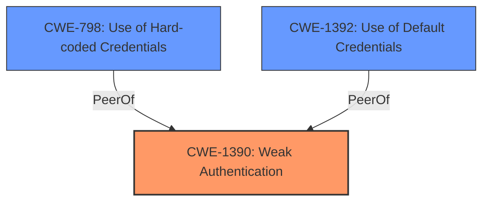

# Analysis for CVE-2021-39064

# Summary
| CWE ID    | CWE Name                                                                                                             | Confidence | CWE Abstraction Level | CWE Vulnerability Mapping Label | CWE-Vulnerability Mapping Notes |
| :---------- | :------------------------------------------------------------------------------------------------------------------- | :--------- | :---------------------- | :------------------------------ | :------------------------------ |
| CWE-1390    | Weak Authentication                                                                                                  | 0.9        | Class                   | Primary                         | Allowed-with-Review             |
| CWE-798    | Use of Hard-coded Credentials                                                                                         | 0.7        | Base                   | Secondary                         | Allowed             |
| CWE-1392    | Use of Default Credentials                                                                                         | 0.7        | Base                   | Secondary                         | Allowed             |

## Evidence and Confidence

*   **Confidence Score:** 0.8
*   **Evidence Strength:** HIGH

## Relationship Analysis
The primary CWE is CWE-1390 which is a class-level CWE. The vulnerability description points to **weak authentication** and **incorrect handling of default credentials**. While CWE-1390 is a class, the specific issues of hardcoded and default credentials are more precisely captured by CWE-798 and CWE-1392 respectively. The relationship is that CWE-798 and CWE-1392 could be causes or variants of CWE-1390, but given the specific mention of **incorrect handling of default credentials**, and the implicit issue of **weak authentication** is likely caused by credentials, they are added as secondary issues.

## Vulnerability Chain
The vulnerability chain starts with **weak authentication** and **weak password rules**, and leads to **incorrect default credential handling** for the Spectrum Copy Data Management Admin console. The initial flaws are in the authentication and password rules, which then result in the mishandling of default credentials.
  - **Root Cause**: **Weak Authentication**, **Weak Password Rules**
  - **Weakness**: **Incorrect Default Credential Handling**
  - **Impact**: Unauthorized access to the Spectrum Copy Data Management Admin console.

## Summary of Analysis
The initial analysis identified **weak authentication**, **weak password rules**, and **incorrect default credential handling** as key issues. The retriever results pointed towards CWE-1390 as the primary candidate for **weak authentication**. The identification of **incorrect default credential handling** suggested CWE-798 and CWE-1392 as secondary issues which are related to but more specific than CWE-1390.

The graph relationships emphasize the connection between general **weak authentication** (CWE-1390) and the specific instances of **hard-coded credentials** (CWE-798) and **default credentials** (CWE-1392).

The selected CWEs are at the optimal level of specificity because they accurately capture the nuances of the vulnerability, including the general problem of **weak authentication** and the concrete instances of **incorrect handling of default credentials** through **hardcoded** and **default credentials**.

Relevant CWE Information:

# Enhanced Context (25 CWEs)
The following CWEs were identified as potentially relevant to this vulnerability:

## CWE-1391: Use of Weak Credentials
**Abstraction Level**: Class
**Similarity Score**: 0.78
**Source**: dense

**Description**:
The product uses weak credentials (such as a default key or hard-coded password) that can be calculated, derived, reused, or guessed by an attacker.

**Mapping Guidance**:
- Usage: Allowed-with-Review
- Rationale: This CWE entry is a Class and might have Base-level children that would be more appropriate

## CWE-311: Missing Encryption of Sensitive Data
**Abstraction Level**: Class
**Similarity Score**: 0.74
**Source**: dense

**Description**:
The product does not encrypt sensitive or critical information before storage or transmission.

**Mapping Guidance**:
- Usage: Discouraged
- Rationale: CWE-311 is high-level with more precise children available. It is a level-1 Class (i.e., a child of a Pillar).

## CWE-326: Inadequate Encryption Strength
**Abstraction Level**: Class
**Similarity Score**: 0.74
**Source**: dense

**Description**:
The product stores or transmits sensitive data using an encryption scheme that is theoretically sound, but is not strong enough for the level of protection required.

**Mapping Guidance**:
- Usage: Allowed-with-Review
- Rationale: This CWE entry is a Class and might have Base-level children that would be more appropriate

## CWE-303: Incorrect Implementation of Authentication Algorithm
**Abstraction Level**: Base
**Similarity Score**: 0.74
**Source**: dense

**Description**:
The requirements for the product dictate the use of an established authentication algorithm, but the implementation of the algorithm is incorrect.

**Mapping Guidance**:
- Usage: Allowed
- Rationale: This CWE entry is at the Base level of abstraction, which is a preferred level of abstraction for mapping to the root causes of vulnerabilities.

## CWE-807: Reliance on Untrusted Inputs in a Security Decision
**Abstraction Level**: Base
**Similarity Score**: 0.73
**Source**: dense

**Description**:
The product uses a protection mechanism that relies on the existence or values of an input, but the input can be modified by an untrusted actor in a way that bypasses the protection mechanism.

**Mapping Guidance**:
- Usage: Allowed
- Rationale: This CWE entry is at the Base level of abstraction, which is a preferred level of abstraction for mapping to the root causes of vulnerabilities.

## CWE-798: Use of Hard-coded Credentials
**Abstraction Level**: Base
**Similarity Score**: 0.73
**Source**: dense

**Description**:
The product contains hard-coded credentials, such as a password or cryptographic key.

**Mapping Guidance**:
- Usage: Allowed
- Rationale: This CWE entry is at the Base level of abstraction, which is a preferred level of abstraction for mapping to the root causes of vulnerabilities.

## CWE-1392: Use of Default Credentials
**Abstraction Level**: Base
**Similarity Score**: 0.73
**Source**: dense

**Description**:
The product uses default credentials (such as passwords or cryptographic keys) for potentially critical functionality.

**Mapping Guidance**:
- Usage: Allowed
- Rationale: This CWE entry is at the Base level of abstraction, which is a preferred level of abstraction for mapping to the root causes of vulnerabilities.

## CWE-657: Violation of Secure Design Principles
**Abstraction Level**: Class
**Similarity Score**: 0.72
**Source**: dense

**Description**:
The product violates well-established principles for secure design.

**Mapping Guidance**:
- Usage: Discouraged
- Rationale: This CWE entry is a level-1 Class (i.e., a child of a Pillar). It might have lower-level children that would be more appropriate

## CWE-307: Improper Restriction of Excessive Authentication Attempts
**Abstraction Level**: Base
**Similarity Score**: 0.72
**Source**: dense

**Description**:
The product does not implement sufficient measures to prevent multiple failed authentication attempts within a short time frame.

**Mapping Guidance**:
- Usage: Allowed
- Rationale: This CWE entry is at the Base level of abstraction, which is a preferred level of abstraction for mapping to the root causes of vulnerabilities.

## CWE-916: Use of Password Hash With Insufficient Computational Effort
**Abstraction Level**: Base
**Similarity Score**: 0.72
**Source**: dense

**Description**:
The product generates a hash for a password, but it uses a scheme that does not provide a sufficient level of computational effort that would make password cracking attacks infeasible or expensive.

**Mapping Guidance**:
- Usage: Allowed
- Rationale: This CWE entry is at the Base level of abstraction, which is a preferred level of abstraction for mapping to the root causes of vulnerabilities.

## CWE-327: Use of a Broken or Risky Cryptographic Algorithm
**Abstraction Level**: Class
**Similarity Score**: 2166.81
**Source**: sparse

**Description**:
The product uses a broken or risky cryptographic algorithm or protocol.

**Mapping Guidance**:
- Usage: Allowed-with-Review
- Rationale: This CWE entry is a Class and might have Base-level children that would be more appropriate

## CWE-916: Use of Password Hash With Insufficient Computational Effort
**Abstraction Level**: Base
**Similarity Score**:

# Enhanced Query for CVE-2021-39064

# Vulnerability Description

    IBM Spectrum Copy Data Management 2.2.13 and earlier has **weak authentication** and password rules and incorrectly handles default credentials for the Spectrum Copy Data Management Admin console. IBM X-Force ID 214957.

    # Keyphrase-Specific CWE Analysis
    This vulnerability contains multiple keyphrases that may map to different CWEs. 
    Please analyze each keyphrase separately and determine the most appropriate CWE(s) for each.

    ## ROOTCAUSE: 'weak authentication'

Relevant CWEs for this ROOTCAUSE:

### 1. CWE-1390: Weak Authentication (Score: 265.13)

The product uses an authentication mechanism to restrict access to specific users or identities, but the mechanism does not sufficiently prove that the claimed identity is correct....

### 2. CWE-326: Inadequate Encryption Strength (Score: 248.39)

The product stores or transmits sensitive data using an encryption scheme that is theoretically sound, but is not strong enough for the level of protection required....

### 3. CWE-307: Improper Restriction of Excessive Authentication Attempts (Score: 244.67)

The product does not implement sufficient measures to prevent multiple failed authentication attempts within a short time frame....

### 4. CWE-327: Use of a Broken or Risky Cryptographic Algorithm (Score: 233.62)

The product uses a broken or risky cryptographic algorithm or protocol....

### 5. CWE-1391: Use of Weak Credentials (Score: 217.66)

The product uses weak credentials (such as a default key or hard-coded password) that can be calculated, derived, reused, or guessed by an attacker....

## ROOTCAUSE: 'weak password rules'

Relevant CWEs for this ROOTCAUSE:

### 1. CWE-1390: Weak Authentication (Score: 265.13)

The product uses an authentication mechanism to restrict access to specific users or identities, but the mechanism does not sufficiently prove that the claimed identity is correct....

### 2. CWE-326: Inadequate Encryption Strength (Score: 248.39)

The product stores or transmits sensitive data using an encryption scheme that is theoretically sound, but is not strong enough for the level of protection required....

### 3. CWE-307: Improper Restriction of Excessive Authentication Attempts (Score: 244.67)

The product does not implement sufficient measures to prevent multiple failed authentication attempts within a short time frame....

### 4. CWE-327: Use of a Broken or Risky Cryptographic Algorithm (Score: 233.62)

The product uses a broken or risky cryptographic algorithm or protocol....

### 5. CWE-1391: Use of Weak Credentials (Score: 217.66)

The product uses weak credentials (such as a default key or hard-coded password) that can be calculated, derived, reused, or guessed by an attacker....

## ROOTCAUSE: 'incorrect default credential handling'

Relevant CWEs for this ROOTCAUSE:

### 1. CWE-1390: Weak Authentication (Score: 265.13)

The product uses an authentication mechanism to restrict access to specific users or identities, but the mechanism does not sufficiently prove that the claimed identity is correct....

### 2. CWE-326: Inadequate Encryption Strength (Score: 248.39)

The product stores or transmits sensitive data using an encryption scheme that is theoretically sound, but is not strong enough for the level of protection required....

### 3. CWE-327: Use of a Broken or Risky Cryptographic Algorithm (Score: 233.62)

The product uses a broken or risky cryptographic algorithm or protocol....

### 4. CWE-522: Insufficiently Protected Credentials (Score: 230.59)

The product transmits or stores authentication credentials, but it uses an insecure method that is susceptible to unauthorized interception and/or retrieval....

### 5. CWE-1391: Use of Weak Credentials (Score: 217.66)

The product uses weak credentials (such as a default key or hard-coded password) that can be calculated, derived, reused, or guessed by an attacker....

## PRODUCT: 'IBM Spectrum Copy Data Management'

Relevant CWEs for this PRODUCT:

### 1. CWE-1390: Weak Authentication (Score: 265.13)

The product uses an authentication mechanism to restrict access to specific users or identities, but the mechanism does not sufficiently prove that the claimed identity is correct....

### 2. CWE-326: Inadequate Encryption Strength (Score: 248.39)

The product stores or transmits sensitive data using an encryption scheme that is theoretically sound, but is not strong enough for the level of protection required....

### 3. CWE-307: Improper Restriction of Excessive Authentication Attempts (Score: 244.67)

The product does not implement sufficient measures to prevent multiple failed authentication attempts within a short time frame....

### 4. CWE-327: Use of a Broken or Risky Cryptographic Algorithm (Score: 233.62)

The product uses a broken or risky cryptographic algorithm or protocol....

### 5. CWE-1022: Use of Web Link to Untrusted Target with window.opener Access (Score: 98.92)

The web application produces links to untrusted external sites outside of its sphere of control, but it does not properly prevent the external site from modifying  security-critical properties of the window.opener object, such as the location property....

## VERSION: '2.2.13 and earlier'

Relevant CWEs for this VERSION:

### 1. CWE-1390: Weak Authentication (Score: 265.13)

The product uses an authentication mechanism to restrict access to specific users or identities, but the mechanism does not sufficiently prove that the claimed identity is correct....

### 2. CWE-326: Inadequate Encryption Strength (Score: 248.39)

The product stores or transmits sensitive data using an encryption scheme that is theoretically sound, but is not strong enough for the level of protection required....

### 3. CWE-327: Use of a Broken or Risky Cryptographic Algorithm (Score: 233.62)

The product uses a broken or risky cryptographic algorithm or protocol....

### 4. CWE-522: Insufficiently Protected Credentials (Score: 230.59)

The product transmits or stores authentication credentials, but it uses an insecure method that is susceptible to unauthorized interception and/or retrieval....

### 5. CWE-256: Plaintext Storage of a Password (Score: 83.22)

Storing a password in plaintext may result in a system compromise....

## COMPONENT: 'Admin console'

Relevant CWEs for this COMPONENT:

### 1. CWE-1390: Weak Authentication (Score: 265.13)

The product uses an authentication mechanism to restrict access to specific users or identities, but the mechanism does not sufficiently prove that the claimed identity is correct....

### 2. CWE-326: Inadequate Encryption Strength (Score: 248.39)

The product stores or transmits sensitive data using an encryption scheme that is theoretically sound, but is not strong enough for the level of protection required....

### 3. CWE-307: Improper Restriction of Excessive Authentication Attempts (Score: 244.67)

The product does not implement sufficient measures to prevent multiple failed authentication attempts within a short time frame....

### 4. CWE-1391: Use of Weak Credentials (Score: 217.66)

The product uses weak credentials (such as a default key or hard-coded password) that can be calculated, derived, reused, or guessed by an attacker....

### 5. CWE-256: Plaintext Storage of a Password (Score: 83.22)

Storing a password in plaintext may result in a system compromise....

    # Analysis Instructions
    1. For each keyphrase, identify the most appropriate CWE(s) that represent the weakness.
    2. Consider how the different keyphrases might relate to each other in the vulnerability chain.
    3. Provide a final determination of primary CWE(s) and any secondary CWEs.
    4. Format your response using the standard analysis template.

    Please analyze how these different weaknesses interact and provide a comprehensive CWE classification.
    