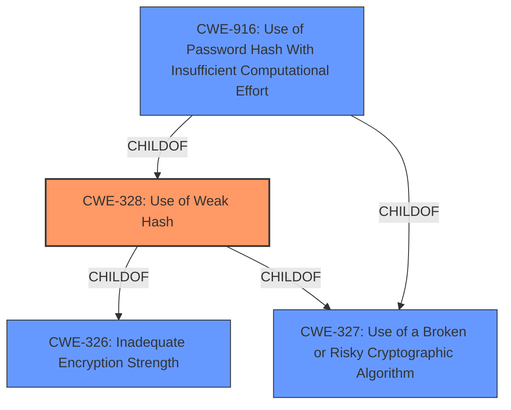

# Analysis Report for CVE-2021-39182

# Vulnerability Analysis Report: CVE-2021-39182

## Description


## Analysis (with Relationship Data)

# Summary
| CWE ID | CWE Name | Confidence | CWE Abstraction Level | CWE Vulnerability Mapping Label | CWE-Vulnerability Mapping Notes |
|---|---|---|---|---|---|
| CWE-328 | Use of Weak Hash | 1.0 | Base | Allowed | Primary CWE |
| CWE-916 | Use of Password Hash With Insufficient Computational Effort | 0.7 | Base | Allowed | Secondary Candidate |
| CWE-327 | Use of a Broken or Risky Cryptographic Algorithm | 0.7 | Class | Allowed-with-Review | Secondary Candidate |

## Evidence and Confidence

*   **Confidence Score:** 0.9
*   **Evidence Strength:** HIGH

## Relationship Analysis
The primary CWE is CWE-328, which is a Base level CWE. CWE-328 has two parent Class level CWEs CWE-326 and CWE-327. CWE-916 is also a Base level CWE, and is a child of CWE-328 and CWE-327. CWE-327 is a Class level CWE. This indicates a possible path where using a broken or risky cryptographic algorithm (CWE-327) can lead to the use of a weak hash (CWE-328), and if that weak hash is used for passwords, it can lead to insufficient computational effort (CWE-916). Selecting CWE-328 as the primary is at the lowest level of abstraction, which is optimal.



## Vulnerability Chain
The vulnerability chain starts with the **use of an insecure hashing algorithm** (MD5) in the EnroCrypt module, specifically within the `hashing.py` file. This **weakness** (CWE-328) can lead to potential compromise of data security, especially if used for password hashing. An attacker could exploit this by cracking the MD5 hashes, leading to unauthorized access.

## Summary of Analysis
The initial analysis identified the **use of the insecure MD5 hashing algorithm** as the root cause. The "Vulnerability Description Key Phrases" section explicitly states "**rootcause:** **use of insecure hashing algorithm**". The "CVE Reference Links Content Summary" confirms this, stating, "The vulnerability stems from the use of the MD5 hashing algorithm within the `hashing.py` file of the EnroCrypt project. MD5 is considered an insecure hashing algorithm due to its susceptibility to collision attacks and its relative speed in being cracked..."

The Retriever results also support this, with CWE-328 (Use of Weak Hash) being the top combined result. CWE-916 (Use of Password Hash With Insufficient Computational Effort) and CWE-327 (Use of a Broken or Risky Cryptographic Algorithm) are also strong candidates.

The graph relationships show that CWE-328 is a child of CWE-327, indicating that using a broken algorithm can lead to the use of a weak hash. CWE-916 is a child of both, suggesting that using a weak hash for passwords can lead to insufficient computational effort.

The final decision is to primarily map to CWE-328 (Use of Weak Hash) because it directly addresses the **root cause** identified in the vulnerability description. CWE-916 and CWE-327 are included as secondary candidates to capture the potential impact on password security and the general use of a broken algorithm. CWE-328 is chosen at the Base level of abstraction, as recommended, providing the most specific and accurate representation of the **weakness**.


## CWE Relationship Analysis

Current CWEs represent these abstraction levels: .


### Vulnerability Chain Analysis

**Chain starting from CWE-916:**
- 916 (Use of Password Hash With Insufficient Computational Effort) - ROOT


**Chain starting from CWE-327:**
- 327 (Use of a Broken or Risky Cryptographic Algorithm) - ROOT


### CWE Relationship Diagram

```mermaid
graph TD
    classDef primary fill:#f96,stroke:#333,stroke-width:2px
    classDef secondary fill:#69f,stroke:#333
    classDef tertiary fill:#9e9,stroke:#333
```


*Report generated on 2025-03-31 00:20:04*
